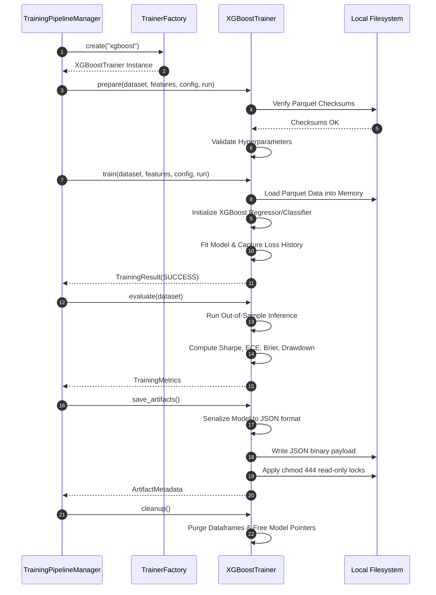

# Sprint 3.5C.1 Design Specification: Real XGBoost Trainer

**Status**: PROPOSED (Ready for Architecture Audit)
**Role**: Principal Quant Architect
**Engineering Contract ID**: MoroQuant-Sprint-3.5C.1-Contract-v1.0
**Target Implementation Agent**: Claude Code

---

## 1. Responsibilities

The `XGBoostTrainer` is the concrete execution unit for XGBoost model operations within the MoroQuant Research Platform. It inherits from `BaseTrainer` and operates under a strict "functional core, side-effect-free" architectural boundary.

### Core Responsibilities:
* **Input Validation**: Enforce structural, type, and shape bounds on inputs before loading.
* **Deterministic Data Preprocessing**: Standardize missing values, sorting, and type casting of feature/target tables.
* **Model Fitting**: Instantiate and train a real, mathematical `xgboost.XGBClassifier` or `xgboost.XGBRegressor` using deterministic configurations.
* **Model Evaluation**: Compute out-of-sample quantitative performance metrics (Sharpe, ECE, Brier, Drawdown) on the validation dataset.
* **Immutable Artifact Serialization**: Serialize the raw model weights into a stable binary representation and calculate its cryptographic checksum.
* **Resource Governance**: Safely release GPU/CPU memory and clean up intermediate processing handles.

### Constraints & Boundaries:
* **No Database Interactions**: Must not perform SQL queries or import DB/ORM classes. Relational persistence is delegated to the `TrainingPipelineManager`.
* **No Network Calls**: Zero network requests or telemetry streaming.
* **No Ad-Hoc Writes**: File saving must go through designated directories with read-only locks (`chmod 444`).

---

## 2. Trainer Lifecycle

The `XGBoostTrainer` lifecycle follows a strict state transition machine:

```
[ UNINITIALIZED ]
       │
       ▼ (Instantiation)
  [ CREATED ]
       │
       ▼ (prepare / validate)
 [ PREPARED ]
       │
       ▼ (train)
  [ TRAINED ]
       │
       ▼ (evaluate / save_artifacts)
[ EVALUATED / ARTIFACTS_SAVED ]
       │
       ▼ (cleanup)
[ UNINITIALIZED ]
```

1. **Created**: Instantiated via `TrainerFactory.create("xgboost")`.
2. **Prepared**: Input snapshots, configurations, and hyperparameters validated; in-memory data structures allocated.
3. **Trained**: Model fitting executed; in-memory model weights populated.
4. **Evaluated**: Validation/test inference completed; metrics arrays cached.
5. **Artifacts Saved**: Serialized bytes written to filesystem; signature metadata computed.
6. **Cleanup**: Internal state variables nullified; memory handles freed.

---

## 3. Input Contracts

The trainer expects the following structures (defined in [models.py](file:///home/zafka/trade-dashboard/ml_service/research/models.py)):

### 1. `DatasetSnapshot`
* `dataset_version_id` (str): Version key (e.g. `DS_1.0.0`).
* `fingerprint` (str): SHA-256 hash of the resampled tick dataframe parquet.
* `file_path` (str): Absolute file path to the read-only parquet dataset.

### 2. `FeatureSnapshot`
* `feature_dataset_id` (str): Version key (e.g. `FDS_1.0.0`).
* `fingerprint` (str): SHA-256 hash of the calculated feature parquet file.
* `file_path` (str): Absolute file path to the feature matrix.

### 3. `TrainerConfig`
* `model_type` (str): Must be exactly `"xgboost"`.
* `seed` (int): Global execution seed.
* `hyperparameters` (Tuple[Tuple[str, Any], ...]): Model arguments (e.g., `max_depth`, `learning_rate`, `n_estimators`, `objective`).
* `training_parameters` (Tuple[Tuple[str, Any], ...]): Execution params (e.g., `early_stopping_rounds`, `validation_split_ratio`, `target_column`).

---

## 4. Output Contracts

Upon execution, the trainer outputs standard payloads wrapped in immutable dataclasses:

### 1. `TrainingResult`
* `status` (str): `"SUCCESS"` or error states.
* `metrics` (`TrainingMetrics`): Detailed statistics.
* `artifacts` (`ArtifactMetadata`): Reference details of the model binary.
* `error_message` (Optional[str]): Set if execution fails.

### 2. `TrainingMetrics`
* `loss_history` (Tuple[float, ...]): Epoch training losses.
* `val_loss_history` (Tuple[float, ...]): Epoch validation losses.
* `sharpe` (float): Out-of-sample Sharpe Ratio of simulated signals.
* `ece` (float): Expected Calibration Error (calibration scorecard).
* `brier` (float): Brier score (probabilistic forecast accuracy).
* `drawdown` (float): Maximum walk-forward simulation drawdown.

### 3. `ArtifactMetadata`
* `checksum` (str): Cryptographic fingerprint (`SHA-256`) of the serialized model binary.
* `file_path` (str): Destination path in the model store.
* `size_bytes` (int): File size.
* `permissions` (str): Standard `"chmod 444"` indicating write protection.

---

## 5. Validation Rules

Validation occurs during `prepare()` and before training/evaluation:

| Parameter | Validation Rule | Action on Failure |
| :--- | :--- | :--- |
| **Model Type** | Must equal `"xgboost"`. | Raise `ValueError` |
| **Datasets** | Snapshot instances must not be None; `file_path` must exist. | Raise `ValueError` |
| **Fingerprint** | SHA-256 checksum of physical file must match snapshot `fingerprint`. | Raise `ValueError` |
| **Target Column** | Specified in training parameters; must exist in loaded feature columns. | Raise `ValueError` |
| **Hyperparameters** | `max_depth` range $[1, 20]$, `learning_rate` $(0.0, 1.0]$, `n_estimators` $[1, 5000]$. | Raise `ValueError` |
| **Seed** | Must be positive 32-bit unsigned integer (`0` to `4294967295`). | Raise `TypeError` / `ValueError` |

---

## 6. Dataset Loading Flow

```
[ DatasetSnapshot ] ──> Resolve File Path ──> Open File (Read-Only) ──> Verify SHA-256 Fingerprint
                                                                                │
                                                                                ▼
[ Raw Pandas DataFrame ] <── Parse Parquet Columns ── Validate Row Count > 0 <──┘
```

1. **Path Resolution**: Resolve absolute file path from the `DatasetSnapshot`.
2. **Fingerprint Verification**: Read file bytes in chunks and verify the `SHA-256` signature matches the snapshot's registry entry before loading to Pandas/PyArrow.
3. **Data Loading**: Load into memory using `pyarrow.parquet.read_table` or `pandas.read_parquet` inside a context manager.
4. **Data Verification**: Confirm index sorting (strictly chronological by `timestamp`) and check that row count $> 0$.

---

## 7. Feature Loading Flow

```
[ FeatureSnapshot ] ──> Load Parquet ──> Verify Fingerprint ──> Align Rows Chronologically
                                                                        │
                                                                        ▼
[ X, y Matrices ] <── Split Target / Features ── Align Timestamp Index ─┘
```

1. **Feature Loading**: Load Parquet from the `FeatureSnapshot` path, verifying the checksum.
2. **Temporal Alignment**: Join the feature table with the main dataset on `timestamp` indices, ensuring zero lookahead bias.
3. **Target Segmentation**: Isolate feature columns $X$ from the configured target column $y$.
4. **Missing Value Isolation**: Replace `NaN` or `inf` values deterministically (e.g. forward-fill for time-series features, or fill with a fixed null indicator value as defined by training configurations).

---

## 8. Training Flow

The actual fitting process uses `xgboost`:

1. **Seed Initialization**: Explicitly set seed in `xgboost` params (i.e. `random_state=seed` / `seed=seed`).
2. **Split Data**: Partition dataset chronologically into train and validation sets based on the `validation_split_ratio` parameter (to preserve temporal causality).
3. **DMatrix Compilation**: Convert pandas matrices into `xgboost.DMatrix` representations (passing feature names and types).
4. **Model Initialization**: Instantiate `xgboost.XGBClassifier` or `xgboost.XGBRegressor` with hyperparameters.
5. **Execution**: Invoke `.fit()` or `xgboost.train()` with `evals` mapping and `early_stopping_rounds`.
6. **Loss Capture**: Parse evaluations from `evals_result()` to populate `loss_history` and `val_loss_history`.

---

## 9. Evaluation Flow

Evaluation generates walk-forward out-of-sample metrics:

1. **Signal Prediction**: Generate probability distributions (for classification) or expected return values (for regression) using the trained model:
   $$\hat{y} = f(X_{\text{val}})$$
2. **Sharpe Ratio**: Simulate simple position returns by going long/short based on signal thresholds, dividing mean return by standard deviation of returns (scaled to annual horizon).
3. **Expected Calibration Error (ECE)**: Bin predictions into $M$ bins and calculate weight differences between accuracy and confidence:
   $$\text{ECE} = \sum_{m=1}^{M} \frac{|B_m|}{N} \left| \text{acc}(B_m) - \text{conf}(B_m) \right|$$
4. **Brier Score**: Compute mean squared error of probability predictions against actual indicators:
   $$\text{Brier} = \frac{1}{N} \sum_{i=1}^{N} (p_i - o_i)^2$$
5. **Drawdown**: Calculate the peak-to-trough drop in simulated cumulative return equity curves.

---

## 10. Artifact Generation

Serialization must be stable across platforms:

1. **Binary Export**: Export the model using the standard JSON format from XGBoost (supported by `.save_model("model.json")`) rather than pickle, ensuring long-term compatibility and cross-language loading.
2. **Deterministic Metadata**: Include the sorted hyperparameters, training configuration, and model architecture details in the JSON structure.
3. **Cryptographic Signatures**: Write file to `/storage/models/` and compute the SHA-256 fingerprint.
4. **Access Restrictions**: Apply OS-level read-only permissions via a sub-shell or standard library call:
   ```bash
   chmod 444 /storage/models/xgboost_<checksum>.json
   ```

---

## 11. Exception Handling

The trainer isolates internal exceptions, translating them to failure statuses returned in `TrainingResult`:

| Exception Class | Root Cause | Lifecycle Action |
| :--- | :--- | :--- |
| `FileNotFoundError` | Snapshot Parquet not found. | Transition to `FAILED_VALIDATION`, cleanup memory, abort. |
| `ValueError` | Hash mismatch or hyperparameter out of range. | Transition to `FAILED_VALIDATION`, cleanup memory, abort. |
| `xgboost.core.XGBoostError` | Algorithm failure / numerical explosion (`NaN` gradients). | Catch, transition to `FAILED_TRAINING`, release resources. |
| `MemoryError` | Out of Memory (OOM) during training. | Transition to `FAILED_TRAINING`, force garbage collection (`gc.collect()`). |

---

## 12. Determinism Requirements

To ensure identical float weights across runs:
* **Explicit Seeds**: Set `seed` in XGBoost configurations (`seed`, `random_state`).
* **Deterministic Algorithms**: Set `parameter: "deterministic_histogram"` or equivalent backend configurations in XGBoost if using histogram-based tree methods.
* **Sorted Inputs**: Ensure feature matrices and datasets are sorted by `timestamp` chronologically and columns are sorted alphabetically before compiling the `DMatrix`.
* **Float Precision**: Use double precision float formatting `float64` for all model inputs to prevent rounding drift.

---

## 13. Performance Considerations

* **DMatrix Optimization**: Use `xgboost.QuantileDMatrix` if using histograms (`tree_method='hist'`) to reduce CPU/GPU memory footprint during dataset construction.
* **Thread Governance**: Set `n_jobs` or `nthread` limit in hyperparameters to prevent thread starvation on shared orchestrator cores.
* **Garbage Collection**: Invoke explicit cleanup steps to free `xgboost.DMatrix` pointers immediately after evaluation.

---

## 14. Integration with TrainingPipeline

The [TrainingPipelineManager](file:///home/zafka/trade-dashboard/ml_service/research/training_pipeline.py) invokes the trainer inside its `run()` loop:

```python
# 1. Pipeline resolves training parameters & hyperparameters
hparams = make_immutable({k: v for k, v in model_params.items() if k != "model_type"})
tparams = make_immutable({k: v for k, v in training_config.items() if k != "model_type"})

trainer_config = TrainerConfig(
    model_type="xgboost",
    seed=seed,
    hyperparameters=hparams,
    training_parameters=tparams
)

# 2. Pipeline instantiates the trainer via TrainerFactory
trainer = TrainerFactory.create("xgboost")

# 3. Executes Trainer Lifecycle methods
trainer.prepare(dataset_snapshot, feature_snapshot, trainer_config, research_run)
trainer_result = trainer.train(dataset_snapshot, feature_snapshot, trainer_config, research_run)
eval_metrics = trainer.evaluate(dataset_snapshot)
artifact_metadata = trainer.save_artifacts()
```

---

## 15. Integration with TrainerFactory

The [TrainerFactory](file:///home/zafka/trade-dashboard/ml_service/research/trainers/trainer_factory.py) registers `XGBoostTrainer` under the `"xgboost"` key:

```python
_registry: Dict[str, Type[BaseTrainer]] = {
    "xgboost": XGBoostTrainer,
    "lightgbm": LightGBMTrainer,
}
```

---

## 16. Integration with ResearchRun

The returned output of `XGBoostTrainer` integrates into `ResearchRun` (defined in [models.py](file:///home/zafka/trade-dashboard/ml_service/research/models.py)):

* The metrics tuple `(sharpe, ece, brier, drawdown, final_loss, final_val_loss)` is mapped to the `metrics` tuple attribute of `ResearchRun`.
* The calculated absolute path `/storage/models/xgboost_<checksum>.json` is saved into `model_binary_path`.
* Execution state is marked as `"COMPLETED"` or `"FAILED"`.

---

## 17. Future Compatibility with Optuna

To support Optuna hyperparameter sweeps:
* The trainer must accept arbitrary configuration ranges injected via `TrainerConfig.hyperparameters`.
* Metrics must be returned as float vectors so the `ExperimentRunner` can optimize specific targets (e.g. maximizing Sharpe, minimizing ECE).

---

## 18. Future Compatibility with GPU

* **GPU Tree Algorithms**: The configuration parameters must support `device="cuda"` or `tree_method="gpu_hist"` / `tree_method="hist"` with `device="cuda"`.
* **Unified Memory Cleanup**: Ensure the `cleanup()` method executes `device_close()` or equivalent GPU cleanup routines to prevent memory leaks on shared GPUs.

---

## 19. Future Compatibility with Distributed Training

* **Distributed DMatrix**: The design must adapt to `xgboost.dask` or distributed frameworks where training features $X$ are loaded as partitioned chunks rather than single in-memory dataframes.
* **Worker Communications**: Configure collective worker variables (`rabit` / `tracker` systems) during the initialization step inside `prepare()`.

---

## 20. Sequence Diagram


