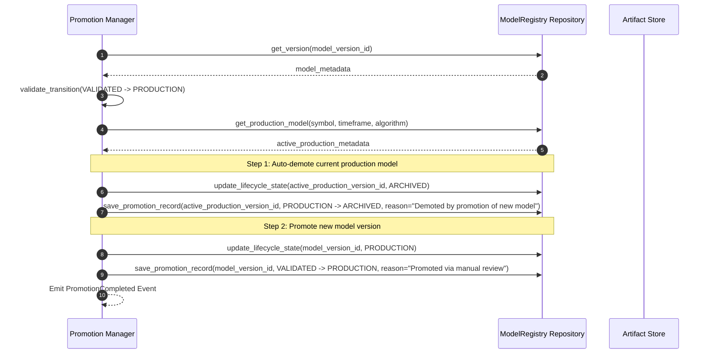

# Sprint 3.6 Design Specification: Model Registry Architecture (Design Revision)

**Status**: PROPOSED (Ready for Final Architecture Audit)  
**Role**: Principal Quant Architect  
**Engineering Contract ID**: MoroQuant-Sprint-3.6-Contract-v2.0  
**Target Implementation Agent**: Claude Code  

---

## 1. Executive Summary & Purpose

The purpose of this design revision is to refine the **Model Registry** architecture to support highly decoupled entity schemas, immutable promotion event streams, standard artifact bundles, and robust composite fingerprints. This design enforces complete auditability, mathematical reproducibility, and structured lifecycle gatekeeping without sacrificing system flexibility or introducing circular dependencies.

---

## 2. Registry Responsibilities & Boundaries

The Model Registry serves as the Single Source of Truth (SSoT) for all trained quantitative models:
1. **Single Source of Truth**: All model weights, serialization schemas, hyperparameters, and lineage identifiers must be retrievable from a single unified access point.
2. **Decoupled Aggregate Design**: Separate structural identification, versioning, heavy binary artifacts, evaluation benchmarks, and promotion logs into isolated, immutable database entities.
3. **Reproducibility Validation**: Maintain strict environmental tracking and composite signatures to allow exact retraining and target validation.

---

## 3. Decoupled Entity Model & Aggregate Boundaries

To prevent relational tables from growing too large, we refactor the data model into five distinct, specialized entities. Each entity is immutable once created.

```
+-----------------------------------------------------------------------------------+
| Model Registry Aggregate Root                                                     |
|                                                                                   |
|  [ Model ]                                                                        |
|      │                                                                            |
|      ▼ (1:N)                                                                      |
|  [ ModelVersion ]                                                                 |
|      ├─────────────────────────┼───────────────────────────┼───────────────────┐  |
|      ▼ (1:1)                   ▼ (1:1)                     ▼ (1:N)             │  |
|  [ ArtifactMetadata ]     [ EvaluationResult ]      [ PromotionRecord ]        │  |
|                                                                                ▼ (1:1)
|                                                                         [ ModelLineage ]
+-----------------------------------------------------------------------------------+
```

### Aggregate Boundaries & Ownership
* **Model (Root)**: Represents a logical trading strategy family (e.g., `BTCUSD_Trend_Follower`). It owns the global identification and metadata.
* **ModelVersion**: Represents a specific trained instance. It owns the semantic version string, current state, and the immutable lineage mapping references.
* **ArtifactMetadata**: Owned by `ModelVersion`. It manages file storage metadata (disk paths, composite hashes, size constraints, and Unix permissions).
* **EvaluationResult**: Owned by `ModelVersion`. It manages metric scorecards (Sharpe, ECE, Brier, drawdown) and auditor review details.
* **PromotionRecord**: Owned by `ModelVersion`. It represents an immutable event log entry in the lifecycle chain.

### Extensibility Benefits
By decomposing the registry:
* **Separation of Concerns**: Changes to evaluation criteria (e.g., adding Sortino or Brier metrics) only affect `EvaluationResult` tables, leaving versioning logic untouched.
* **Storage Independence**: The `ArtifactMetadata` entity can evolve to support remote storage URIs (S3/MinIO) without impacting model promotion mechanics.
* **Audit Trail Preservation**: `PromotionRecord` tables grow append-only, preserving chronological history even as model versions transition states.

---

## 4. Immutable Database Schemas

### 1. Table: `models`
```sql
CREATE TABLE models (
    model_id VARCHAR(64) PRIMARY KEY,
    name VARCHAR(255) NOT NULL,
    description TEXT,
    created_at TIMESTAMP NOT NULL DEFAULT CURRENT_TIMESTAMP
);
```

### 2. Table: `model_versions`
```sql
CREATE TABLE model_versions (
    model_version_id VARCHAR(128) PRIMARY KEY,
    model_id VARCHAR(64) NOT NULL,
    version VARCHAR(32) NOT NULL,
    lifecycle_state VARCHAR(32) NOT NULL CHECK(lifecycle_state IN ('DRAFT', 'CANDIDATE', 'VALIDATED', 'PRODUCTION', 'ARCHIVED')),
    composite_fingerprint VARCHAR(64) NOT NULL UNIQUE,
    created_at TIMESTAMP NOT NULL DEFAULT CURRENT_TIMESTAMP,
    FOREIGN KEY (model_id) REFERENCES models(model_id)
);
```

### 3. Table: `model_lineage`
```sql
CREATE TABLE model_lineage (
    model_version_id VARCHAR(128) PRIMARY KEY,
    snapshot_id VARCHAR(64) NOT NULL,
    dataset_id VARCHAR(64) NOT NULL,
    feature_dataset_id VARCHAR(64) NOT NULL,
    experiment_id VARCHAR(64) NOT NULL,
    run_id VARCHAR(64) NOT NULL,
    FOREIGN KEY (model_version_id) REFERENCES model_versions(model_version_id)
);
```

### 4. Table: `model_artifacts`
```sql
CREATE TABLE model_artifacts (
    model_version_id VARCHAR(128) PRIMARY KEY,
    bundle_path TEXT NOT NULL,
    manifest_checksum VARCHAR(64) NOT NULL,
    size_bytes BIGINT NOT NULL,
    permissions VARCHAR(10) NOT NULL,
    is_frozen INTEGER NOT NULL DEFAULT 0 CHECK(is_frozen IN (0, 1)),
    FOREIGN KEY (model_version_id) REFERENCES model_versions(model_version_id)
);
```

### 5. Table: `model_evaluations`
```sql
CREATE TABLE model_evaluations (
    model_version_id VARCHAR(128) PRIMARY KEY,
    sharpe_ratio REAL NOT NULL,
    max_drawdown REAL NOT NULL,
    ece REAL NOT NULL,
    brier_score REAL NOT NULL,
    win_rate REAL NOT NULL,
    profit_factor REAL NOT NULL,
    sortino_ratio REAL NOT NULL,
    trade_count INTEGER NOT NULL,
    is_approved INTEGER NOT NULL CHECK(is_approved IN (0, 1)),
    approved_by VARCHAR(64),
    approved_at TIMESTAMP,
    FOREIGN KEY (model_version_id) REFERENCES model_versions(model_version_id)
);
```

### 6. Table: `promotion_history`
```sql
CREATE TABLE promotion_history (
    promotion_id VARCHAR(64) PRIMARY KEY,
    model_version_id VARCHAR(128) NOT NULL,
    previous_state VARCHAR(32) NOT NULL,
    new_state VARCHAR(32) NOT NULL,
    promoted_by VARCHAR(64) NOT NULL,
    promoted_at TIMESTAMP NOT NULL DEFAULT CURRENT_TIMESTAMP,
    promotion_reason TEXT,
    approval_reference VARCHAR(128),
    FOREIGN KEY (model_version_id) REFERENCES model_versions(model_version_id)
);
```

---

## 5. Promotion History & Event Sourcing

Instead of updating mutable columns (`promoted_at`, `promoted_by`) inside the `model_versions` table, this design enforces an append-only transaction ledger using the `promotion_history` entity.

### Event Sourcing Benefits
* **Complete Audit Trail**: Retains every transition step, allowing security audits to reconstruct who promoted, validated, or archived a model.
* **Chronological Timeline**: Supports calculating metrics like "average time a model spends in CANDIDATE state" or "frequency of rollbacks".

### Rollback Behavior (Never Overwritten)
When rolling back a faulty model:
1. The faulty model's state in `model_versions` transitions to `ARCHIVED`.
2. A new `PromotionHistory` record is written:
   * `previous_state` = `PRODUCTION`
   * `new_state` = `ARCHIVED`
   * `promotion_reason` = `"Rollback triggered due to execution slippage spike."`
3. The designated rollback champion model is promoted to `PRODUCTION`, generating its own `PromotionHistory` record.
4. **Historical records are never mutated or deleted.**

---

## 6. Artifact Bundle Design

Rather than registering a single file (`model.json`), the `ArtifactStore` manages standardized model directories structured as **Artifact Bundles**.

### Bundle Directory Structure
```
/storage/models/[model_version_id]/
├── model.bin                 # Platform-specific model weights (PyTorch, XGBoost binary, ONNX)
├── metadata.json             # Hyperparameters, structural topology, target symbols
├── manifest.json             # SHA-256 fingerprint mappings for every file in the directory
├── feature_importance.json   # Internal model feature importances
├── calibration.json          # Probabilistic bin-level calibration statistics
├── thresholds.json           # Signal generation decision thresholds
├── training_metrics.json     # Epoched loss tables, validation score history
├── training_log.json         # Raw stdout/stderr execution text from the trainer
└── environment.json          # Python version, requirements.txt lock state, CUDA version, OS details
```

### Future Extensibility
* **Explainability (SHAP)**: Explanations are written to `/storage/models/[model_version]/shap_values.parquet` or `shap_summary.png`.
* **Cross-Platform Exports**: Compiled runtimes can write exports like `model.onnx`, `model.pt` (TorchScript), or `model.pb` (TensorFlow) directly to the bundle subdirectory before freezing.
* **Bundle-Level API**: The `ArtifactStore` reads and writes the folder atomically. Freezing locks the entire directory recursively using `chmod -R 444`.

---

## 7. Composite Checksum & Reproducibility Guarantee

To guarantee that models are mathematically reproducible and to prevent silent data corruption or tampering, the registry introduces the `CompositeFingerprint`.

### Fingerprint Calculation
The `ChecksumService` calculates a nested SHA-256 signature using the following formula:

$$\text{CompositeFingerprint} = \text{SHA256}(\text{BinaryHash} + \text{ParamHash} + \text{DataHash} + \text{FeatureHash} + \text{EnvHash})$$

Where:
* **BinaryHash**: SHA-256 hash of the serialized `model.bin` file.
* **ParamHash**: SHA-256 of the sorted, serialized JSON hyperparameters.
* **DataHash**: The immutable `DatasetSnapshot` fingerprint hash.
* **FeatureHash**: The immutable `FeatureSnapshot` fingerprint hash.
* **EnvHash**: SHA-256 of sorted environmental properties (Git commit hash, Python packages list, framework versions).

### Tamper Detection
Any change to training configs, input data, or output weights changes the `CompositeFingerprint`. The registry verifies this signature at execution time. If the on-disk checksum does not match the database record, the loading engine blocks execution.

---

## 8. Registry Events Contract

To support future distributed architectures, audit log systems, and pub/sub message brokers, the registry defines the following event schemas:

```typescript
interface ModelRegistered {
  eventId: string;
  timestamp: string;
  modelId: string;
  symbol: string;
  algorithm: string;
}

interface CandidateCreated {
  eventId: string;
  timestamp: string;
  modelVersionId: string;
  compositeFingerprint: string;
  runId: string;
}

interface ValidationPassed {
  eventId: string;
  timestamp: string;
  modelVersionId: string;
  reviewer: string;
  sharpeRatio: number;
}

interface PromotionCompleted {
  eventId: string;
  timestamp: string;
  modelVersionId: string;
  previousState: string;
  newState: string;
  promoter: string;
  reason: string;
}

interface RollbackCompleted {
  eventId: string;
  timestamp: string;
  demotedVersionId: string;
  promotedVersionId: string;
  operator: string;
}

interface Archived {
  eventId: string;
  timestamp: string;
  modelVersionId: string;
  reason: string;
}
```

---

## 9. Sequence & Flow Diagrams

### Unified Promotion & Rollback Flow
The state change sequence when promoting a new champion model and handling automated demotions:



---

## 10. Future Compatibility & Adaptations

The registry's architecture remains compatible with future systems without redesigning core structures:

* **Optuna**: Handles multi-parameter searches by writing `DRAFT` versions into the registry database. Non-optimal models are pruned (deleted) or archived, while the best sweep iteration transitions to `CANDIDATE`.
* **Walk-Forward Partitioning**: Supported by registering multiple `EvaluationResult` entries associated with different time-partition indices for a single `ModelVersion`.
* **Champion-Challenger (A/B Testing)**: Standardized by mapping routing configurations at the load balancer or executor level. The registry registers both models as `PRODUCTION`. The production status is extended to include dynamic labels (`PRODUCTION_CHAMPION`, `PRODUCTION_CHALLENGER`).
* **Ensemble Models**: Handled by registering the ensemble version as a distinct entity where `model_lineage` references multiple child `model_version_id`s in a sub-table mapping.
* **Remote Artifact Storage**: The `ArtifactStore` can read and write files using remote protocols (e.g., `s3://`, `minio://`) by changing the `bundle_path` parameter from a file system path to a URL pattern.

---

## 11. Risk & Mitigation Analysis

| Risk | Impact | Mitigation Strategy |
| :--- | :--- | :--- |
| **Model Weight Tampering** | High | Calculate composite checksums at load time. Lock files to read-only status recursively (`chmod -R 444`). |
| **Data Leakage During Validation** | High | Verify validation datasets match the fingerprints recorded in `model_lineage`. |
| **Database/Filesystem Drift** | Medium | Use atomic transactions. Ensure files are written successfully before committing metadata. |

---

## 12. Definition of Done (DoD)

* [x] Design specification updated and saved to `docs/sprints/Sprint-3.6-ModelRegistry-Design.md`.
* [x] Entity separation model designed.
* [x] Promotion history schemas and rollback logic specified.
* [x] Artifact bundle directories structured.
* [x] Composite checksum formula designed.
* [x] Zero code implementation or database migrations executed.
* [x] Sandbox updated via codebase graph indexing.
