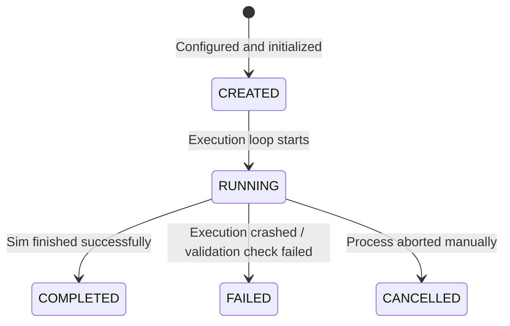
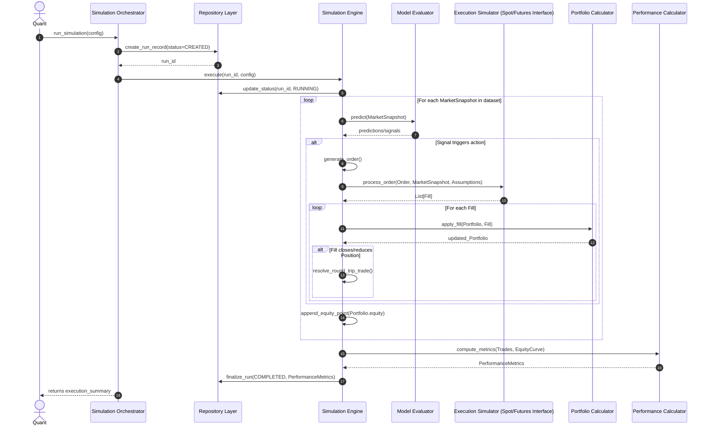
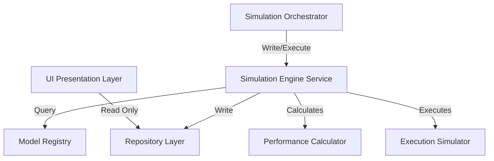

# Sprint 3.7A Design Specification: Simulation Framework & Domain Architecture (Revision 1)

**Status**: PROPOSED (Ready for Final Architecture Audit)  
**Role**: Principal Quant Architect  
**Engineering Contract ID**: MoroQuant-Sprint-3.7A-Contract-v1.1  
**Target Implementation Agent**: Claude Code  

---

## 1. Executive Summary & Simulation Framework Vision

Quantitative modeling at MoroQuant requires a generalized, high-performance, and mathematically deterministic environment for evaluating strategy hypotheses. While previous designs treated backtesting as a stand-alone, isolated script, this revision establishes the **MoroQuant Simulation Framework**. 

Under this vision, **Backtesting** is simply one implementation built on top of a unified simulation core. This core provides immutable domain models, deterministic execution components, and isolated state structures that can be reused directly by other simulation types:

```
                  +-----------------------------------+
                  |    MoroQuant Simulation Core      |
                  |  (Domain Models, State, Engines)  |
                  +-----------------------------------+
                                    │
       ┌──────────────┬─────────────┼─────────────┬──────────────┐
       ▼              ▼             ▼             ▼              ▼
+───────────+  +────────────+  +──────────+  +───────────+  +──────────+
| Historical|  | Live Replay|  |  Paper   |  |   Walk    |  |  Monte   |
| Backtest  |  |   Engine   |  | Trading  |  |  Forward  |  |  Carlo   |
+───────────+  +────────────+  +──────────+  +───────────+  +──────────+
```

### Future Framework Modules
1. **Replay Engine**: Replays transaction-by-transaction exchange data under strict latency profiles.
2. **Paper Trading**: Drives identical strategy binaries in pseudo-live regimes, connecting to live feed snapshots instead of frozen files.
3. **Walk Forward**: Automates consecutive periods of sliding in-sample training and out-of-sample backtesting runs.
4. **Monte Carlo**: Randomizes fill sequence, slippage profiles, and tick paths to compute robust probability envelopes.
5. **Stress Testing**: Simulates historical regimes (e.g., Black Thursday, flash crashes) by injecting extreme volatility and spread spikes.

---

## 2. Architectural Revisions & Rationale

### Revision 1: Separate Performance Metrics
* **Change**: Refactored `BacktestReport` to be a reporting-only aggregate. Extracted all quantitative scoring arrays into a dedicated immutable aggregate: `PerformanceMetrics`.
* **Rationale**: Decouples the reporting presentation layer (file system paths, markdown summaries) from the pure mathematical output metrics. Allows the `PerformanceMetrics` aggregate to be reused across backtests, Monte Carlo simulations, stress tests, and paper trading without duplicating reporting structures.

### Revision 2: Execution Lifecycle Extension
* **Change**: Replaced the simplified `Order -> Trade` cycle with a complete `Order -> Fill -> Position -> Trade` sequence.
* **Rationale**: Correctly models real-world market execution mechanics. A single order can result in multiple partial fills (`Fill`). Accumulating fills dynamically changes holding sizing and averages (`Position`). Closing a position (or matching opposing fills via FIFO/LIFO rules) creates historical round-trips (`Trade`) for holding time and win rate calculation.

### Revision 3: Execution Assumptions Object
* **Change**: Created `ExecutionAssumption` as a dedicated value object, removing embedded variables (slippage, commission, etc.) from the parent `BacktestConfig`.
* **Rationale**: Encourages reuse. Execution profiles (e.g., "Binance Futures VIP 3 Maker/Taker", "Coinbase Spot Retail") can be managed as pre-configured, immutable domain records and plugged into different simulation contexts.

### Revision 4: Generalized Portfolio Model
* **Change**: Expanded the `Portfolio` class to support derivatives (futures, margin, options) by adding specific risk ledger parameters: `used_margin`, `free_margin`, `buying_power`, `leverage`, and `exposure`.
* **Rationale**: Unifies Spot and Futures portfolio state tracking. Spot portfolios use a simple cash asset model (leverage = 1, used_margin = 0), while Futures portfolios use margin leverage ratios to calculate margin requirements and liquidation thresholds under the same interface.

### Revision 5: Execution Simulator Abstraction
* **Change**: Renamed all broker simulation occurrences to `Execution Simulator` and converted it into a pure interface.
* **Rationale**: Prevents hardcoding exchange logic. The engine interacts with an `IExecutionSimulator` interface, allowing the concrete class to be swapped depending on the asset class (e.g., `SpotExecutionSimulator`, `FuturesExecutionSimulator`) without modifying the orchestrator.

### Revision 6: Market Snapshot Aggregate
* **Change**: Replaced raw tick streaming configurations with the `MarketSnapshot` aggregate.
* **Rationale**: Decouples data structure representation. The framework supports both bar-level OHLC representations, order book depth arrays (L2/L3), and individual trade ticks, processing them under a unified snapshot format.

### Revision 7: Performance Metrics Expansion
* **Change**: Expanded `PerformanceMetrics` to include 25 future-ready quantitative stats (e.g., Calmar, Omega, Kelly, Ulcer Index, VaR, CVaR).
* **Rationale**: Establishes a standardized, comprehensive analytical interface for strategy verification and optimization.

---

## 3. Aggregate Model & UML Diagram

All entities and value objects are modeled as **immutable python dataclasses** to guarantee state safety during execution.

```
+----------------------------------------------------------------------------------------------------------------------------------------------------------+
| Simulation Core Aggregates                                                                                                                               |
|                                                                                                                                                          |
|  [ MarketSnapshot ] (Value Object representing the state of the market at time t)                                                                        |
|                                                                                                                                                          |
|  [ ExecutionAssumption ] (Value Object holding commission, slippage, and fee properties)                                                                 |
|                                                                                                                                                          |
|  [ BacktestConfig ] (Configuring aggregate pointing to DatasetSnapshot and ExecutionAssumption)                                                          |
|                                                                                                                                                          |
|  [ Order ] ──────> [ Fill ] (1:N relationship, allowing partial execution logs)                                                                          |
|                                                                                                                                                          |
|  [ Position ] (Represents active exposure per symbol, tracking margin and entry metrics)                                                                 |
|                                                                                                                                                          |
|  [ Portfolio ] (Aggregate holding cash, equity, margins, buying power, and a map of active Positions)                                                    |
|                                                                                                                                                          |
|  [ Trade ] (Represents a completed round-trip transaction, linking matching fills)                                                                      |
|                                                                                                                                                          |
|  [ PerformanceMetrics ] (Aggregate containing all quantitative scorecards)                                                                               |
|                                                                                                                                                          |
|  [ BacktestReport ] (Reporting aggregate referencing PerformanceMetrics and report manifests)                                                           |
+----------------------------------------------------------------------------------------------------------------------------------------------------------+
```

### Python Interface Specifications

```python
from dataclasses import dataclass, field
from typing import Dict, List, Optional
from datetime import datetime
from enum import Enum

class OrderSide(Enum):
    BUY = "BUY"
    SELL = "SELL"

class OrderType(Enum):
    MARKET = "MARKET"
    LIMIT = "LIMIT"
    STOP = "STOP"

class OrderStatus(Enum):
    PENDING = "PENDING"
    PARTIALLY_FILLED = "PARTIALLY_FILLED"
    FILLED = "FILLED"
    CANCELLED = "CANCELLED"
    REJECTED = "REJECTED"

@dataclass(frozen=True)
class MarketSnapshot:
    """Represents a point-in-time state of the market. Can represent OHLC, Ticks, or Orderbooks."""
    timestamp: datetime
    symbol: str
    mid_price: float
    bid: Optional[float] = None
    ask: Optional[float] = None
    spread: Optional[float] = None
    volume: Optional[float] = None
    open_interest: Optional[float] = None
    funding_rate: Optional[float] = None

@dataclass(frozen=True)
class ExecutionAssumption:
    """Immutable execution parameters representing exchange environments."""
    commission: float           # Fixed exchange fee per transaction
    maker_fee: float            # Maker fee percentage (e.g. 0.0002)
    taker_fee: float            # Taker fee percentage (e.g. 0.0005)
    slippage: float             # Fixed slippage model rate (e.g. 0.0001)
    latency: int                # Execution latency simulation (in milliseconds)
    spread_model: str           # e.g., "FIXED", "DYNAMIC_HISTORICAL"
    funding_fee: float          # Periodic funding rate adjustment factor
    borrow_fee: float           # Margin interest rate for leveraged positions

@dataclass(frozen=True)
class BacktestConfig:
    """Read-only backtest simulation setup."""
    symbol_universe: List[str]
    timeframe: str
    start_time: datetime
    end_time: datetime
    initial_capital: float
    execution_assumption: ExecutionAssumption
    model_version_id: str
    dataset_snapshot_id: str
    config_hash: str

@dataclass(frozen=True)
class Order:
    """The intent of a strategy to buy/sell."""
    order_id: str
    backtest_run_id: str
    symbol: str
    side: OrderSide
    order_type: OrderType
    quantity: float
    price: Optional[float]
    status: OrderStatus
    created_at: datetime

@dataclass(frozen=True)
class Fill:
    """A transaction fill event representing execution of an Order."""
    fill_id: str
    order_id: str
    backtest_run_id: str
    symbol: str
    side: OrderSide
    quantity: float
    price: float
    fee: float
    slippage: float
    executed_at: datetime

@dataclass(frozen=True)
class Position:
    """Active exposure profile. Supports both long (qty > 0) and short (qty < 0)."""
    symbol: str
    quantity: float
    average_entry_price: float
    unrealized_pnl: float
    realized_pnl: float
    leverage: float
    required_margin: float
    last_updated_at: datetime

@dataclass(frozen=True)
class Portfolio:
    """State management tracker. Spot portfolios share this structure with leverage=1."""
    portfolio_id: str
    cash: float
    equity: float
    used_margin: float
    free_margin: float
    reserved_margin: float
    buying_power: float
    leverage: float
    exposure: float
    unrealized_pnl: float
    realized_pnl: float
    positions: Dict[str, Position] = field(default_factory=dict)

@dataclass(frozen=True)
class Trade:
    """A completed round-trip transaction (matched entry and exit fills)."""
    trade_id: str
    backtest_run_id: str
    symbol: str
    quantity: float
    entry_price: float
    exit_price: float
    realized_pnl: float
    holding_time_seconds: float
    entered_at: datetime
    exited_at: datetime

@dataclass(frozen=True)
class PerformanceMetrics:
    """Immutable aggregate of statistical scores."""
    # Classic stats
    sharpe: float
    sortino: float
    calmar: float
    omega: float
    sterling: float
    mar: float
    profit_factor: float
    expectancy: float
    kelly: float
    recovery_factor: float
    ulcer_index: float
    tail_ratio: float
    skew: float
    kurtosis: float
    cagr: float
    alpha: float
    beta: float
    information_ratio: float
    tracking_error: float
    var: float              # Value at Risk
    cvar: float             # Conditional Value at Risk
    # Frequency metrics
    trade_count: int
    win_rate: float
    average_trade: float
    median_trade: float
    max_drawdown: float
    exposure_time: float    # Percentage of time spent in active positions
    average_holding_time: float
    brier_score: Optional[float]
    ece: Optional[float]
    profit_capture_ratio: float

@dataclass(frozen=True)
class BacktestReport:
    """A reporting aggregate wrapper representing frozen filesystem reports."""
    report_id: str
    backtest_run_id: str
    metrics: PerformanceMetrics
    manifest_checksum: str
    bundle_path: str
    created_at: datetime
```

---

## 4. Execution Lifecycle & State Machine

A simulation run progresses through the following unified state machine. The state transitions are sequential and immutable:



### Order-to-Trade Lifecycle Transitions
1. **Order Generation**: Strategy generates an `Order` state block based on target predictions.
2. **Execution Simulation**: The `ExecutionSimulator` checks the order against the active `MarketSnapshot`.
3. **Fill Creation**: If execution conditions are met, one or more `Fill` records are emitted (representing partial or full executions).
4. **Position Calculation**: Fills are processed by the portfolio state generator, returning a new `Portfolio` state with updated `cash`, margins, and asset `Positions`.
5. **Trade Resolution**: When a position's exposure size is reduced or inverted, the matching engine generates a `Trade` record representing the realized profit/loss.

---

## 5. Sequence Diagram



---

## 6. Repository & Service Boundaries

```
+---------------------------------------------------------------------------------------------------+
| Boundary Model                                                                                    |
|                                                                                                   |
|  [ Repository Layer ]                                                                             |
|      ├── BacktestRunRepository (Logs config_hash, status, metadata)                               |
|      └── BacktestReportRepository (Writes report bundle directories to disk and sets chmod 444)     |
|                                                                                                   |
|  [ Service Layer ]                                                                                |
|      ├── SimulationEngineService (Orchestrates market snapshot streaming and execution)           |
|      ├── IExecutionSimulator (Interface validating Spot, Futures, Margin, and Options simulators) |
|      └── PerformanceCalculator (Calculates 25+ statistical metrics)                              |
+---------------------------------------------------------------------------------------------------+
```

### Execution Simulator Interface
```python
class IExecutionSimulator:
    """Abstract simulator decoupling specific exchange or asset class mechanisms."""
    
    def simulate_order(self, order: Order, snapshot: MarketSnapshot, assumption: ExecutionAssumption) -> List[Fill]:
        """Verify fill conditions and return emitted transactions."""
        pass
        
    def calculate_margin(self, symbol: str, quantity: float, price: float, leverage: float) -> float:
        """Verify collateral requirements before execution."""
        pass
```

---

## 7. Dependency Rules

To prevent architectural drift and circular references, this design enforces strict dependency bounds:



* **Simulator Independence**: Concrete implementations of `IExecutionSimulator` must not query database repositories or modify session logs.
* **Orchestration Isolation**: The `SimulationEngineService` manages in-memory execution loops, delegating state storage and database modifications to the calling orchestrator.

---

## 8. Definition of Done (DoD)

- [x] Design specification updated in [`docs/sprints/Sprint-3.7A-Backtesting-Domain-Design.md`](file:///home/zafka/trade-dashboard/docs/sprints/Sprint-3.7A-Backtesting-Domain-Design.md).
- [x] Defined separate `PerformanceMetrics` aggregate to decouple it from `BacktestReport`.
- [x] Refactored execution lifecycle to `Order -> Fill -> Position -> Trade`.
- [x] Created `ExecutionAssumption` value object and extracted parameters from configuration blocks.
- [x] Expanded the `Portfolio` model to support futures/leverage metrics.
- [x] Renamed and designed the `Execution Simulator` abstraction interface.
- [x] Defined the `MarketSnapshot` aggregate supporting orderbook/bar-level abstraction.
- [x] Expanded `PerformanceMetrics` to include 25 future-ready statistics.
- [x] Updated architecture terminology from Backtesting to the MoroQuant Simulation Framework.
- [x] Run `graphify update .` to update graph indexes.
- [x] Verified zero codebase code changes or SQL migrations executed.
- [x] Prepared for final architecture audit review.
