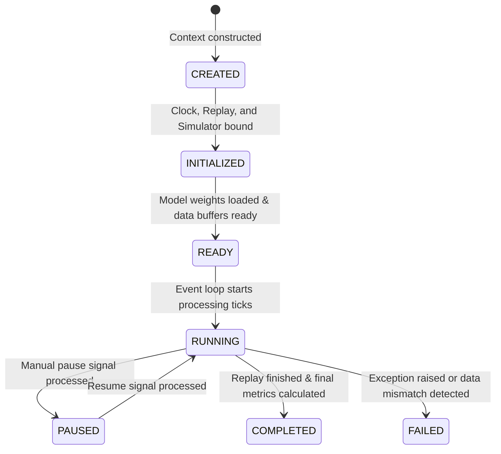
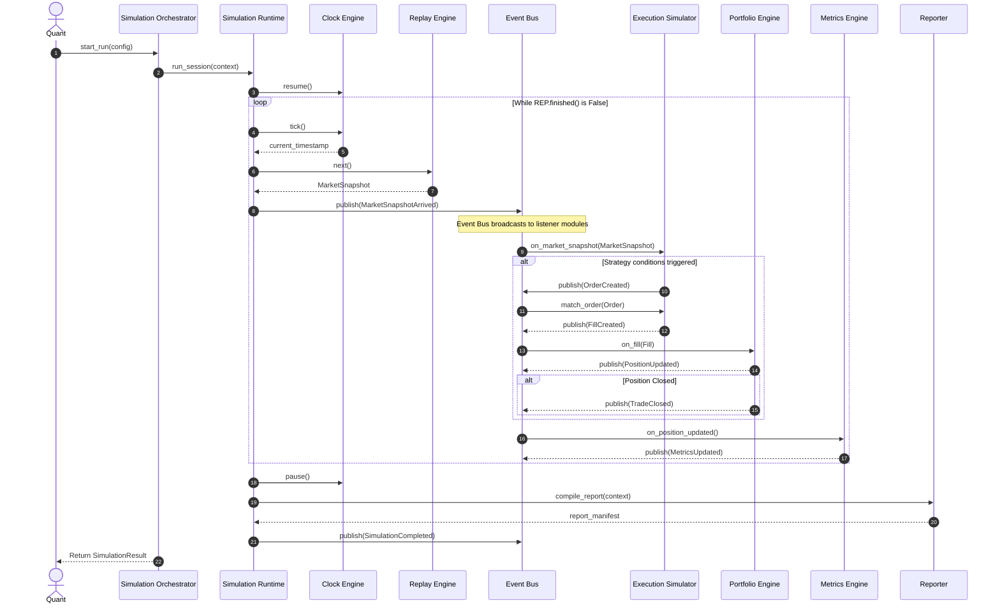
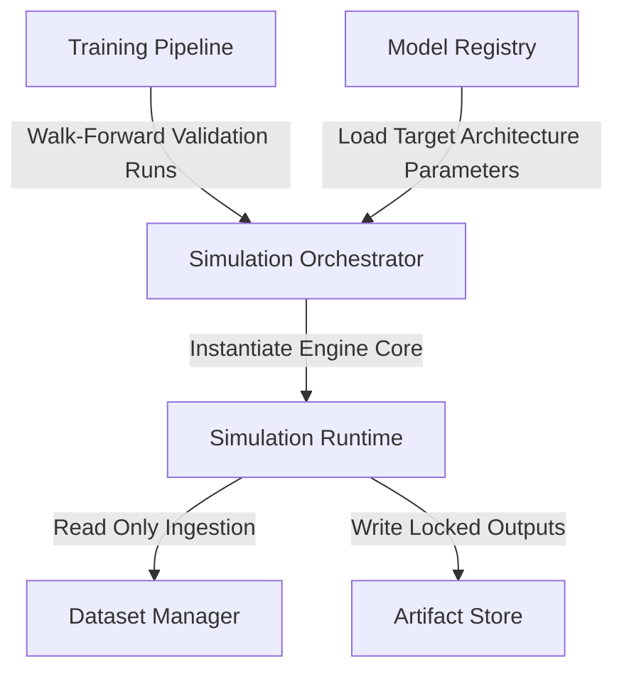
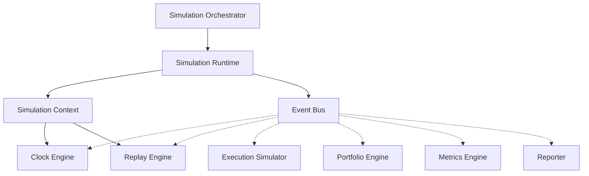

# Sprint 3.7B Design Specification: Simulation Engine Core (Design Only)

**Status**: PROPOSED (Ready for Final Architecture Audit)  
**Role**: Principal Quant Architect  
**Engineering Contract ID**: MoroQuant-Sprint-3.7B-Contract-v1.0  
**Target Implementation Agent**: Claude Code  

---

## 1. Executive Summary & Purpose

The purpose of this specification is to define the **Simulation Engine Core** that serves as the universal execution runtime for the MoroQuant Simulation Framework. Under `ADR-024` and the preceding architectures, the core transitions from a simple backtest runner to an event-driven, deterministic, and asset-agnostic state machine. 

This engine is designed to run in multiple environments (Historical Backtesting, Live Paper Trading, Walk-Forward Validation, Monte Carlo Sweeps, Stress Testing, and Future Live Shadow Trading) without modifying its core state transitions, scheduling, or event-routing mechanics.

---

## 2. Core Architectural Rationale

1. **Decoupled Clock and Replay Engines**: Decoupling time advancement (`SimulationClock`) from data ingestion (`ReplayEngine`) allows the engine to run in simulated historical time (seeking, ticking, rewinding) or bind directly to real-world live market feeds (where time tick events come from the system clock and data arrives via WebSocket streams).
2. **Event-Driven, Pure Functional Core**: The runtime operates by receiving events and calculating new states. Components emit immutable events to a local `EventBus` that propagates transitions, ensuring complete determinism. If the same events are replayed with the same seed, the resulting portfolio state and metrics are identical down to the float bit representation.
3. **Storage and Infrastructure Separation**: The core does not access SQLite databases or write files. Data reading is abstracted via the `ReplayEngine` interface, and persistence is managed by the external orchestrator or reporter, preserving the "Functional Core, Imperative Shell" model.

---

## 3. Core Components

The framework is divided into nine decoupled, single-responsibility components:

```
+-------------------------------------------------------------------------------+
| Simulation Engine Core                                                        |
|                                                                               |
|                   [ Simulation Orchestrator ]                                 |
|                               │                                               |
|                   [ Simulation Runtime ]                                      |
|                               │                                               |
|       ┌──────────────┬────────┼────────┬──────────────┬──────────────┐        |
|       ▼              ▼                 ▼              ▼              ▼        |
|  [Clock Engine] [Replay Engine]   [Event Bus]  [Execution Sim] [Portfolio]    |
|                                        │                             │        |
|                                        ▼                             ▼        |
|                                 [Metrics Engine]                [Reporter]    |
+-------------------------------------------------------------------------------+
```

1. **Simulation Orchestrator**: The outer shell. It boots execution environments, resolves configurations, loads datasets, manages SQLite lifecycle transactions, and coordinates file-writing steps.
2. **Simulation Runtime**: The inner controller. It runs the simulation event loop, monitors clocks, pulls data from the replay engine, and processes the terminal state.
3. **Clock Engine**: Manages time advancement and synchronization.
4. **Replay Engine**: An abstract iterator streaming historical snapshots or binding to real-time orderbook/trade queues.
5. **Execution Simulator**: Validates orders against the current market snapshot and generates transaction fills.
6. **Portfolio Engine**: Performs pure functional state updates on cash, margin ledgers, asset holdings, and unrealized/realized PnL.
7. **Metrics Engine**: Aggregates fills and equity points to update 25+ risk-adjusted metrics dynamically.
8. **Event Bus**: The routing broker that handles registering listeners and publishing event payloads inside the runtime process.
9. **Reporter**: Generates final markdown and structured JSON outputs at the end of the simulation.

---

## 4. Domain Aggregates & Interfaces

All models are modeled as **immutable python dataclasses** to guarantee state safety during execution.

```python
from dataclasses import dataclass, field
from typing import Dict, List, Optional, Any, Callable
from datetime import datetime
from enum import Enum
import uuid

class LifecycleState(Enum):
    CREATED = "CREATED"
    INITIALIZED = "INITIALIZED"
    READY = "READY"
    RUNNING = "RUNNING"
    PAUSED = "PAUSED"
    COMPLETED = "COMPLETED"
    FAILED = "FAILED"

@dataclass(frozen=True)
class RuntimeMetadata:
    """System and environment audit details."""
    run_id: str
    host_os: str
    python_version: str
    library_versions: Dict[str, str]
    started_at: datetime
    completed_at: Optional[datetime] = None

@dataclass(frozen=True)
class SimulationState:
    """Holds the complete, immutable state snapshot of a running simulation."""
    lifecycle: LifecycleState
    current_time: datetime
    portfolio_equity: float
    order_count: int
    fill_count: int
    position_count: int
    error_message: Optional[str] = None

@dataclass(frozen=True)
class SimulationResult:
    """The frozen output payload returning metrics and reports."""
    run_id: str
    status: LifecycleState
    metadata: RuntimeMetadata
    metrics_summary: Dict[str, Any]
    report_manifest_hash: str
    artifact_paths: List[str]

# --- Core Component Interfaces ---

class SimulationClock:
    """Universal interface for managing simulated or real-time progress."""
    def tick(self, step_ns: int) -> datetime: ...
    def seek(self, target: datetime) -> None: ...
    def rewind(self, target: datetime) -> None: ...
    def pause(self) -> None: ...
    def resume(self) -> None: ...
    def now(self) -> datetime: ...

class ReplayEngine:
    """Iterator contract for historical data files or live WebSocket message queues."""
    def next(self) -> Optional[Any]: ...
    def peek(self) -> Optional[Any]: ...
    def seek(self, target: datetime) -> None: ...
    def finished(self) -> bool: ...
    def rewind(self) -> None: ...

@dataclass(frozen=True)
class SimulationContext:
    """The immutable parent container holding references to active engine components."""
    context_id: str
    clock: SimulationClock
    replay: ReplayEngine
    portfolio: Any                  # Current Portfolio aggregate instance
    execution: Any                  # IExecutionSimulator instance
    metrics: Any                    # PerformanceMetrics accumulator
    model_version_id: str
    run_metadata: RuntimeMetadata
    configuration: Dict[str, Any]
```

---

## 5. Event-Driven Architecture

The runtime communicates internally using **immutable events**. State changes are published to a synchronous `EventBus`:

### Immutable Event Types
```python
@dataclass(frozen=True)
class SimulationEvent:
    event_id: str = field(default_factory=lambda: str(uuid.uuid4()))
    timestamp: datetime = field(default_factory=datetime.now)

@dataclass(frozen=True)
class MarketSnapshotArrived(SimulationEvent):
    snapshot: Any  # MarketSnapshot instance

@dataclass(frozen=True)
class SignalGenerated(SimulationEvent):
    symbol: str
    prediction_score: float
    direction: str  # BUY/SELL/HOLD

@dataclass(frozen=True)
class OrderCreated(SimulationEvent):
    order: Any  # Order instance

@dataclass(frozen=True)
class FillCreated(SimulationEvent):
    fill: Any  # Fill instance

@dataclass(frozen=True)
class PositionUpdated(SimulationEvent):
    position: Any  # Position instance

@dataclass(frozen=True)
class TradeClosed(SimulationEvent):
    trade: Any  # Trade instance

@dataclass(frozen=True)
class MetricsUpdated(SimulationEvent):
    metrics: Any  # PerformanceMetrics instance

@dataclass(frozen=True)
class SimulationCompleted(SimulationEvent):
    run_id: str
    result: SimulationResult

@dataclass(frozen=True)
class SimulationFailed(SimulationEvent):
    run_id: str
    error_message: str
    traceback: str
```

---

## 6. Simulation Runtime Lifecycle State Machine



### Transition Specifications

| Source State | Destination State | Trigger | Preconditions / Actions |
| :--- | :--- | :--- | :--- |
| `None` | `CREATED` | `SimulationOrchestrator.create()` | Generate `run_id`, construct `SimulationContext`, set status to `CREATED`. |
| `CREATED` | `INITIALIZED` | `SimulationRuntime.initialize()` | Bind Clock and Replay engine interfaces. |
| `INITIALIZED` | `READY` | `SimulationRuntime.prepare()` | Retrieve model parameters from the `ModelRegistry`, verify dataset snapshots, check initial capital. |
| `READY` | `RUNNING` | `SimulationRuntime.start()` | Set clock running, start pulling event messages. |
| `RUNNING` | `PAUSED` | `SimulationClock.pause()` | Halt event loop polling, maintain current time timestamp. |
| `PAUSED` | `RUNNING` | `SimulationClock.resume()` | Resume event loop polling. |
| `RUNNING` | `COMPLETED` | Data Exhaustion | Replay stream finishes, compile `PerformanceMetrics`, lock artifacts via `Reporter`. |
| `RUNNING` | `FAILED` | Exception | Capture error logs, populate `error_message`, transition state to `FAILED`. |

---

## 7. Sequence Diagram



---

## 8. Integration Points



### 1. Training Pipeline
* **Walk-Forward Validation**: During training sweeps, the `TrainingPipeline` acts as the `SimulationOrchestrator`, spinning up isolated `SimulationRuntime` instances to validate intermediate model configurations.
* **Optuna Sweeps**: Optuna spawns run contexts, running them to compute out-of-sample metrics (Sharpe, Drawdown) to direct hyperparameter search.

### 2. Model Registry
* **Model Validation**: The runtime pulls model weights and feature definitions directly from the registry `/storage/models/{version_id}/`, checking the manifest hash before beginning simulation inference steps.

---

## 9. Dependency Diagram



---

## 10. Definition of Done (DoD)

- [x] Design specification complete and saved to [`docs/sprints/Sprint-3.7B-Simulation-Engine-Core-Design.md`](file:///home/zafka/trade-dashboard/docs/sprints/Sprint-3.7B-Simulation-Engine-Core-Design.md).
- [x] Defined all core aggregates (`SimulationContext`, `SimulationClock`, `SimulationRuntime`, `SimulationResult`, `SimulationState`, `RuntimeMetadata`).
- [x] Mapped lifecycle state transitions from `CREATED` to `FAILED`.
- [x] Defined programmatic interfaces for `SimulationClock` and `ReplayEngine` methods.
- [x] Detailed event-driven structures and immutable event contracts.
- [x] Created sequence diagram, UML layout, and dependency graph.
- [x] Executed `graphify update .` to update the AST graph database.
- [x] Verified zero codebase code changes or SQL migrations executed.
- [x] Prepared for final architecture audit review.
