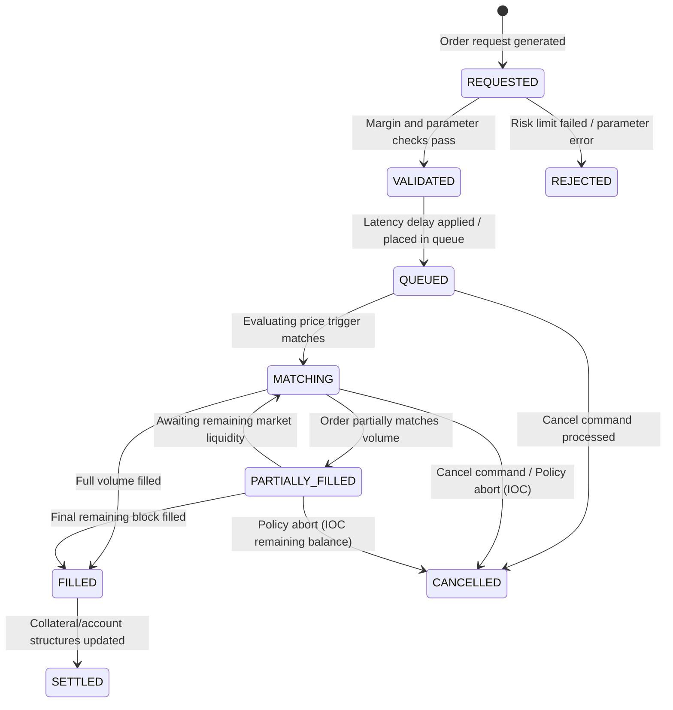
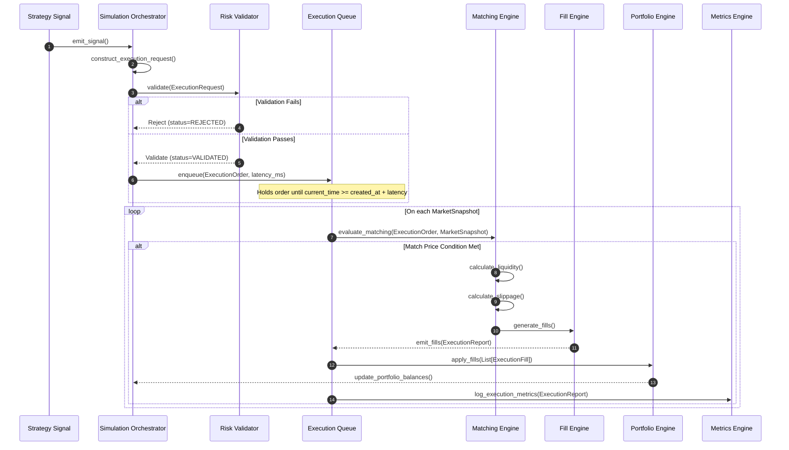

# Sprint 3.7C Design Specification: Execution Simulator (Design Only)

**Status**: PROPOSED (Ready for Final Architecture Audit)  
**Role**: Principal Quant Architect  
**Engineering Contract ID**: MoroQuant-Sprint-3.7C-Contract-v1.0  
**Target Implementation Agent**: Claude Code  

---

## 1. Executive Summary & Purpose

The purpose of this specification is to define the **Execution Simulator** component of the MoroQuant Simulation Framework. The Execution Simulator acts as a pure functional execution layer that maps trading signals and orders into deterministic transaction fills. 

To support seamless transitions from historical simulation to live regimes, the component executes independently of live exchange APIs, broker libraries, or database write queries. By using abstract models for **Slippage, Commission, Latency, and Liquidity**, the simulator enforces mathematical consistency whether processing historical OHLC bars, high-frequency tick replays, or real-time WebSocket orderbooks.

---

## 2. Core Architectural Rationale

1. **Plug-and-Play Simulation Profiles**: Decoupling latency, commission, slippage, and liquidity models into abstract polymorphic interfaces allows researchers to simulate complex market friction parameters. The configuration can be swapped dynamically (e.g., from an "Infinite Liquidity, No Latency" baseline to a "Limited Liquidity, dynamic volume-based slippage, and 50ms random exchange latency" profile) without changing strategy code.
2. **Pure Functional Matching Core**: The matching engine takes the current `ExecutionOrder`, `MarketSnapshot`, and `ExecutionAssumption` states as inputs and returns an immutable list of fills and reports. It maintains no internal state database connections, ensuring that execution sequences can be re-run with exact reproducibility.

---

## 3. Component Hierarchy & Aggregate Definitions

```
+----------------------------------------------------------------------------------------------------+
| Execution Simulator Aggregate Layer                                                                |
|                                                                                                    |
|  [ ExecutionRequest ] (Incoming payload from strategy signal layer)                                |
|        │                                                                                           |
|        ▼                                                                                           |
|  [ ExecutionOrder ] (Aggregated state tracking order type, lifecycle status, policies, and parameters) |
|        │                                                                                           |
|        ├──> [ ExecutionPolicy ] (FOK, IOC, GTC, DAY value objects)                                  |
|        ├──> [ FillPolicy ] (Full Fill, Partial Fill, Reject configurations)                        |
|        │                                                                                           |
|        ▼ (Matching Evaluation outputs)                                                             |
|  [ ExecutionFill ] (Single transaction fill event mapping to matching price and quantity)         |
|        │                                                                                           |
|        ▼                                                                                           |
|  [ ExecutionReport ] (Execution state update summary returned to runtime orchestrator)             |
+----------------------------------------------------------------------------------------------------+
```

### Polymorphic Friction & Simulation Models
* **Slippage Models**: `BaseSlippageModel` -> `FixedSlippage`, `ATRSlippage`, `VolumeSlippage`
* **Commission Models**: `BaseCommissionModel` -> `SpotCommission`, `FuturesCommission`, `CustomCommission`
* **Latency Models**: `BaseLatencyModel` -> `FixedLatency`, `RandomLatency`, `ExchangeLatency`
* **Liquidity Models**: `InfiniteLiquidity` -> `LimitedLiquidity`, `OrderBookLiquidity`

### Python Domain Interfaces

```python
from dataclasses import dataclass, field
from typing import Dict, List, Optional
from datetime import datetime
from enum import Enum

class OrderType(Enum):
    MARKET = "MARKET"
    LIMIT = "LIMIT"
    STOP = "STOP"
    STOP_LIMIT = "STOP_LIMIT"
    TRAILING_STOP = "TRAILING_STOP"

class ExecutionPolicy(Enum):
    FOK = "FOK"  # Fill or Kill
    IOC = "IOC"  # Immediate or Cancel
    GTC = "GTC"  # Good 'Til Cancelled
    DAY = "DAY"  # Good for Day

class FillPolicy(Enum):
    FULL_FILL = "FULL_FILL"
    PARTIAL_FILL = "PARTIAL_FILL"
    REJECT = "REJECT"

class ExecutionLifecycle(Enum):
    REQUESTED = "REQUESTED"
    VALIDATED = "VALIDATED"
    QUEUED = "QUEUED"
    MATCHING = "MATCHING"
    PARTIALLY_FILLED = "PARTIALLY_FILLED"
    FILLED = "FILLED"
    SETTLED = "SETTLED"
    REJECTED = "REJECTED"
    CANCELLED = "CANCELLED"

@dataclass(frozen=True)
class ExecutionRequest:
    """Incoming request generated by the ML signal layer."""
    symbol: str
    side: str  # BUY / SELL
    order_type: OrderType
    quantity: float
    price: Optional[float]
    execution_policy: ExecutionPolicy
    fill_policy: FillPolicy
    stop_price: Optional[float] = None
    trailing_delta: Optional[float] = None
    requested_at: datetime = field(default_factory=datetime.now)

@dataclass(frozen=True)
class ExecutionOrder:
    """Aggregated state tracking order execution parameters."""
    order_id: str
    request: ExecutionRequest
    status: ExecutionLifecycle
    cumulative_filled_qty: float
    average_filled_price: float
    active_price: Optional[float]  # Tracks trailing stops / current thresholds
    created_at: datetime
    updated_at: datetime

@dataclass(frozen=True)
class ExecutionFill:
    """Immutable transaction record representing a filled order segment."""
    fill_id: str
    order_id: str
    symbol: str
    side: str
    quantity: float
    price: float
    commission: float
    slippage: float
    executed_at: datetime

@dataclass(frozen=True)
class ExecutionReport:
    """Update report returned to the orchestrator after a matching cycle."""
    order_id: str
    status: ExecutionLifecycle
    emitted_fills: List[ExecutionFill]
    remaining_quantity: float
    rejection_reason: Optional[str] = None
    timestamp: datetime = field(default_factory=datetime.now)
```

---

## 4. Friction & Execution Interface Contracts

To enforce modular boundaries, friction components inherit from standard abstract interfaces:

```python
class BaseSlippageModel:
    def calculate_slippage(self, order: ExecutionOrder, snapshot: Any) -> float: ...

class FixedSlippage(BaseSlippageModel):
    fixed_bps: float
    
class ATRSlippage(BaseSlippageModel):
    atr_multiplier: float
    atr_value: float

class VolumeSlippage(BaseSlippageModel):
    volume_factor: float

# --- Commission ---

class BaseCommissionModel:
    def calculate_commission(self, quantity: float, price: float, is_maker: bool) -> float: ...

class SpotCommission(BaseCommissionModel):
    fee_pct: float

class FuturesCommission(BaseCommissionModel):
    maker_fee_pct: float
    taker_fee_pct: float

class CustomCommission(BaseCommissionModel):
    calculation_fn: Callable[[float, float, bool], float]

# --- Latency ---

class BaseLatencyModel:
    def get_latency_ms(self) -> int: ...

class FixedLatency(BaseLatencyModel):
    latency_ms: int

class RandomLatency(BaseLatencyModel):
    min_ms: int
    max_ms: int

class ExchangeLatency(BaseLatencyModel):
    network_profile: str

# --- Liquidity ---

class BaseLiquidityModel:
    def get_available_volume(self, price: float, snapshot: Any) -> float: ...

class InfiniteLiquidity(BaseLiquidityModel):
    pass

class LimitedLiquidity(BaseLiquidityModel):
    max_participation_pct: float  # Limit execution to % of bar volume

class OrderBookLiquidity(BaseLiquidityModel):
    orderbook_depth: Dict[float, float]
```

---

## 5. Execution State Machine



---

## 6. Sequence Diagram



---

## 7. Matching Engine Logic Details

*   **Market Orders**: Fills immediately at the `MarketSnapshot` ask price (for Buy orders) or bid price (for Sell orders) plus simulated slippage. If liquidity models restrict volume, market orders are either partially filled or rejected based on the `FillPolicy`.
*   **Limit Orders**: Executed only if the market snapshot's price crosses the target limit price threshold ($Price \le Limit$ for buys, $Price \ge Limit$ for sells).
*   **Stop Orders**: Placed in `QUEUED` state until market price crosses the stop price threshold, which triggers and converts the order into a `Market` order.
*   **Stop Limit Orders**: Crosses the stop threshold and converts into a `Limit` order.
*   **Trailing Stop Orders**: Dynamically updates the trigger price as market price moves in a favorable direction. If the price retraces by the `trailing_delta`, the order triggers.

---

## 8. Definition of Done (DoD)

- [x] Design specification complete and saved to [`docs/sprints/Sprint-3.7C-Execution-Simulator-Design.md`](file:///home/zafka/trade-dashboard/docs/sprints/Sprint-3.7C-Execution-Simulator-Design.md).
- [x] Defined aggregates and value objects (`ExecutionRequest`, `ExecutionOrder`, `ExecutionFill`, `ExecutionReport`, `ExecutionPolicy`, `OrderType`, `FillPolicy`, `SlippageModel`, `CommissionModel`, `LatencyModel`, `LiquidityModel`).
- [x] Documented lifecycle state transitions from `REQUESTED` to `CANCELLED` / `SETTLED`.
- [x] Formulated interface signatures for slippage, commission, latency, and liquidity models.
- [x] Detailed matching logic parameters for Limit, Stop, Stop-Limit, and Trailing Stops.
- [x] Generated UML layout, state machine, sequence diagram, and dependency graph.
- [x] Executed `graphify update .` to update the AST graph database.
- [x] Verified zero codebase code changes or SQL migrations executed.
- [x] Prepared for final architecture audit review.
