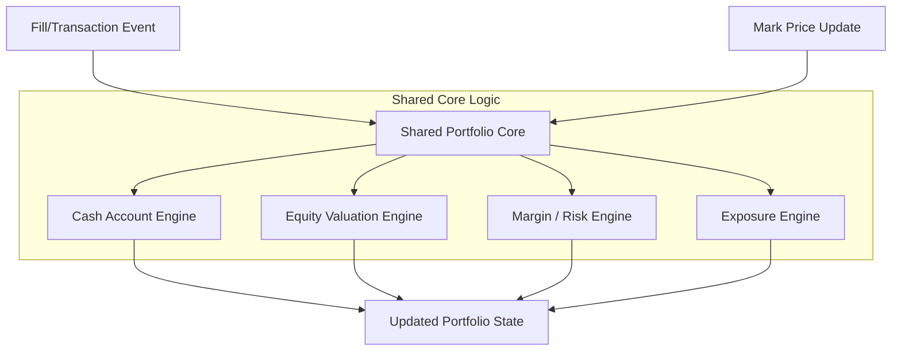
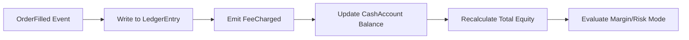
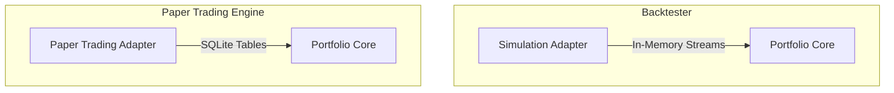
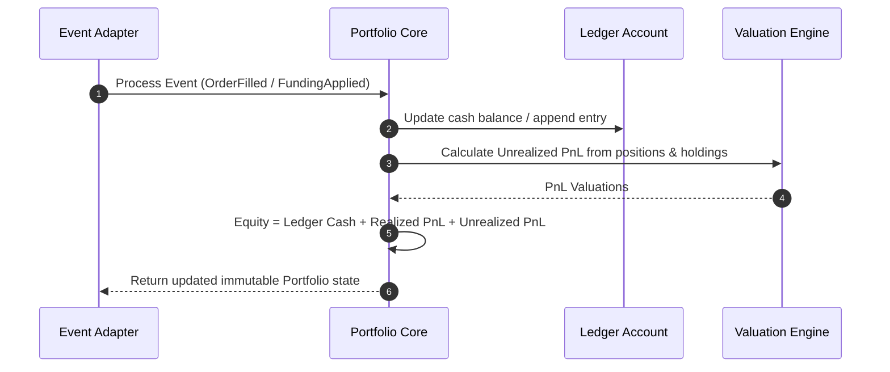
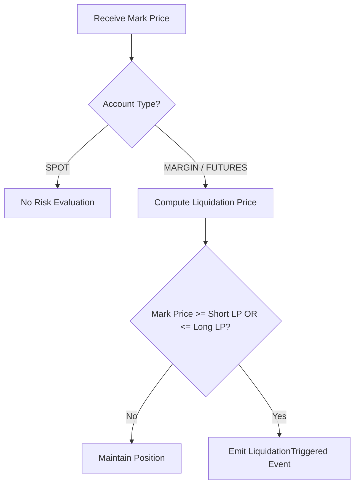

# Sprint 3.7D Design Specification: Portfolio Engine (Design Version 2.0)

**Status**: APPROVED & REVISED  
**Role**: Principal Quant Architect  
**Engineering Contract ID**: MoroQuant-Sprint-3.7D-Contract-v2.0  
**Target Implementation Agent**: Claude Code  

---

## 1. Executive Summary & Purpose

The MoroQuant Portfolio Engine functions as the core financial accounting engine of the MoroQuant Simulation and Trading platform. Based on the Sprint 3.7D Architecture Audit, this revised design establishes a **unified, pure functional core** shared by both historical backtesting simulations and real-time paper/live trading infrastructure.

The core design principle is **Pure Functional Accounting**:
* No side-effects, no direct database connectivity, and no execution responsibilities.
* Operates on deterministic state transitions: consumes transaction event feeds (ledger updates, fills, mark prices) and outputs a new immutable `Portfolio` state.
* Implements a **Ledger-as-Single-Source-of-Truth** model to resolve double-counting of fees and funding costs.

---

## 2. Core Architectural Design (Shared Portfolio Core)

To eliminate divergence between historical backtesting simulations and real-time paper trading, the platform adopts a shared **Portfolio Core** with specialized event adapters.

```
                         +-----------------------------------+
                         |           Portfolio Core          |
                         |   (Pure Functional Accounting)    |
                         |  - Position / PnL / Equity Calc   |
                         |  - Margin & Exposure Calculations  |
                         +-----------------------------------+
                                           ^
                                           |
                  +------------------------+------------------------+
                  |                                                 |
     +--------------------------+                      +--------------------------+
     |    Simulation Adapter    |                      |  Paper Trading Adapter   |
     |                          |                      |                          |
     | - Consumes Historical    |                      | - Consumes Real-Time     |
     |   Fill Events (In-Memory)|                      |   Fills (SQLite-backed)  |
     +--------------------------+                      +--------------------------+
```

### Architectural Rules:
1. **Shared Logic**: Both adapters must route execution data through the exact same mathematical engines for PnL, equity, margin, exposure, and liquidation calculations.
2. **Adapter Isolation**: Adapters vary only in the latency profile and persistence source of events:
   * **Simulation**: Historical batch execution updates portfolio states in memory.
   * **Paper Trading**: Real-time signal matching events trigger database-backed transaction logs, mapped directly into the shared Portfolio Core entities.

---

## 3. Revised Domain Aggregates & Value Objects

The revised domain models separate accounts and positions by risk type to eliminate spot liquidation bugs.

```python
from dataclasses import dataclass, field
from typing import Dict, List, Optional
from datetime import datetime
from enum import Enum

class AccountType(Enum):
    SPOT = "SPOT"
    MARGIN = "MARGIN"
    FUTURES = "FUTURES"

class PositionType(Enum):
    SPOT = "SPOT"
    MARGIN = "MARGIN"
    FUTURES = "FUTURES"

class RiskMode(Enum):
    NONE = "NONE"                     # Used for Spot
    MARGIN = "MARGIN"                 # Collateralized without liquidation
    LIQUIDATION_ENABLED = "LIQUIDATION_ENABLED"  # Margined futures/leverage

class PortfolioLifecycle(Enum):
    EMPTY = "EMPTY"
    ACTIVE = "ACTIVE"
    MARGIN_CALL = "MARGIN_CALL"
    LIQUIDATED = "LIQUIDATED"
    CLOSED = "CLOSED"

class PositionLifecycle(Enum):
    OPENING = "OPENING"
    OPEN = "OPEN"
    PARTIALLY_CLOSED = "PARTIALLY_CLOSED"
    CLOSED = "CLOSED"

class TransactionType(Enum):
    DEPOSIT = "DEPOSIT"
    WITHDRAWAL = "WITHDRAWAL"
    TRADE_DEBIT = "TRADE_DEBIT"
    TRADE_CREDIT = "TRADE_CREDIT"
    FEE_CHARGE = "FEE_CHARGE"
    FUNDING_ADJUSTMENT = "FUNDING_ADJUSTMENT"

@dataclass(frozen=True)
class LedgerEntry:
    """Ledger transaction representing the single source of truth for cash movements."""
    entry_id: str
    timestamp: datetime
    transaction_type: TransactionType
    asset: str
    amount: float
    description: str

@dataclass(frozen=True)
class CashAccount:
    """Cash ledger segments within the portfolio."""
    ledger_cash_balance: float   # Net ledger cash (includes deposits, withdrawals, fees)
    realized_pnl: float          # Realized trading gains/losses
    available_cash: float        # Cash available to open new positions / withdraw
    reserved_cash: float         # Cash reserved for pending open orders
    locked_cash: float           # Cash locked as collateral for active positions

@dataclass(frozen=True)
class MarginAccount:
    """Margin and collateral ledger parameters."""
    risk_mode: RiskMode
    initial_margin: float        # Capital required to open active positions
    maintenance_margin: float    # Capital required to maintain active positions
    margin_ratio: float          # maintenance_margin / total_equity
    liquidation_buffer: float    # Distance to liquidation threshold (margin space)
    liquidation_price: Dict[str, float]  # Calculated liquidation price per symbol

@dataclass(frozen=True)
class AssetHolding:
    """Tracks non-leveraged spot asset inventory."""
    symbol: str
    quantity: float
    acquisition_price: float
    current_price: float
    market_value: float

@dataclass(frozen=True)
class Position:
    """An active trading position with exposure."""
    symbol: str
    position_type: PositionType
    status: PositionLifecycle
    quantity: float              # Positive = Long, Negative = Short
    average_entry_price: float
    average_exit_price: float
    unrealized_pnl: float
    realized_pnl: float
    margin_required: float
    opened_at: datetime
    updated_at: datetime

@dataclass(frozen=True)
class EquitySnapshot:
    timestamp: datetime
    ledger_cash: float
    realized_pnl: float
    unrealized_pnl: float
    funding_adjustment: float
    total_equity: float

@dataclass(frozen=True)
class ExposureSnapshot:
    timestamp: datetime
    asset_allocation: Dict[str, float]  # Percentage allocation per asset
    gross_exposure: float                # Long value + Short value
    net_exposure: float                  # Long value - Short value
    leverage: float                      # gross_exposure / total_equity
    buying_power: float                  # Remaining capital space for trades

@dataclass(frozen=True)
class Portfolio:
    portfolio_id: str
    account_type: AccountType
    lifecycle: PortfolioLifecycle
    ledger: List[LedgerEntry]
    cash_ledger: CashAccount
    margin_ledger: MarginAccount
    positions: Dict[str, Position]
    holdings: Dict[str, AssetHolding]
    equity: float
    last_updated: datetime
```

---

## 4. Revised Mathematical Formulations

To ensure financial correctness and eliminate critical bugs identified in the audit:

### 1. Equity Valuation Engine (Ledger Single Source of Truth)
To prevent double fee/funding subtraction, fees and funding are processed directly as cash modifications in the ledger:
$$\text{Equity} = \text{Ledger Cash Balance} + \text{Realized PnL} + \text{Unrealized PnL} + \text{Funding Adjustment}$$
* *Rule*: When an order executes, a `FeeCharged` event generates a debit transaction on the ledger, decreasing the `Ledger Cash Balance`. The Equity Engine evaluates total equity by aggregating the active ledger balance and current unrealized valuations.

### 2. Spot Risk Engine (Zero-Margin/Zero-Liquidation)
For `AccountType.SPOT`:
* $\text{Leverage} = 1.0$
* $\text{Initial Margin} = 0.0$
* $\text{Maintenance Margin} = 0.0$
* $\text{Margin Ratio} = 0.0$
* $\text{Liquidation Buffer} = 1.0$
* $\text{Liquidation Price} = 0.0$ (Spot assets are never liquidated for margin reasons)

### 3. Margin & Futures Liquidation Engine (Bi-Directional Pricing)
For `AccountType.MARGIN` and `AccountType.FUTURES` with `RiskMode.LIQUIDATION_ENABLED`:
* **Margin Ratio**:
  $$\text{Margin Ratio} = \frac{\text{Maintenance Margin}}{\text{Equity}}$$
* **Liquidation Price (Long)**:
  $$\text{Liquidation Price (Long)} = \text{Average Entry Price} \times \left(1.0 - \frac{\text{Initial Margin Ratio} - \text{Maintenance Margin Ratio}}{\text{Leverage}}\right)$$
* **Liquidation Price (Short)**:
  $$\text{Liquidation Price (Short)} = \text{Average Entry Price} \times \left(1.0 + \frac{\text{Initial Margin Ratio} - \text{Maintenance Margin Ratio}}{\text{Leverage}}\right)$$
* **Liquidation Buffer**:
  $$\text{Liquidation Buffer} = \max\left(0, 1.0 - \text{Margin Ratio}\right)$$

---

## 5. Event Contracts

State updates output the following event packages:

```python
@dataclass(frozen=True)
class OrderFilled:
    portfolio_id: str
    order_id: str
    symbol: str
    quantity: float
    price: float
    timestamp: datetime

@dataclass(frozen=True)
class FeeCharged:
    portfolio_id: str
    order_id: str
    fee_amount: float
    asset: str
    timestamp: datetime

@dataclass(frozen=True)
class FundingApplied:
    portfolio_id: str
    symbol: str
    amount: float
    timestamp: datetime

@dataclass(frozen=True)
class PositionOpened:
    portfolio_id: str
    position: Position
    timestamp: datetime

@dataclass(frozen=True)
class PositionUpdated:
    portfolio_id: str
    position: Position
    pnl_delta: float
    timestamp: datetime

@dataclass(frozen=True)
class PositionClosed:
    portfolio_id: str
    position: Position
    realized_pnl: float
    timestamp: datetime

@dataclass(frozen=True)
class EquityUpdated:
    portfolio_id: str
    snapshot: EquitySnapshot

@dataclass(frozen=True)
class MarginUpdated:
    portfolio_id: str
    margin_ledger: MarginAccount
    timestamp: datetime

@dataclass(frozen=True)
class ExposureUpdated:
    portfolio_id: str
    snapshot: ExposureSnapshot

@dataclass(frozen=True)
class LiquidationTriggered:
    portfolio_id: str
    symbol: str
    liquidation_price: float
    trigger_equity: float
    timestamp: datetime
```

---

## 6. Architecture & Flow Diagrams

### 6.1 Portfolio Core Architecture



### 6.2 Event Flow Diagram



### 6.3 Simulation vs. Paper Trading Adapter Diagram



### 6.4 Equity Calculation Sequence



### 6.5 Liquidation Decision Flow



---

## 7. Financial Validation Section

### Example 1: Spot BTC Purchase
* **Initial State**:
  * `AccountType` = SPOT
  * `ledger_cash_balance` = 10,000 USDT
  * `holdings` = {}
* **Event**: Buy 0.1 BTC at 50,000 USDT. Fee is 0.1% (5 USDT).
* **Ledger Entries**:
  * Entry 1: Trade Debit: -5,000 USDT
  * Entry 2: Fee Charge: -5 USDT
* **State Updates**:
  * `ledger_cash_balance` = 10,000 - 5,000 - 5 = 4,995 USDT
  * `holdings["BTC"]` = AssetHolding(quantity=0.1, acquisition_price=50,000, current_price=50,000, market_value=5,000)
  * `realized_pnl` = 0.0
  * `unrealized_pnl` = 0.0
  * `Equity` = 4,995 + 5,000 = 9,995 USDT
  * `liquidation_price` = 0.0 (SPOT mode bypasses liquidation)

### Example 2: Long Futures Liquidation
* **Initial State**:
  * `AccountType` = FUTURES, `leverage` = 10x
  * `ledger_cash_balance` = 1,000 USDT
  * Long 1 BTC at 10,000 USDT. Initial Margin = 1,000 USDT. MMR = 5% (0.05).
* **Liquidation Price (Long)**:
  $$\text{Liquidation Price} = 10,000 \times \left(1.0 - \frac{0.1 - 0.05}{10}\right) = 10,000 \times (1.0 - 0.005) = 9,950 \text{ USDT}$$
* **Event**: Mark Price drops to 9,950 USDT.
* **Calculation**:
  * `unrealized_pnl` = 1 * (9,950 - 10,000) = -50.0 USDT
  * `Equity` = 1,000 - 50.0 = 950 USDT
  * `Margin Ratio` = (10,000 * 0.05) / 950 = 500 / 950 = 0.526
  * Action: Price hits 9,950 threshold -> Trigger Liquidation event.

### Example 3: Short Futures Liquidation
* **Initial State**:
  * `AccountType` = FUTURES, `leverage` = 10x
  * `ledger_cash_balance` = 1,000 USDT
  * Short 1 BTC at 10,000 USDT. Initial Margin = 1,000 USDT. MMR = 5% (0.05).
* **Liquidation Price (Short)**:
  $$\text{Liquidation Price} = 10,000 \times \left(1.0 + \frac{0.1 - 0.05}{10}\right) = 10,000 \times 1.005 = 10,050 \text{ USDT}$$
* **Event**: Mark Price rises to 10,050 USDT.
* **Calculation**:
  * `unrealized_pnl` = -1 * (10,050 - 10,000) = -50.0 USDT
  * `Equity` = 1,000 - 50.0 = 950 USDT
  * Action: Price hits 10,050 threshold -> Trigger Liquidation event.

### Example 4: Fee Accounting Lifecycle
1. User deposits 1,000 USDT. `Ledger Cash` = 1,000 USDT.
2. Limit order is placed. 100 USDT is marked as `reserved_cash`.
3. Order fills. `FeeCharged` of 1 USDT is applied.
4. Ledger Cash is updated to 999 USDT. `reserved_cash` returns to 0.

### Example 5: Funding Payment Lifecycle
1. Position is held over funding hour.
2. `FundingApplied` event triggers with -10 USDT debit.
3. Ledger entry appended: `FundingAdjustment` of -10 USDT.
4. `Ledger Cash` decremented by 10 USDT.

---

## 8. Migration Notes (Changes from v1.0 Specification)

* **Refactored Equity Formula**: Replaced old formula subtracting fees dynamically with a net-of-fees Ledger Cash calculation base.
* **Added Position & Account Slicing**: Introduced `AccountType` and `PositionType` to isolate Spot asset holdings from leveraged derivatives.
* **Bi-directional Liquidation**: Added the missing Short liquidation pricing formulation and disabled it for Spot positions.
* **Shared Portfolio Core**: Shifted model focus from simulation-only objects to interfaces shareable with `paper_broker.py`.
