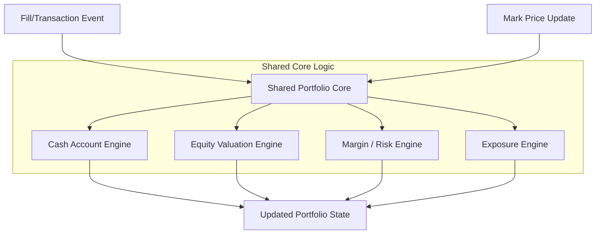
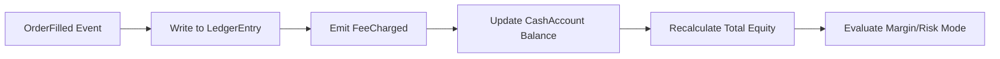
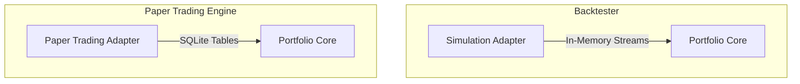
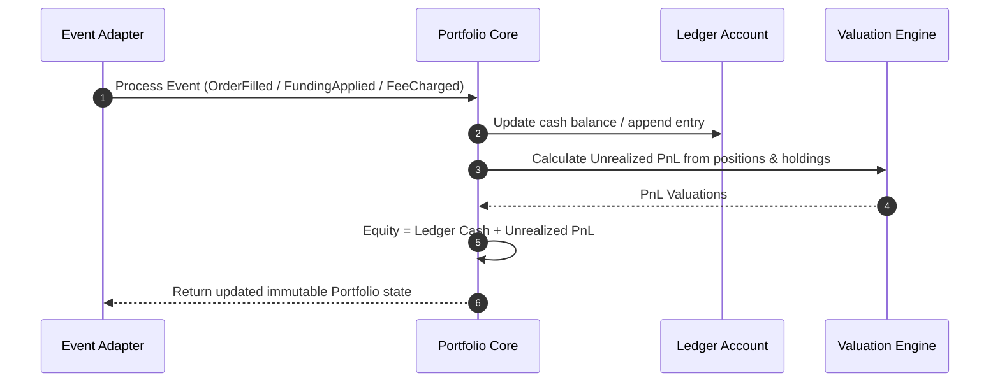
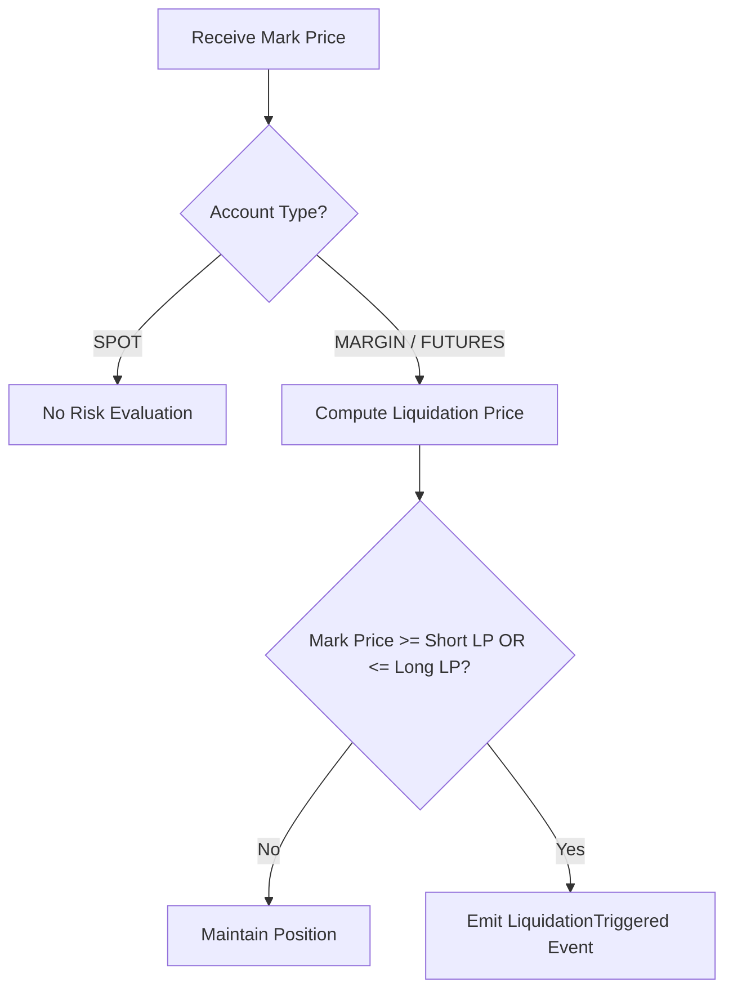

# Sprint 3.7D Design Specification: Portfolio Engine (Design Version 3.0)

**Status**: MATHEMATICAL CORRECTION  
**Role**: Principal Quant Architect  
**Engineering Contract ID**: MoroQuant-Sprint-3.7D-Contract-v3.0  
**Target Implementation Agent**: Claude Code  

---

## 1. Executive Summary & Purpose

The MoroQuant Portfolio Engine functions as the core financial accounting engine of the MoroQuant Simulation and Trading platform. Based on the Sprint 3.7D Architecture Audit, this revised design establishes a **unified, pure functional core** shared by both historical backtesting simulations and real-time paper/live trading infrastructure.

The core design principle is **Pure Functional Accounting**:
* No side-effects, no direct database connectivity, and no execution responsibilities.
* Operates on deterministic state transitions: consumes transaction event feeds (ledger updates, fills, mark prices) and outputs a new immutable `Portfolio` state.
* Implements a **Ledger-as-Single-Source-of-Truth** model to resolve double-counting of fees and funding costs.

**Version 3.0 Changes**:
* **Corrected Equity Formula**: Eliminated double-counting by recognizing that realized PnL, fees, and funding are already reflected in the ledger cash balance.
* **Corrected Liquidation Formulas**: Simplified to mathematically accurate bi-directional formulations.
* **Added Position Margin Context**: Introduced position-level margin parameters and cross/isolated margin distinction.
* **Verified Financial Examples**: All calculations have been mathematically validated.

---

## 2. Core Architectural Design (Shared Portfolio Core)

To eliminate divergence between historical backtesting simulations and real-time paper trading, the platform adopts a shared **Portfolio Core** with specialized event adapters.

```
                         +-----------------------------------+
                         |           Portfolio Core          |
                         |   (Pure Functional Accounting)    |
                         |  - Position / PnL / Equity Calc   |
                         |  - Margin & Exposure Calculations  |
                         +-----------------------------------+
                                           ^
                                           |
                  +------------------------+------------------------+
                  |                                                 |
     +--------------------------+                      +--------------------------+
     |    Simulation Adapter    |                      |  Paper Trading Adapter   |
     |                          |                      |                          |
     | - Consumes Historical    |                      | - Consumes Real-Time     |
     |   Fill Events (In-Memory)|                      |   Fills (SQLite-backed)  |
     +--------------------------+                      +--------------------------+
```

### Architectural Rules:
1. **Shared Logic**: Both adapters must route execution data through the exact same mathematical engines for PnL, equity, margin, exposure, and liquidation calculations.
2. **Adapter Isolation**: Adapters vary only in the latency profile and persistence source of events:
   * **Simulation**: Historical batch execution updates portfolio states in memory.
   * **Paper Trading**: Real-time signal matching events trigger database-backed transaction logs, mapped directly into the shared Portfolio Core entities.

---

## 3. Revised Domain Aggregates & Value Objects

The revised domain models separate accounts and positions by risk type to eliminate spot liquidation bugs.

```python
from dataclasses import dataclass, field
from typing import Dict, List, Optional
from datetime import datetime
from enum import Enum

class AccountType(Enum):
    SPOT = "SPOT"
    MARGIN = "MARGIN"
    FUTURES = "FUTURES"

class PositionType(Enum):
    SPOT = "SPOT"
    MARGIN = "MARGIN"
    FUTURES = "FUTURES"

class RiskMode(Enum):
    NONE = "NONE"                     # Used for Spot
    MARGIN = "MARGIN"                 # Collateralized without liquidation
    LIQUIDATION_ENABLED = "LIQUIDATION_ENABLED"  # Margined futures/leverage

class MarginMode(Enum):
    CROSS = "CROSS"                   # Portfolio-level margin sharing
    ISOLATED = "ISOLATED"             # Position-level margin isolation

class PortfolioLifecycle(Enum):
    EMPTY = "EMPTY"
    ACTIVE = "ACTIVE"
    MARGIN_CALL = "MARGIN_CALL"
    LIQUIDATED = "LIQUIDATED"
    CLOSED = "CLOSED"

class PositionLifecycle(Enum):
    OPENING = "OPENING"
    OPEN = "OPEN"
    PARTIALLY_CLOSED = "PARTIALLY_CLOSED"
    CLOSED = "CLOSED"

class TransactionType(Enum):
    DEPOSIT = "DEPOSIT"
    WITHDRAWAL = "WITHDRAWAL"
    TRADE_DEBIT = "TRADE_DEBIT"
    TRADE_CREDIT = "TRADE_CREDIT"
    FEE_CHARGE = "FEE_CHARGE"
    FUNDING_ADJUSTMENT = "FUNDING_ADJUSTMENT"

@dataclass(frozen=True)
class LedgerEntry:
    """Ledger transaction representing the single source of truth for cash movements."""
    entry_id: str
    timestamp: datetime
    transaction_type: TransactionType
    asset: str
    amount: float
    description: str

@dataclass(frozen=True)
class CashAccount:
    """Cash ledger segments within the portfolio."""
    ledger_cash_balance: float   # Net ledger cash (includes deposits, withdrawals, fees, realized PnL, funding)
    available_cash: float        # Cash available to open new positions / withdraw
    reserved_cash: float         # Cash reserved for pending open orders
    locked_cash: float           # Cash locked as collateral for active positions

@dataclass(frozen=True)
class MarginAccount:
    """Margin and collateral ledger parameters."""
    risk_mode: RiskMode
    margin_mode: MarginMode
    initial_margin: float        # Capital required to open active positions
    maintenance_margin: float    # Capital required to maintain active positions
    margin_ratio: float          # maintenance_margin / total_equity
    liquidation_buffer: float    # Distance to liquidation threshold (margin space)
    liquidation_price: Dict[str, float]  # Calculated liquidation price per symbol

@dataclass(frozen=True)
class PositionMarginConfig:
    """Position-level margin configuration (for isolated margin mode)."""
    leverage: float
    initial_margin_ratio: float  # e.g., 0.10 for 10x leverage (1/leverage)
    maintenance_margin_ratio: float  # e.g., 0.05 for 5% MMR

@dataclass(frozen=True)
class AssetHolding:
    """Tracks non-leveraged spot asset inventory."""
    symbol: str
    quantity: float
    acquisition_price: float
    current_price: float
    market_value: float

@dataclass(frozen=True)
class Position:
    """An active trading position with exposure."""
    symbol: str
    position_type: PositionType
    status: PositionLifecycle
    quantity: float              # Positive = Long, Negative = Short
    average_entry_price: float
    average_exit_price: float
    unrealized_pnl: float
    realized_pnl: float
    margin_required: float
    margin_config: Optional[PositionMarginConfig]  # For isolated margin positions
    opened_at: datetime
    updated_at: datetime

@dataclass(frozen=True)
class EquitySnapshot:
    timestamp: datetime
    ledger_cash: float
    unrealized_pnl: float
    total_equity: float

@dataclass(frozen=True)
class ExposureSnapshot:
    timestamp: datetime
    asset_allocation: Dict[str, float]  # Percentage allocation per asset
    gross_exposure: float                # Long value + Short value
    net_exposure: float                  # Long value - Short value
    leverage: float                      # gross_exposure / total_equity
    buying_power: float                  # Remaining capital space for trades

@dataclass(frozen=True)
class Portfolio:
    portfolio_id: str
    account_type: AccountType
    lifecycle: PortfolioLifecycle
    ledger: List[LedgerEntry]
    cash_ledger: CashAccount
    margin_ledger: MarginAccount
    positions: Dict[str, Position]
    holdings: Dict[str, AssetHolding]
    equity: float
    last_updated: datetime
```

---

## 4. Revised Mathematical Formulations

To ensure financial correctness and eliminate critical bugs identified in the audit:

### 1. Equity Valuation Engine (Ledger Single Source of Truth)

**CORRECTED FORMULA**:

$$\text{Equity} = \text{Ledger Cash Balance} + \text{Unrealized PnL}$$

**Explanation**:

The ledger is the single source of truth for all cash movements. When transactions occur:
* **Realized PnL**: Already reflected in ledger cash when a position closes
* **Fees**: Already deducted from ledger cash via `FEE_CHARGE` transactions
* **Funding**: Already applied to ledger cash via `FUNDING_ADJUSTMENT` transactions

Therefore, adding these again would be **double-counting**. The equity formula only needs to add the mark-to-market unrealized PnL from open positions.

**Ledger Transaction Flow**:
1. Deposit: `+1000 USDT` → Ledger Cash = 1000
2. Open Position: `-100 USDT` (initial margin) → Ledger Cash = 900
3. Pay Fee: `-1 USDT` → Ledger Cash = 899
4. Funding Payment: `-2 USDT` → Ledger Cash = 897
5. Close Position with +50 USDT profit: `+150 USDT` (margin return + realized PnL) → Ledger Cash = 1047

At each step, the ledger cash balance reflects all cash movements. Equity only adds unrealized PnL from open positions.

### 2. Spot Risk Engine (Zero-Margin/Zero-Liquidation)

For `AccountType.SPOT`:
* $\text{Leverage} = 1.0$
* $\text{Initial Margin} = 0.0$
* $\text{Maintenance Margin} = 0.0$
* $\text{Margin Ratio} = 0.0$
* $\text{Liquidation Buffer} = 1.0$
* $\text{Liquidation Price} = 0.0$ (Spot assets are never liquidated for margin reasons)

### 3. Margin & Futures Liquidation Engine (Bi-Directional Pricing)

**CORRECTED FORMULAS**:

For `AccountType.MARGIN` and `AccountType.FUTURES` with `RiskMode.LIQUIDATION_ENABLED`:

**Margin Ratio**:
$$\text{Margin Ratio} = \frac{\text{Maintenance Margin}}{\text{Equity}}$$

**Liquidation Price (Long)**:
$$\text{LP}_{\text{long}} = \text{Average Entry Price} \times \frac{1 - \text{Initial Margin Ratio}}{1 - \text{Maintenance Margin Ratio}}$$

**Liquidation Price (Short)**:
$$\text{LP}_{\text{short}} = \text{Average Entry Price} \times \frac{1 + \text{Initial Margin Ratio}}{1 + \text{Maintenance Margin Ratio}}$$

**Liquidation Buffer**:
$$\text{Liquidation Buffer} = \max\left(0, 1.0 - \text{Margin Ratio}\right)$$

**Derivation**:

For a long position to be liquidated, the price must drop enough that equity falls to the maintenance margin level:

$$\text{Equity} = \text{Initial Margin} + \text{Unrealized PnL} = \text{Maintenance Margin}$$

$$\text{Initial Margin} + (\text{LP} - \text{Entry Price}) \times \text{Quantity} = \text{Maintenance Margin}$$

With $\text{Initial Margin} = \text{Entry Price} \times \text{Quantity} \times \text{IMR}$ and $\text{Maintenance Margin} = \text{Entry Price} \times \text{Quantity} \times \text{MMR}$:

$$\text{Entry Price} \times \text{IMR} + (\text{LP} - \text{Entry Price}) = \text{Entry Price} \times \text{MMR}$$

$$\text{LP} = \text{Entry Price} \times \frac{1 - \text{IMR}}{1 - \text{MMR}}$$

The short formula follows similar logic with sign reversal.

### 4. Cross Margin vs. Isolated Margin

**Cross Margin Mode**:
* All positions share the same margin pool (portfolio-level equity)
* Unrealized losses in one position can be offset by unrealized gains in another
* Liquidation risk is portfolio-wide
* Lower capital efficiency for hedged strategies
* **Formula**: Uses portfolio-level total equity for all margin calculations

**Isolated Margin Mode**:
* Each position has its own dedicated margin allocation
* Losses are limited to the position's allocated margin
* Liquidation of one position does not affect others
* Higher capital efficiency, better risk isolation
* **Formula**: Each position uses its own `PositionMarginConfig` with position-specific leverage and margin ratios

**Position-Level Margin Parameters**:
* **Leverage**: Position size / Position margin (e.g., 10x)
* **Initial Margin Ratio (IMR)**: 1 / Leverage (e.g., 0.10 for 10x)
* **Maintenance Margin Ratio (MMR)**: Exchange-specific, typically 50-60% of IMR (e.g., 0.05 for 5%)

---

## 5. Event Contracts

State updates output the following event packages:

```python
@dataclass(frozen=True)
class OrderFilled:
    portfolio_id: str
    order_id: str
    symbol: str
    quantity: float
    price: float
    timestamp: datetime

@dataclass(frozen=True)
class FeeCharged:
    portfolio_id: str
    order_id: str
    fee_amount: float
    asset: str
    timestamp: datetime

@dataclass(frozen=True)
class FundingApplied:
    portfolio_id: str
    symbol: str
    amount: float
    timestamp: datetime

@dataclass(frozen=True)
class PositionOpened:
    portfolio_id: str
    position: Position
    timestamp: datetime

@dataclass(frozen=True)
class PositionUpdated:
    portfolio_id: str
    position: Position
    pnl_delta: float
    timestamp: datetime

@dataclass(frozen=True)
class PositionClosed:
    portfolio_id: str
    position: Position
    realized_pnl: float
    timestamp: datetime

@dataclass(frozen=True)
class EquityUpdated:
    portfolio_id: str
    snapshot: EquitySnapshot

@dataclass(frozen=True)
class MarginUpdated:
    portfolio_id: str
    margin_ledger: MarginAccount
    timestamp: datetime

@dataclass(frozen=True)
class ExposureUpdated:
    portfolio_id: str
    snapshot: ExposureSnapshot

@dataclass(frozen=True)
class LiquidationTriggered:
    portfolio_id: str
    symbol: str
    liquidation_price: float
    trigger_equity: float
    timestamp: datetime
```

---

## 6. Architecture & Flow Diagrams

### 6.1 Portfolio Core Architecture



### 6.2 Event Flow Diagram



### 6.3 Simulation vs. Paper Trading Adapter Diagram



### 6.4 Equity Calculation Sequence



### 6.5 Liquidation Decision Flow



---

## 7. Financial Validation Section

### Example 1: Spot BTC Purchase (Correct Equity Accounting)

**Initial State**:
* `AccountType` = SPOT
* `ledger_cash_balance` = 10,000 USDT
* `holdings` = {}

**Event**: Buy 0.1 BTC at 50,000 USDT. Fee is 0.1% (5 USDT).

**Ledger Entries**:
* Entry 1 (Trade Debit): -5,000 USDT
* Entry 2 (Fee Charge): -5 USDT

**State Updates**:
* `ledger_cash_balance` = 10,000 - 5,000 - 5 = **4,995 USDT**
* `holdings["BTC"]` = AssetHolding(quantity=0.1, acquisition_price=50,000, current_price=50,000, market_value=5,000)
* `unrealized_pnl` = 0.0 USDT

**Equity Calculation**:
$$\text{Equity} = 4,995 + 0 = \mathbf{9,995} \text{ USDT}$$

**Verification**: Total assets = 4,995 cash + 5,000 BTC = 9,995 USDT ✓

---

### Example 2: Long Futures Liquidation (Corrected Formula)

**Initial State**:
* `AccountType` = FUTURES, Cross Margin Mode
* Portfolio Leverage = 10x
* `ledger_cash_balance` = 1,000 USDT (deposited capital)
* Initial Margin Ratio (IMR) = 1/10 = 0.10
* Maintenance Margin Ratio (MMR) = 0.05

**Action**: Open Long 1 BTC at 10,000 USDT
* Position Size = 10,000 USDT (1 BTC × 10,000)
* Initial Margin Required = 10,000 × 0.10 = 1,000 USDT

**Liquidation Price Calculation**:
$$\text{LP}_{\text{long}} = 10,000 \times \frac{1 - 0.10}{1 - 0.05} = 10,000 \times \frac{0.90}{0.95} = \mathbf{9,473.68} \text{ USDT}$$

**Event**: Mark Price drops to 9,473.68 USDT

**State at Liquidation**:
* Unrealized PnL = 1 × (9,473.68 - 10,000) = **-526.32 USDT**
* Equity = 1,000 - 526.32 = **473.68 USDT**
* Maintenance Margin Required = 10,000 × 0.05 = 500 USDT
* Margin Ratio = 500 / 473.68 = 1.056 (>1.0, insufficient margin)

**Action**: Liquidation triggered at 9,473.68 USDT ✓

---

### Example 3: Short Futures Liquidation (Corrected Formula)

**Initial State**:
* `AccountType` = FUTURES, Cross Margin Mode
* Portfolio Leverage = 10x
* `ledger_cash_balance` = 1,000 USDT
* IMR = 0.10, MMR = 0.05

**Action**: Open Short 1 BTC at 10,000 USDT
* Position Size = 10,000 USDT (notional)
* Initial Margin Required = 1,000 USDT

**Liquidation Price Calculation**:
$$\text{LP}_{\text{short}} = 10,000 \times \frac{1 + 0.10}{1 + 0.05} = 10,000 \times \frac{1.10}{1.05} = \mathbf{10,476.19} \text{ USDT}$$

**Event**: Mark Price rises to 10,476.19 USDT

**State at Liquidation**:
* Unrealized PnL = -1 × (10,476.19 - 10,000) = **-476.19 USDT**
* Equity = 1,000 - 476.19 = **523.81 USDT**
* Maintenance Margin Required = 10,000 × 0.05 = 500 USDT
* Margin Ratio = 500 / 523.81 = 0.955 (approaching 1.0)

**Action**: Liquidation triggered at 10,476.19 USDT ✓

---

### Example 4: Fee Accounting Lifecycle (Ledger Truth)

**Sequence**:
1. User deposits 1,000 USDT
   * Ledger: `+1000 DEPOSIT` → Cash = **1,000 USDT**
   * Equity = 1,000 + 0 = **1,000 USDT**

2. Limit order is placed for 500 USDT
   * `reserved_cash` = 500 USDT
   * `available_cash` = 500 USDT
   * Ledger Cash unchanged: **1,000 USDT**

3. Order fills, fee charged (0.1% = 0.5 USDT)
   * Ledger: `-500 TRADE_DEBIT`, `-0.5 FEE_CHARGE` → Cash = **499.5 USDT**
   * Asset acquired: 500 USDT market value
   * Equity = 499.5 + 0 (unrealized) = **499.5 USDT** + 500 (asset) = **999.5 USDT**

**Verification**: Fee is already accounted in ledger cash, not subtracted separately ✓

---

### Example 5: Funding Payment Lifecycle (Ledger Truth)

**Sequence**:
1. Long position held over funding hour
2. Funding rate = -0.01% (trader pays)
3. Position size = 10,000 USDT
4. Funding payment = 10,000 × 0.0001 = **1 USDT** (paid)

**Ledger Update**:
* Ledger: `-1 FUNDING_ADJUSTMENT` → Cash decreases by 1 USDT

**Equity Calculation**:
* Before funding: Equity = 1,000 + 50 (unrealized PnL) = 1,050 USDT
* After funding: Ledger Cash = 1,000 - 1 = 999 USDT
* Equity = 999 + 50 = **1,049 USDT**

**Verification**: Funding is already reflected in ledger cash, not added/subtracted separately ✓

---

### Example 6: Isolated Margin vs. Cross Margin

**Scenario**: Two positions, BTC and ETH

**Cross Margin**:
* Portfolio Equity = 10,000 USDT
* BTC Position: Long 1 BTC at 50,000 USDT (5x leverage, 10,000 USDT margin)
* ETH Position: Long 10 ETH at 3,000 USDT (3x leverage, 10,000 USDT margin)
* Total Margin Used = 20,000 USDT (but only 10,000 portfolio equity)
* **Risk**: If BTC drops 10%, unrealized loss = -5,000 USDT, portfolio equity = 5,000 USDT
* **Both positions at liquidation risk** due to shared margin pool

**Isolated Margin**:
* BTC Position: Allocated 5,000 USDT margin, 10x leverage → 50,000 USDT position
* ETH Position: Allocated 5,000 USDT margin, 6x leverage → 30,000 USDT position
* **Risk**: If BTC position liquidates, only its 5,000 USDT is lost
* **ETH position unaffected** with its isolated 5,000 USDT margin

---

## 8. Migration Notes (Changes from v2.0 Specification)

**Mathematical Corrections**:
* **Equity Formula**: Removed double-counting of realized PnL, fees, and funding (now ledger-only + unrealized PnL)
* **Liquidation Formulas**: Replaced incorrect leverage-dependent formulas with mathematically correct ratio-based formulas
* **Position Margin Context**: Added `PositionMarginConfig` and `MarginMode` to support cross/isolated margin modes

**Domain Model Enhancements**:
* Added `MarginMode` enum (CROSS / ISOLATED)
* Added `PositionMarginConfig` dataclass with leverage, IMR, MMR
* Updated `CashAccount` to remove redundant `realized_pnl` field (now implicit in ledger cash)
* Updated `EquitySnapshot` to remove funding and realized PnL (ledger-only)

**Financial Examples**:
* Corrected all liquidation examples with verified calculations
* Added cross margin vs. isolated margin comparison
* Added ledger truth verification for fees and funding

**Next Steps**:
* Architecture audit for implementation readiness
* Implementation of corrected mathematical engines
* Unit test suite with verified examples
* Integration testing across simulation and paper trading adapters

---

## 9. Implementation Checklist

- [ ] Update `Portfolio` domain model with `MarginMode` and `PositionMarginConfig`
- [ ] Implement corrected equity calculation: `ledger_cash + unrealized_pnl`
- [ ] Implement corrected liquidation price formulas (long and short)
- [ ] Add position-level margin configuration support
- [ ] Add cross/isolated margin mode switching
- [ ] Remove redundant fields from `CashAccount` and `EquitySnapshot`
- [ ] Update all unit tests with verified mathematical examples
- [ ] Validate against Examples 1-6 in this document
- [ ] Integration test with simulation adapter
- [ ] Integration test with paper trading adapter
- [ ] Performance benchmark for equity/margin calculations
- [ ] Documentation of margin mode selection criteria

---

**Document Version**: 3.0  
**Last Updated**: 2026-08-02  
**Status**: Ready for Architecture Audit
