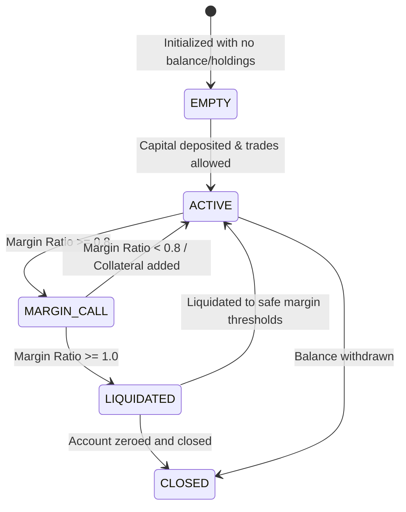
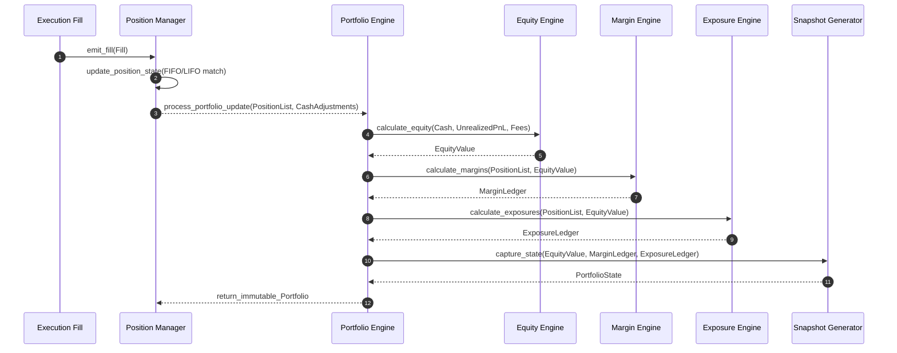

# Sprint 3.7D Design Specification: Portfolio Engine (Design Only)

**Status**: PROPOSED (Ready for Final Architecture Audit)  
**Role**: Principal Quant Architect  
**Engineering Contract ID**: MoroQuant-Sprint-3.7D-Contract-v1.0  
**Target Implementation Agent**: Claude Code  

---

## 1. Executive Summary & Purpose

The purpose of this specification is to define the **Portfolio Engine** of the MoroQuant Simulation Framework. The Portfolio Engine functions as the financial state accounting engine, responsible exclusively for calculating valuations, cash ledger allocations, margin requirements, leverage exposures, and liquidation thresholds. 

To maintain clean architecture boundaries, the engine operates as a **Pure Functional Core** with no execution capability, no risk decision ownership, and no database or exchange connections. It consumes transaction fills and market snapshots, returning updated, immutable portfolio states.

---

## 2. Core Architectural Rationale

1. **Strict Accounting Isolation**: By separating accounting logic from execution decisions, the portfolio engine does not reject orders or trigger liquidations itself. Instead, it computes metrics like `Margin Ratio` or `Liquidation Price`. Downstream validation services or the orchestrator inspect these metrics to trigger margin calls or liquidations.
2. **Unified Margin/Cash Accounting**: The engine models both Spot and Futures accounting under a single interface. Futures portfolios utilize leverage and maintenance margins, while Spot portfolios execute with margin values set to zero and leverage set to 1.0, simplifying accounting calculations.

---

## 3. Core Component Layers & Aggregates

```
+----------------------------------------------------------------------------------------------------+
| Portfolio Engine Aggregate Layer                                                                   |
|                                                                                                    |
|  [ Portfolio ] (Root aggregate managing cash, margins, exposures, and active holdings)              |
|        ├──> [ CashAccount ] (Tracks cash segments: Available, Reserved, Locked, Withdrawable)       |
|        ├──> [ MarginAccount ] (Tracks initial margin, maintenance margin, buffers, ratios)         |
|        ├──> [ Position ] (Tracks individual position states and average prices)                    |
|        └──> [ AssetHolding ] (Quantity and spot value tracking for non-leveraged assets)           |
|                                                                                                    |
|  [ PortfolioState ] (Immutable snapshot state tracking: ACTIVE, MARGIN_CALL, LIQUIDATED, etc.)      |
|        ├──> [ EquitySnapshot ] (Valuation logs: Cash, Unrealized PnL, Fees, Funding)               |
|        ├──> [ ExposureSnapshot ] (Exposure logs: Allocations, Gross/Net, Leverage, BuyingPower)    |
|        └──> [ MarginSnapshot ] (Point-in-time snapshot of margin requirements)                    |
+----------------------------------------------------------------------------------------------------+
```

### Python Domain Interfaces

```python
from dataclasses import dataclass, field
from typing import Dict, List, Optional
from datetime import datetime
from enum import Enum

class PortfolioLifecycle(Enum):
    EMPTY = "EMPTY"
    ACTIVE = "ACTIVE"
    MARGIN_CALL = "MARGIN_CALL"
    LIQUIDATED = "LIQUIDATED"
    CLOSED = "CLOSED"

class PositionLifecycle(Enum):
    OPENING = "OPENING"
    OPEN = "OPEN"
    PARTIALLY_CLOSED = "PARTIALLY_CLOSED"
    CLOSED = "CLOSED"

@dataclass(frozen=True)
class CashAccount:
    """Cash ledger segments within the portfolio."""
    available_cash: float       # Cash available to open new positions
    reserved_cash: float        # Cash reserved for pending open orders
    locked_cash: float          # Cash locked as collateral for active positions
    withdrawable_cash: float    # Cash available for account withdrawals

@dataclass(frozen=True)
class MarginAccount:
    """Margin and collateral ledger parameters."""
    initial_margin: float       # Capital required to open active positions
    maintenance_margin: float   # Capital required to maintain active positions
    margin_ratio: float         # maintenance_margin / total_equity
    liquidation_buffer: float   # Distance to liquidation threshold (margin space)
    liquidation_price: Dict[str, float]  # Liquidation price calculated per symbol

@dataclass(frozen=True)
class AssetHolding:
    """Tracks non-leveraged spot asset inventory."""
    symbol: str
    quantity: float
    acquisition_price: float
    current_price: float
    market_value: float

@dataclass(frozen=True)
class Position:
    """An active trading position with exposure."""
    symbol: str
    status: PositionLifecycle
    quantity: float             # Positive = Long, Negative = Short
    average_entry_price: float
    average_exit_price: float
    unrealized_pnl: float
    realized_pnl: float
    margin_required: float
    opened_at: datetime
    updated_at: datetime

@dataclass(frozen=True)
class EquitySnapshot:
    timestamp: datetime
    cash: float
    unrealized_pnl: float
    fees_paid: float
    funding_costs: float
    total_equity: float

@dataclass(frozen=True)
class ExposureSnapshot:
    timestamp: datetime
    asset_allocation: Dict[str, float]  # Percentage allocation per asset
    gross_exposure: float                # Long value + Short value
    net_exposure: float                  # Long value - Short value
    leverage: float                      # gross_exposure / total_equity
    buying_power: float                  # Remaining capital space for trades

@dataclass(frozen=True)
class Portfolio:
    portfolio_id: str
    lifecycle: PortfolioLifecycle
    cash_ledger: CashAccount
    margin_ledger: MarginAccount
    positions: Dict[str, Position]
    holdings: Dict[str, AssetHolding]
    equity: float
    last_updated: datetime
```

---

## 4. Internal Calculation Engines (Functional Core)

1. **Cash Engine**:
   $$\text{Available Cash} = \text{Total Cash} - \text{Reserved Cash} - \text{Locked Cash}$$
   $$\text{Withdrawable Cash} = \max(0, \text{Total Cash} - \text{Initial Margin Requirements})$$
2. **Equity Engine**:
   $$\text{Equity} = \text{Cash} + \text{Unrealized PnL} - \text{Fees} - \text{Funding}$$
3. **Margin Engine**:
   $$\text{Margin Ratio} = \frac{\text{Maintenance Margin}}{\text{Equity}}$$
   $$\text{Liquidation Buffer} = 1.0 - \text{Margin Ratio}$$
   $$\text{Liquidation Price (Long)} = \text{Average Entry Price} \times \left(1.0 - \frac{\text{Maintenance Margin Ratio}}{\text{Leverage}}\right)$$
4. **Exposure Engine**:
   $$\text{Gross Exposure} = \sum |Quantity \times Price|$$
   $$\text{Net Exposure} = \sum (Quantity \times Price)$$
   $$\text{Leverage} = \frac{\text{Gross Exposure}}{\text{Equity}}$$
   $$\text{Buying Power} = \text{Available Cash} \times \text{Max Leverage Limit}$$

---

## 5. Event Contracts (Immutable Notification Payload)

State updates output the following event packages:

```python
@dataclass(frozen=True)
class PositionOpened:
    portfolio_id: str
    position: Position
    timestamp: datetime

@dataclass(frozen=True)
class PositionUpdated:
    portfolio_id: str
    position: Position
    pnl_delta: float
    timestamp: datetime

@dataclass(frozen=True)
class PositionClosed:
    portfolio_id: str
    position: Position
    realized_pnl: float
    timestamp: datetime

@dataclass(frozen=True)
class EquityUpdated:
    portfolio_id: str
    snapshot: EquitySnapshot

@dataclass(frozen=True)
class MarginUpdated:
    portfolio_id: str
    margin_ledger: MarginAccount
    timestamp: datetime

@dataclass(frozen=True)
class ExposureUpdated:
    portfolio_id: str
    snapshot: ExposureSnapshot
```

---

## 6. Portfolio State Machine



---

## 7. Sequence Diagram



---

## 8. Definition of Done (DoD)

- [x] Design specification complete and saved to [`docs/sprints/Sprint-3.7D-Portfolio-Engine-Design.md`](file:///home/zafka/trade-dashboard/docs/sprints/Sprint-3.7D-Portfolio-Engine-Design.md).
- [x] Defined all aggregates and value objects (`Portfolio`, `CashAccount`, `MarginAccount`, `Position`, `AssetHolding`, `EquitySnapshot`, `ExposureSnapshot`, `MarginSnapshot`, `BuyingPower`, `PortfolioState`).
- [x] Documented lifecycle transitions for portfolios and positions.
- [x] Formulated formulas for Cash, Equity, Margin, and Exposure engines.
- [x] Defined programmatic Event Contracts (`PositionOpened`, `PositionUpdated`, `PositionClosed`, `EquityUpdated`, `MarginUpdated`, `ExposureUpdated`).
- [x] Generated UML layout, state machine, sequence diagram, and dependency graph.
- [x] Executed `graphify update .` to update the AST graph database.
- [x] Verified zero codebase code changes or SQL migrations executed.
- [x] Prepared for final architecture audit review.
