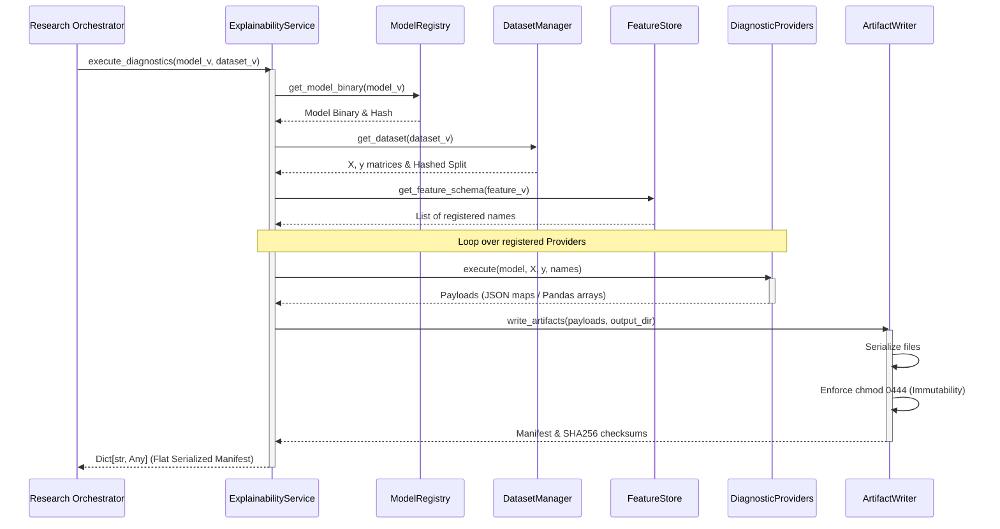

# Sprint R1A Design Specification — Explainability Foundation

**Date**: 2026-07-23  
**Status**: APPROVED (Design Spec v1.2 Refined)  
**Author**: Principal Software Architect  
**Target Audience**: Implementation Engineer (Claude Code)  
**Reference ADR**: [ADR-022: Model Diagnostics & Explainability Framework](file:///home/zafka/trade-dashboard/docs/adr/ADR-022-Model-Diagnostics-Explainability-Framework.md)

---

## 1. Sprint Overview

### Objective
Implement the foundational, in-process compute engines and artifact generation pipeline for the MoroQuant Model Diagnostics & Explainability Framework. This sprint establishes the core orchestrator, provider architecture, and contract-compliant artifact writers.

### Scope
- **Core Explainability Framework Engine**: Python execution orchestrator that initiates diagnostic runs, maps feature IDs to human-readable labels, and controls execution pipelines.
- **Provider Architecture**: Standardized provider interface (`BaseDiagnosticProvider`) allowing registration and execution of algorithms.
- **Initial Providers**:
  - **Standard Providers**:
    - `SHAP Provider`: Global and local Shapley attribution computation (using standard SHAP library structures).
    - `Correlation Provider`: Symmetrical feature correlation matrix (Pearson and Spearman) mapping multicollinearity.
    - `Permutation Provider`: Out-of-sample feature performance degradation via feature column shuffling.
  - **Specialized Providers**:
    - `Stability Provider`: Variance and deviation analysis of importances across cross-validation splits, operating on feature importance matrices across validation folds (instead of raw feature matrix X).
- **Report Generator**: Automated markdown compiler combining results into an immutable audit report.
- **Artifact Writer**: Output serializer for JSON, Parquet, and Markdown files conforming to target structural specifications and applying strict read-only file permissions (`chmod 0444`).

### Out of Scope (Deferred to Sprint R1B+)
- **SQL / SQLite Persistence**: Schema migrations for `storage/research_metadata.db` or creation of the SQL-based `Diagnostic Repository`.
- **Dashboard Integration**: React frontend component implementation, API endpoints (`GET /signals/{id}/explain`), or visualization engines.
- **Persistent Caching Store**: SQLite/redis-backed cache checks.
- **Orchestrator Automation**: Integration of the diagnostic stage into the automatic research loop scheduler.

### Dependencies
- **Dataset Manager Service**: To supply evaluation dataset splits.
- **Feature Store Service**: To retrieve feature schema definitions and map column indices to feature names.
- **Model Registry Service**: To retrieve candidate model binaries.

### Related ADRs
- [ADR-022: Model Diagnostics & Explainability Framework](file:///home/zafka/trade-dashboard/docs/adr/ADR-022-Model-Diagnostics-Explainability-Framework.md) (Canonical Design)
- [ADR-013: Model Registry Lifecycle & Lineage Policy](file:///home/zafka/trade-dashboard/docs/adr/ADR-013-Model-Registry-Lifecycle.md) (Registry Context)
- [ADR-014: Research Orchestrator Design](file:///home/zafka/trade-dashboard/docs/adr/ADR-014-Research-Orchestrator.md) (Execution Context)

---

## 2. Deliverables

| Deliverable ID | Component | Description |
|:---|:---|:---|
| **DEL-R1A-001** | `ExplainabilityService` | Python service class that coordinates the lifecycle of a Diagnostic Run, registers diagnostic providers, maps feature indices, triggers compilation, and returns flat Dict[str, Any] manifest matching serialization contract. |
| **DEL-R1A-002** | `DiagnosticProvider` Contracts | Abstract base class (`BaseDiagnosticProvider`) and configuration typing schema. |
| **DEL-R1A-003** | `ShapProvider` | Computes Shapley additive explanations for tree-based models and output-ready arrays. |
| **DEL-R1A-004** | `CorrelationProvider` | Computes Pearson/Spearman coefficients. |
| **DEL-R1A-005** | `PermutationProvider` | Computes degradation of statistical metrics (e.g., Accuracy, F1, Sharpe, MSE) when individual features are permuted. |
| **DEL-R1A-006** | `StabilityProvider` | Specialized provider. Computes feature ranking stability. Calculates standard deviations of ranking positions and importances across validation folds consuming Feature Importance Matrix. |
| **DEL-R1A-007** | `ArtifactWriter` | Utility writing JSON, Parquet, and Markdown files to disk and enforcing `chmod 0444` immutability. |
| **DEL-R1A-008** | `ReportGenerator` | Markdown report assembler that aggregates telemetry, plots, and provider metrics into `diagnostics_report.md`. |

---

## 3. Proposed Folder Structure

All code is confined to `ml_service/research/explainability/` and `ml_service/tests/services/explainability/`. No code files should be written to database schemas, dashboards, or shared front-end layers.

```
ml_service/
├── research/
│   ├── explainability/
│   │   ├── __init__.py                # Package entrypoint exposing service and models
│   │   ├── service.py                 # Coordinates execution of Diagnostic Runs
│   │   ├── types.py                   # Dataclasses and Pydantic schemas for runs & configs
│   │   ├── writer.py                  # Immutable artifact writer (handles Parquet, JSON, chmod)
│   │   ├── report.py                  # Markdown report template engine and compiler
│   │   └── providers/
│   │       ├── __init__.py            # Provider registrations
│   │       ├── base.py                # Abstract class BaseDiagnosticProvider
│   │       ├── shap.py                # TreeExplainer and LinearExplainer SHAP calculations
│   │       ├── correlation.py         # Pearson & Spearman collinearity matrices
│   │       ├── permutation.py         # OOS feature permutation degradation
│   │       └── stability.py           # Cross-validation feature stability analyzer
└── tests/
    └── services/
        └── test_explainability.py     # Unit and integration test suite
```

---

## 4. Component Responsibilities

### `ExplainabilityService`
- **Purpose**: High-level execution coordinator of the Diagnostic Run.
- **Inputs**:
  - `model_version_id`: Unique model version in registry.
  - `dataset_id`: Hashed validation dataset.
  - `config`: Diagnostic configuration parameters (e.g., selection of active providers, sample sizes).
- **Outputs**:
  - `Dict[str, Any]`: Flat dictionary serialization contract containing run status, start/end times, artifact manifests, and output paths. Must contain the following mandatory top-level keys: `run_id`, `status`, `start_time`, `end_time`, `artifact_manifest`, `output_paths`, `execution_duration_sec`, `max_memory_kb`, `errors`.
- **Responsibilities**:
  - Dynamically load model binaries via Model Registry.
  - Fetch validation datasets via Dataset Manager.
  - Intersect feature columns with feature schemas from the Feature Store.
  - Instantiate and execute configured providers.
  - Collate provider metrics and forward them to the `ArtifactWriter` and `ReportGenerator`.
- **Non-responsibilities**:
  - Persisting run status to `storage/research_metadata.db` (deferred).
  - Creating or managing database connection sessions.

### `BaseDiagnosticProvider`
- **Purpose**: Defines standard behavior, configuration, and interface specs for explainability algorithms.
- **Inputs**: Model instance, features matrix ($X$), target vector ($y$), list of feature names.
- **Outputs**: Dictionary containing numerical arrays/metrics.
- **Responsibilities**:
  - Enforce common error handling, execution profiling, and timeouts.
  - Implement mathematical conversions without causing silent NaN failures.
- **Non-responsibilities**:
  - Writing files to disk or communicating with outside storage systems.

### `ShapProvider`
- **Purpose**: Calculate additive feature attribution mapping for local predictions.
- **Inputs**: Serialized model, features matrix $X$.
- **Outputs**: Out-of-sample data points mapping features to SHAP attribution values.
- **Responsibilities**:
  - Dynamically detect model type (e.g., XGBoost, LightGBM, Linear) and select the correct SHAP explainer (e.g., `TreeExplainer`, `LinearExplainer`).
  - Cap sample sizes if input dataset exceeds threshold configurations to control latency.
- **Non-responsibilities**:
  - Rendering plots or visual beeswarm charts directly (this is a presentation concern).

### `CorrelationProvider`
- **Purpose**: Detect linear and non-linear collinearity risks.
- **Inputs**: Features matrix $X$, target vector $y$.
- **Outputs**: Complete feature-to-feature matrix of correlation coefficients.
- **Responsibilities**:
  - Calculate Pearson and Spearman correlation matrices.
  - Flag features exceeding multicollinearity boundaries.
- **Non-responsibilities**:
  - Deciding feature pruning actions (only metrics calculation).

### `PermutationProvider`
- **Purpose**: Measure prediction performance degradation when features are destroyed.
- **Inputs**: Model, features matrix $X$, target vector $y$.
- **Outputs**: Performance delta vector per feature.
- **Responsibilities**:
  - Execute out-of-sample column shuffles ($N$ repetitions).
  - Calculate degradation metrics (Accuracy, F1, Sharpe, MSE depending on classification/regression model type).
- **Non-responsibilities**:
  - Retraining models (the model must remain frozen).

### `StabilityProvider` (Specialized Provider)
- **Purpose**: Gauge consistency of importances over shifting validation folds.
- **Inputs**: Feature importance matrix ($X$) representing importances calculated across multiple walk-forward test periods / validation folds. (Parameters `model` and `y` are unused).
- **Outputs**: Standard deviation and ranking shift variance scores.
- **Responsibilities**:
  - Standardize importance metrics across partitions and output standard deviations.
- **Non-responsibilities**:
  - Split division logic (must consume pre-partitioned slices).
  - Executing standard feature attribution directly on raw datasets (operates downstream of standard providers).

### `ArtifactWriter`
- **Purpose**: Securely serialize compute payloads to the filesystem.
- **Inputs**: Payload dictionaries, target directory paths.
- **Outputs**: Absolute paths to generated files.
- **Responsibilities**:
  - Serialize to standard formats: JSON (`feature_importance`, `correlation_matrix`, `stability_report`), Parquet (`shap_summary`), Markdown (`diagnostics_report`).
  - Maintain cryptographic checks (compute SHA256 of resulting files).
  - Enforce immutable filesystem permissions (`chmod 0444` or `readonly` file locks).
- **Non-responsibilities**:
  - Validating dataset properties or model hyperparameters.

---

## 5. Public Interfaces

No implementation logic is presented here. The classes define strict API contracts for integration.

```python
from abc import ABC, abstractmethod
from typing import Dict, Any, List, Optional
from dataclasses import dataclass

@dataclass
class DiagnosticRunContext:
    run_id: str
    model_version_id: str
    dataset_version_id: str
    feature_dataset_version_id: str
    model_binary_hash: str
    dataset_hash: str
    timestamp: str

class BaseDiagnosticProvider(ABC):
    """Abstract contract for all Explainability providers."""
    
    def __init__(self, config: Dict[str, Any]):
        self.config = config

    @abstractmethod
    def execute(self, model: Any, X: Any, y: Any, feature_names: List[str]) -> Dict[str, Any]:
        """
        Executes the explainability provider computation.
        
        Args:
            model: The trained model binary wrapper object.
            X: Matrix of features (pandas.DataFrame or numpy.ndarray).
            y: Vector of targets (pandas.Series or numpy.ndarray).
            feature_names: List of column names mapping to index order.
            
        Returns:
            Dict containing output metrics/matrices.
        """
        pass

class ExplainabilityService:
    """Core entrypoint coordinator for explainability computations."""
    
    def __init__(self, dataset_service: Any, model_registry_service: Any, feature_service: Any):
        self.dataset_service = dataset_service
        self.model_registry_service = model_registry_service
        self.feature_service = feature_service
        self.providers: Dict[str, BaseDiagnosticProvider] = {}
        
    def register_provider(self, name: str, provider: BaseDiagnosticProvider) -> None:
        """Register diagnostic compute provider."""
        pass
        
    def execute_diagnostics(
        self, 
        model_version_id: str, 
        dataset_version_id: str, 
        output_dir: str,
        config: Optional[Dict[str, Any]] = None
    ) -> Dict[str, Any]:
        """
        Triggers execution of active providers, generates reports, and locks files.
        
        Args:
            model_version_id: Identifies candidate model.
            dataset_version_id: Identifies validation dataset split.
            output_dir: Root storage path for diagnostic artifacts.
            config: Execution tuning options.
            
        Returns:
            Dict[str, Any] containing the flat execution serialization contract:
                - run_id: str (UUID)
                - status: str (e.g. "completed", "failed")
                - start_time: str (ISO timestamp)
                - end_time: str (ISO timestamp)
                - artifact_manifest: Dict[str, str] (filename -> sha256)
                - output_paths: Dict[str, str] (artifact key -> absolute path)
                - execution_duration_sec: float
                - max_memory_kb: Optional[int]
                - errors: List[str]
        """
        pass
```

---

## 6. Artifact Contracts

All output files must be written to a dedicated directory named after the Diagnostic Run context:
`storage/research/diagnostics/runs/{model_version}/{run_id}/`

### Expected Output Files and Schemas

#### 1. `feature_importance.json`
Maps feature names directly to relative numerical scores.
```json
{
  "version": "1.0",
  "importances": {
    "feature_rsi_14": 0.354,
    "feature_macd_diff": 0.282,
    "feature_usdt_volume": 0.184,
    "feature_bb_width": 0.180
  },
  "metrics_sum": 1.0
}
```

#### 2. `shap_summary.parquet`
Table with observations matching evaluation indices, storing Shapley values for each feature alongside raw values.
Columns:
- `observation_index` (int / datetime)
- `shap_val_<feature_name>` (float)
- `raw_val_<feature_name>` (float)

#### 3. `correlation_matrix.json`
Symmetrical structure of correlation metrics.
```json
{
  "features": ["feature_rsi_14", "feature_macd_diff"],
  "pearson": [
    [1.0, 0.42],
    [0.42, 1.0]
  ],
  "spearman": [
    [1.0, 0.39],
    [0.39, 1.0]
  ]
}
```

#### 4. `stability_report.json`
Attribution shift across walk-forward partitions.
```json
{
  "stability_metrics": {
    "feature_rsi_14": {
      "mean_importance": 0.354,
      "std_deviation": 0.024,
      "rank_variance": 0.08
    }
  }
}
```

#### 5. `diagnostic_metadata.json`
Stores configuration parameters and lineage indicators.
```json
{
  "run_id": "run_9a2f1b4c8d",
  "timestamp": "2026-07-23T15:00:00Z",
  "lineage": {
    "model_version_id": "model_v1_0_3",
    "model_binary_hash": "e3b0c44298fc1c149afbf4c8996fb92427ae41e4649b934ca495991b7852b855",
    "dataset_version_id": "dataset_2026_q2_val",
    "dataset_hash": "c0552b96317b6a12b489a234f9a3e2c34d4567e89101b2a3d4e5f6a7b8c9d0e1",
    "feature_dataset_version_id": "feature_ds_v2"
  },
  "runtime_telemetry": {
    "execution_duration_sec": 4.12,
    "max_memory_kb": 142032
  },
  "provider_versions": {
    "shap": "0.45.0"
  }
}
```

#### 6. `diagnostics_report.md`
Self-contained, human-readable markdown audit trail summary. Includes:
- Frontmatter with unique Diagnostic Run ID, dates, and lineage hashes.
- Highlighted tabular summaries of top features.
- Warnings for multicollinearity risks (Pearson > 0.85).
- Stability trend indicators.

---

## 7. Execution Flow

The sequence diagram below models the computation execution lifecycle:



---

## 8. Testing Strategy

### Unit Tests
- **Provider Assertions**: Test each diagnostic provider class independently with mock model instances (e.g., standard scikit-learn models like LinearRegression or DecisionTree) and synthetic datasets.
  - Verify `ShapProvider` can output correct coordinate dimensions for linear and tree-based structures.
  - Verify `CorrelationProvider` accurately detects perfect linear correlation ($r=1.0$) between collinear synthetic columns.
  - Verify `PermutationProvider` reports performance degradation on predictable predictive feature shuffles.
- **Robustness Checks**: Assert that passing inputs containing NaN elements or infinite vectors does not trigger core execution failures (the system should isolate failures, log warnings, or raise typed exceptions).

### Integration Tests
- **Lineage Flow**: Mock the Dataset Manager and Model Registry to verify that `ExplainabilityService` correctly orchestrates inputs and aggregates final reports.
- **Permission Auditing**: Test the file-system state immediately after `ArtifactWriter` completion:
  - Attempting to overwrite a written artifact file must raise `PermissionError` / `OSError`.
  - Assert target file permission masks equal `0o444` (or `S_IRUSR | S_IRGRP | S_IROTH`).

### Regression Tests
- Verify that compute functions do not alter or overwrite previously completed execution artifacts from other runs.
- Run the full pipeline on a frozen candidate model and assert bitwise parity of hashes across successive diagnostic runs.

### Acceptance Tests
- Confirm that every file declared in the **Artifact Contracts** is written to target directories and matches semantic validation schemas.
- Ensure `pytest` passes 100% of diagnostic checks before finalizing.

---

## 9. Performance Considerations

- **Sampling Constraints**: Calculating SHAP values on large validation partitions ($N > 10,000$) can increase CPU latency exponentially. The execution config must support `max_shap_samples` (defaulting to 2,500) to sub-sample observations deterministically.
- **Memory Footprint**: High-dimensional datasets can lead to substantial peak RAM spikes during permutation importance execution. Data-structures should avoid making deep copies of dataframe arrays except where necessary.
- **Serialization Speeds**: Parquet structures should utilize snappy compression blocks to optimize storage utilization without degrading IO operations.

---

## 10. Risks

| Risk | Impact | Mitigation Strategy |
|:---|:---|:---|
| **Memory Exhaustion on Large Datasets** | High | Apply strict deterministic row sub-sampling on evaluation datasets prior to running explainers. |
| **Model Incompatibility** | Medium | Check model architecture class names before executing explainers; route tree-based models to `TreeExplainer` and linear/deep frameworks to their respective engines. |
| **Silent Algorithm Failures** | Medium | Ensure division by zero and matrix singularity issues (common in correlation metrics) default to `0.0` or `NaN` with structured log warning flags. |

---

## 11. Acceptance Criteria

Sprint R1A is successful when the following criteria are verified:
1. **Module Creation**: The module package `ml_service/research/explainability` exists.
2. **Provider Implementations**: SHAP, Correlation, Permutation, and Stability computations execute without failures on XGBoost and LightGBM model formats.
3. **Lineage Preservation**: The output metadata file `diagnostic_metadata.json` records valid validation-dataset and model hashes.
4. **Immutability Enforcement**: Written files are successfully set to read-only.
5. **Report Generation**: A valid markdown report `diagnostics_report.md` is compiled at the end of execution.
6. **Zero Persistence Debt**: No database queries, tables, or API endpoints are added.

---

## 12. Definition of Done

- [ ] Core classes and base providers implemented without modifying frozen ADR-022 structure.
- [ ] Compute algorithms (SHAP, Correlation, Permutation, Stability) verified via unit tests.
- [ ] Output directories and artifact file formats conform exactly to JSON, Parquet, and Markdown specifications.
- [ ] Immutability policy (`chmod 0444`) enforced on files.
- [ ] Unit and integration tests pass successfully with `pytest`.
- [ ] `npm run build` succeeds (verifying no regressions in workspace build status).
- [ ] Workspace AST index updated by running `graphify update .`.
- [ ] No database schema changes or Next.js frontend code committed.

---

## 13. Architecture Compliance & Refinement Notes
The modifications introduced in Version 1.2 (specifically the return contract of `execute_diagnostics()` returning a serialized plain `Dict[str, Any]` and the classification/inputs of the specialized `StabilityProvider`) represent formal architectural decisions. 

These updates are designed to resolve ambiguities identified during the Interface Compliance Audit and are NOT considered design deviations. All future automated and manual compliance audits of the diagnostics subsystem must evaluate implementation codebase conformance directly against this updated contract.
