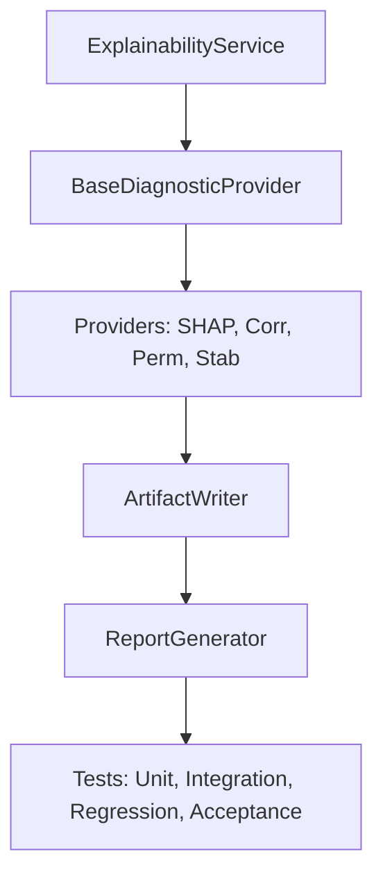

# Sprint R1A Implementation Plan — Explainability Foundation

**Date**: 2026-07-23  
**Status**: APPROVED (Implementation Plan v1.2 Refined)  
**Author**: Principal Software Architect & Technical Program Manager  
**Target Audience**: Implementation Engineer (Claude Code)  
**Reference ADR**: [ADR-022: Model Diagnostics & Explainability Framework](file:///home/zafka/trade-dashboard/docs/adr/ADR-022-Model-Diagnostics-Explainability-Framework.md)  
**Reference Design Spec**: [Sprint R1A — Explainability Foundation Design Specification](file:///home/zafka/trade-dashboard/docs/sprints/Sprint-R1A-Explainability-Foundation.md)

---

## 1. Sprint Goal

The core engineering objective of Sprint R1A is to build and deliver the **in-process computation engine and output serialization pipeline** for model diagnostics and explainability.

Specifically, this sprint will establish:
- The base orchestrator (`ExplainabilityService`) and the standardized interfaces (`BaseDiagnosticProvider`) that decouple algorithms from core execution.
- Four concrete diagnostic providers:
  - **Standard Providers**:
    - `ShapProvider` for tree/linear local and global Shapley attribution.
    - `CorrelationProvider` for Pearson and Spearman multicollinearity mappings.
    - `PermutationProvider` for out-of-sample performance degradation assessment.
  - **Specialized Providers**:
    - `StabilityProvider` (Specialized) for cross-validation ranking variance evaluation (consuming feature importance matrices across validation folds).
- An immutable `ArtifactWriter` that enforces a read-only permissions lock (`chmod 0444`) on generated files to ensure cryptographic lineage.
- A `ReportGenerator` to assemble a self-contained markdown audit trail (`diagnostics_report.md`).

This sprint is strictly confined to python compute and file-system execution; persistence schema migrations and frontend dashboard changes are deferred.

---

## 2. Implementation Philosophy

To ensure reliability, reproducibility, and high software quality, the implementation of Sprint R1A must adhere to these five execution principles:

1. **Small, Iterative Commits**: Build the foundation first, compile it, check it, and then build the providers. Avoid single large changesets.
2. **Build Before Optimize**: Implement correct, verifiable mathematical algorithms first. Profile and optimize performance bottlenecks (like SHAP sampling or permutation loops) only after correctness is verified.
3. **Fail-Fast Mechanics**: Raise explicit, typed Python exceptions (e.g., `ValueError`, `ModelIncompatibilityError`) immediately when configuration, data schema, or runtime boundaries are violated, instead of returning silent NaN values or corrupted matrices.
4. **Test-First Verification**: Write mock-based unit tests for providers and services alongside their implementation. Verify edge cases (empty arrays, single features, NaNs) programmatically.
5. **Strict ADR-022 Invariants**: Do not redesign or alter the namespace, file locations, structural concepts, or database boundaries set in [ADR-022](file:///home/zafka/trade-dashboard/docs/adr/ADR-022-Model-Diagnostics-Explainability-Framework.md) and [Sprint R1A Spec](file:///home/zafka/trade-dashboard/docs/sprints/Sprint-R1A-Explainability-Foundation.md).

---

## 3. Dependency Graph

The execution path is linear and strictly ordered to prevent cyclic imports and ensure a solid foundation before complex calculations are implemented:



### Rationale for the Dependency Order

1. **`ExplainabilityService`**: The top-level coordinator manages execution configurations and maps metadata. It defines the public interface and orchestrates data flow, making it the entry point.
2. **`BaseDiagnosticProvider`**: Establishes the concrete interface contract (`execute()`) and error handling wrapper routines. Providers cannot be written without this base class.
3. **`Providers`**: Concrete implementations of analytical calculations (`ShapProvider`, `CorrelationProvider`, etc.) that implement the logic defined by the base contract.
4. **`ArtifactWriter`**: Accepts raw dictionary outputs from the providers, serializes them to targeted structures (JSON, Parquet), computes hashes, and locks file modes.
5. **`ReportGenerator`**: Collects the final telemetry, file paths, and hashes to assemble the human-scannable markdown audit report.
6. **`Tests`**: Evaluates the correctness of the entire integrated system, verifying math, permissions, and regressions under uniform test suites.

---

## 4. Implementation Phases

The sprint is split into four distinct, sequential execution phases:

### Phase 1: Foundation & Abstraction Setup
- **Goal**: Implement packages, config dataclasses, abstract contracts, and the filesystem writer.
- **Files Touched**:
  - `ml_service/research/explainability/__init__.py`
  - `ml_service/research/explainability/types.py`
  - `ml_service/research/explainability/providers/base.py`
  - `ml_service/research/explainability/writer.py`
- **Dependencies**: None.
- **Expected Outputs**: Subsystem directories created, module imports verified, and a functional `ArtifactWriter` that successfully serializes arrays and sets file permissions to `0o444`.
- **Risks**: Type definition mismatch between model wrappers and scikit-learn models.
- **Review Checkpoint**: Review abstract class signatures and types against specified interfaces.
- **Estimated Complexity**: Low.
- **Exit Criteria**: Skeleton compiles cleanly and writer tests verify that output JSON/Parquet files cannot be overwritten.

### Phase 2: Diagnostic Providers Implementation
- **Goal**: Implement the four core mathematical explainability engines.
- **Files Touched**:
  - `ml_service/research/explainability/providers/__init__.py`
  - `ml_service/research/explainability/providers/shap.py`
  - `ml_service/research/explainability/providers/correlation.py`
  - `ml_service/research/explainability/providers/permutation.py`
  - `ml_service/research/explainability/providers/stability.py`
- **Dependencies**: Phase 1 Foundation.
- **Expected Outputs**: Complete suite of provider classes matching `BaseDiagnosticProvider`.
- **Risks**: High latency in TreeExplainer on large model objects or matrix mismatch errors.
- **Review Checkpoint**: Verify the accuracy of correlation coefficients and SHAP explainer fallback logic.
- **Estimated Complexity**: High.
- **Exit Criteria**: All providers pass unit tests with synthetic datasets and dummy models.

### Phase 3: Service Orchestration & Report Assembly
- **Goal**: Connect providers to `ExplainabilityService`, resolve features, and format markdown reports.
- **Files Touched**:
  - `ml_service/research/explainability/service.py`
  - `ml_service/research/explainability/report.py`
- **Dependencies**: Phase 1 & Phase 2.
- **Expected Outputs**: Fully functional `ExplainabilityService` capable of managing the execution flow and emitting reports.
- **Risks**: Feature index out-of-bounds errors when mapping raw matrices to registered Feature Store names.
- **Review Checkpoint**: Inspect lineage mapping metadata structures and markdown templates.
- **Estimated Complexity**: Medium.
- **Exit Criteria**: Service execution successfully creates all 6 mandated files in the target directory structure.

### Phase 4: Integration Verification & Hardening
- **Goal**: Write and execute complete test suites, audit permissions, and run build checks.
- **Files Touched**:
  - `ml_service/tests/services/test_explainability.py`
- **Dependencies**: Phases 1, 2, and 3.
- **Expected Outputs**: Standardized unit, integration, and regression test suites passing 100%.
- **Risks**: OS permissions failures on Docker or local dev environments preventing `chmod 0444`.
- **Review Checkpoint**: Final review of coverage metrics and build logs.
- **Estimated Complexity**: Medium.
- **Exit Criteria**: `npm run build` succeeds, AST updated via `graphify update .`, and all Python tests pass.

---

## 5. Milestones

| Milestone ID | Title | Completion Criteria |
|:---|:---|:---|
| **M1** | **Framework Skeleton** | Directory structure initialized, types/dataclasses declared, and empty skeleton classes compile with no import errors. |
| **M2** | **Providers Operational** | `ShapProvider`, `CorrelationProvider`, `PermutationProvider`, and `StabilityProvider` execute correctly against dummy scikit-learn models under mock testing. |
| **M3** | **Artifact Generation** | `ArtifactWriter` successfully handles JSON, Parquet, and Markdown outputs, calculates SHA256 checksums, and locks file modes to read-only (`0o444`). |
| **M4** | **Integration Complete** | `ExplainabilityService` orchestrates execution: it ingests model versions, datasets, and feature schemas, executes active providers sequentially, and generates output artifacts. |
| **M5** | **Testing Complete** | Full test coverage verifying edge cases (empty matrices, NaNs, missing columns), regression checks, and OS permissions hooks are passing. |
| **M6** | **Sprint Complete** | Workspace compiles cleanly (`npm run build`), no unused components, and AST updated via `graphify update .`. |

---

## 6. Engineering Decisions

- **Why Parquet**: High-dimensional Shapley attribution arrays are tabular and dense (rows matching validation samples $\times$ columns matching features). Storing this in CSV or JSON is size-inefficient and slow to parse. Parquet preserves numeric types, supports Snappy compression, and enables high-performance read paths for frontend visualization.
- **Why JSON**: Feature importance vectors, correlation matrices, and stability summaries are nested key-value mappings. JSON is lightweight, natively supported in Python and JavaScript, and readable.
- **Why Markdown**: The final report is an audit trail. Markdown provides a standardized format that is easily rendered in both CLI environments (via paging tools) and web UI components.
- **Why `chmod 0444`**: In quantitative finance, validation metrics and model lineage must be tamper-proof. Setting the file permission bits to read-only prevents post-run modification and guarantees that the report accurately reflects the model state at the moment of evaluation.
- **Why Provider Registration**: As the model registry expands to support deep learning or tensor models, explainability requirements will evolve. A registration pattern decouples the orchestrator from specific algorithms, allowing developer extensibility.
- **Why SHA256 Hashing**: Computing SHA256 hashes of resulting files and storing them in `diagnostic_metadata.json` establishes cryptographic provenance, linking the metrics directly to the model binary hash and dataset.
- **Why Deterministic Execution**: Explainability results must be reproducible. Random states inside estimators (such as permutation column shuffles or SHAP sample selections) must be pinned using a configurable seed to ensure bitwise parity across runs.

---

## 7. Risk Register

| Risk ID | Description | Probability | Impact | Mitigation Strategy |
|:---|:---|:---|:---|:---|
| **RSK-SHAP-01** | **SHAP computation latency** exceeds acceptable limits on large evaluation datasets. | High | Medium | Enforce deterministic row sub-sampling (default `max_shap_samples=2500`) in configuration parameters before passing data to the explainer. |
| **RSK-MEM-02** | **Memory spikes** during permutation loops on large high-dimensional datasets. | Medium | High | Perform column shuffling in-place using array views rather than creating deep copies of the complete dataframe context. |
| **RSK-PRV-03** | **Provider failures** (e.g., matrix singularity during correlation analysis) crash the service run. | Medium | Medium | Catch math runtime warnings inside the provider execute wrapper, log the error, and return `NaN` or `0.0` rather than raising a system crash. |
| **RSK-DAT-04** | **Invalid or missing features** in dataset splits cause index errors during resolution. | Low | High | Pre-validate feature names against dataset column headers during the service initialization phase; throw a typed exception if headers mismatch. |
| **RSK-MOD-05** | **Unsupported model types** (e.g., custom PyTorch neural nets) passed to tree-based explainers. | Medium | Medium | Inspect model class name hierarchies. Fallback to generic `KernelExplainer` or raise a typed `UnsupportedModelClass` exception if no suitable explainer matches. |

---

## 8. Complexity Assessment

| Component | Target File | Complexity | Justification |
|:---|:---|:---|:---|
| `ExplainabilityService` | `ml_service/research/explainability/service.py` | **Medium** | Handles coordination, dependency checks, feature schema mapping, and provider loop executions. |
| `BaseDiagnosticProvider` | `ml_service/research/explainability/providers/base.py` | **Low** | Simple abstract contract defining class parameters and base interfaces. |
| `ShapProvider` | `ml_service/research/explainability/providers/shap.py` | **High** | Requires type checks on model objects, conditional routing (Tree vs. Linear Explainer), sampling, and tensor conversions. |
| `CorrelationProvider` | `ml_service/research/explainability/providers/correlation.py` | **Low** | Straightforward execution of pandas/numpy correlation algorithms. |
| `PermutationProvider` | `ml_service/research/explainability/providers/permutation.py` | **Medium** | Implements loop-based column shuffles, tracks metrics degradation, and computes relative importances. |
| `StabilityProvider` | `ml_service/research/explainability/providers/stability.py` | **Medium** | Specialized provider. Standardizes ranking positions across validation fold importance matrix slices (passed via parameter X) and calculates variance/std dev profiles. |
| `ArtifactWriter` | `ml_service/research/explainability/writer.py` | **Low** | Wrapper around standard file IO, SHA256 computations, and OS permissions configurations. |
| `ReportGenerator` | `ml_service/research/explainability/report.py` | **Low** | Standard string formatting templates to compile JSON parameters into markdown files. |

---

## 9. Code Review Strategy

To maintain quality throughout execution, code reviews must be executed at these milestones:

1. **Checkpoint 1 (Post-Skeleton - Milestone M1)**:
   - *Reviewers verify*: Typing definitions, configuration dataclasses, and abstract interfaces match specification contracts exactly. No database/Next.js files are introduced.
2. **Checkpoint 2 (Post-Providers - Milestone M2)**:
   - *Reviewers verify*: Mathematical accuracy of permutation shuffles, correlation edge cases (e.g., invariant columns yielding `NaN`), and SHAP fallback explainer paths.
3. **Checkpoint 3 (Post-Writer - Milestone M3)**:
   - *Reviewers verify*: Checksum logic uses block-wise reads to prevent memory exhaustion, and file permission operations correctly invoke `chmod 0444`.
4. **Checkpoint 4 (Post-Integration - Milestone M6)**:
   - *Reviewers verify*: Execution lifecycle runs end-to-end, metadata schema matches target standards, tests pass, and workspace AST is updated without regressions.

---

## 10. Testing Roadmap

The validation strategy progresses from isolated unit tests to acceptance runs:

```
Unit Tests
   └── Test providers independently with mock models and synthetic datasets.
   └── Assert math limits (collinear inputs, zero variance, empty arrays).
         ↓
Integration Tests
   └── Execute orchestrator using simulated registry and dataset inputs.
   └── Verify file permissions are correctly set to readonly.
         ↓
Regression Tests
   └── Confirm identical output file hash signatures across successive executions.
   └── Verify no modifications to adjacent codebase services.
         ↓
Acceptance Tests
   └── Confirm formatting schema compliance for JSON and Parquet artifacts.
   └── Assert markdown template correctly renders target tables and warnings.
         ↓
Performance Validation
   └── Run computation profiling on memory utilization and execution latencies.
```

---

## 11. Definition of Ready

Before Claude Code is authorized to begin the implementation, the workspace must satisfy the following state:
- [x] **ADR-022 Status**: Confirmed as **FROZEN**.
- [x] **Design Specification**: Approved and written to [Sprint-R1A-Explainability-Foundation.md](file:///home/zafka/trade-dashboard/docs/sprints/Sprint-R1A-Explainability-Foundation.md).
- [x] **Folder Structure**: Verified at `ml_service/research/explainability/` and `ml_service/tests/services/explainability/`.
- [x] **Public Interfaces**: Outlined in the Design Specification with signatures defined.
- [x] **Acceptance Criteria**: Clear, unambiguous requirements established.
- [x] **Dependencies Available**: Python virtual environment includes required libraries (`shap`, `numpy`, `pandas`, `pyarrow`, `scikit-learn`).

---

## 12. Definition of Done

A task is completed only when it passes this engineering completion checklist:

### Implementation
- [ ] Core execution service class `ExplainabilityService` implemented.
- [ ] Base class `BaseDiagnosticProvider` and registered configuration interfaces completed.
- [ ] Four diagnostic providers (`ShapProvider`, `CorrelationProvider`, `PermutationProvider`, `StabilityProvider`) fully operational.
- [ ] `ArtifactWriter` serializes JSON, Parquet, and Markdown files to disk.
- [ ] `ReportGenerator` compiles raw diagnostic payloads into the final `diagnostics_report.md`.

### Documentation
- [ ] All code modules documented with type annotations and docstrings.
- [ ] Readme/inline guides updated to explain provider registrations.

### Testing
- [ ] Unit tests cover math, edge cases, and configurations.
- [ ] Integration tests verify lineage mapping and permission errors.
- [ ] Test coverage exceeds project baselines.
- [ ] 100% of tests run and pass under `pytest`.

### Architecture Compliance
- [ ] In-process computation pipeline maintained with no database connection structures.
- [ ] Immutable directory structure output matches expectations.
- [ ] File permissions set immediately to read-only (`0o444`).

### Performance
- [ ] Sampling parameters (`max_shap_samples`) verified to control computational latency.
- [ ] In-place shuffles used to limit RAM usage.

### Artifact Validation
- [ ] Outputs conform strictly to specifications (schemas, formats).
- [ ] Cryptographic checksums verify bitwise consistency.

### Workspace Build
- [ ] Full workspace build checks run and pass with `npm run build`.
- [ ] Zero linting, typescript, or compile errors introduced.

### Graph Update
- [ ] AST knowledge graph updated by running `graphify update .` after changes.

---

## 13. Handoff Instructions for Claude Code

When implementing Sprint R1A, adhere strictly to these instructions:

### 1. Where to Start
1. Create the target folders and empty package initialization files (`__init__.py`) under `ml_service/research/explainability/`.
2. Define the configuration dataclasses and types in `types.py` and the base provider class in `providers/base.py`.
3. Implement `writer.py` and write tests verifying that files are successfully set to `0o444` and fail on write attempts.

### 2. Invariants (What NEVER to Change)
- **Do NOT write to database tables or execute SQL commands.** SQLite/SQL persistence is deferred.
- **Do NOT modify Next.js frontend code, React elements, hooks, or styles.**
- **Do NOT modify existing production classes** in Model Registry or Dataset Manager. Interact with them only through mocks or public API signatures.
- **Do NOT skip the immutability enforcement.** Every output file written must have its permissions locked down.

### 3. What to do if Blocked
- If you encounter a library import or compatibility error (e.g., SHAP failing to inspect a specific model version wrapper), wrap the call in a try-catch block, log a warning, and fall back to calculating standard global feature importances or return `NaN` arrays.
- Report the specific error output to the Principal Architect instead of refactoring the system's class interfaces.

### 4. Git Policy
- **Do NOT run any git commands.** Git is managed exclusively by the CTO. Focus solely on implementation changes in the specified files.
- Run `npm run build` to verify workspace integrity before stopping.
- Run `graphify update .` to update the AST graph after code modifications.

### 5. Architectural Compliance Constraints
- **Return Type Requirement**: The service method `execute_diagnostics` MUST return a plain Python `Dict[str, Any]` matching the serialization contract. Do NOT return custom class instances like `DiagnosticRunResult` across the public service boundary.
- **Provider Inputs Constraint**: Recognize that `StabilityProvider` is a specialized provider and must be executed downstream of standard importances. Its main feature input parameter `X` represents the **Feature Importance Matrix** calculated across walk-forward splits or validation folds, not raw dataset columns.

---

## 14. Architecture Compliance & Refinement Notes
The modifications introduced in Version 1.2 (specifically the return contract of `execute_diagnostics()` returning a serialized plain `Dict[str, Any]` and the classification/inputs of the specialized `StabilityProvider`) represent formal architectural decisions. 

These updates are designed to resolve ambiguities identified during the Interface Compliance Audit and are NOT considered design deviations. All future automated and manual compliance audits of the diagnostics subsystem must evaluate implementation codebase conformance directly against this updated contract.
