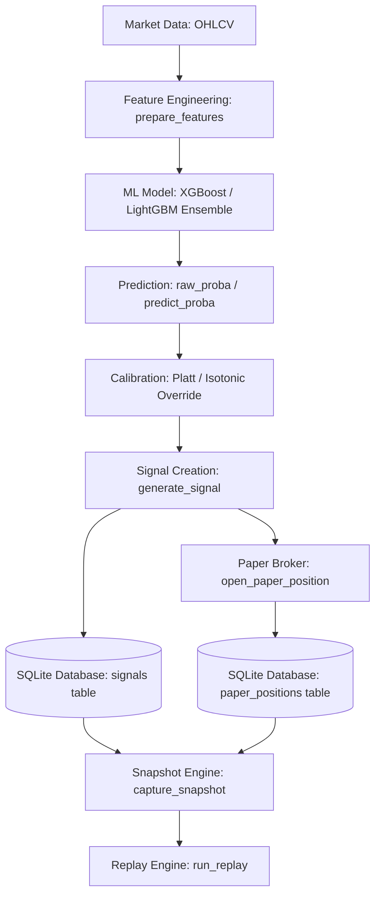

# Prediction Lifecycle Trace

This document details the trace of the prediction and inference pipeline in the trading dashboard system.

## 1. Inference Lifecycle Trace



## 2. Prediction Execution Details

- **File Location**: [predictor.py](file:///home/zafka/trade-dashboard/ml_service/models/predictor.py#L311-L321)
- **Execution Code**:
  ```python
  if isinstance(model, dict) and 'xgb' in model and 'lgb' in model:
      xgb_proba = model['xgb'].predict_proba(X_latest)[0]
      lgb_proba = model['lgb'].predict_proba(X_latest)[0]
      raw_proba = (xgb_proba + lgb_proba) / 2
  else:
      raw_proba = model.predict_proba(X_latest)[0]
  ```

## 3. Disappearance of Prediction Fields

1. **Model Output**: The model outputs a probability array of size 3 (corresponding to short, neutral, long classes).
2. **Signal Creation**: The `generate_signal` function maps these to `prob_short`, `prob_neutral`, and `prob_long`.
3. **Database Insertion**: `save_signal_to_db` inserts all probability values, `model_version`, `regime`, multipliers, and thresholds into the `signals` SQLite table.
4. **Disappearance Point**: The data disappears in [signal_repository.py](file:///home/zafka/trade-dashboard/ml_service/repositories/signal_repository.py). The repository's SQL queries selected only 8 basic columns, ignoring the probability and model details. As a result, the `Signal` dataclass objects returned to the Snapshot Engine had `None` values for those fields.
