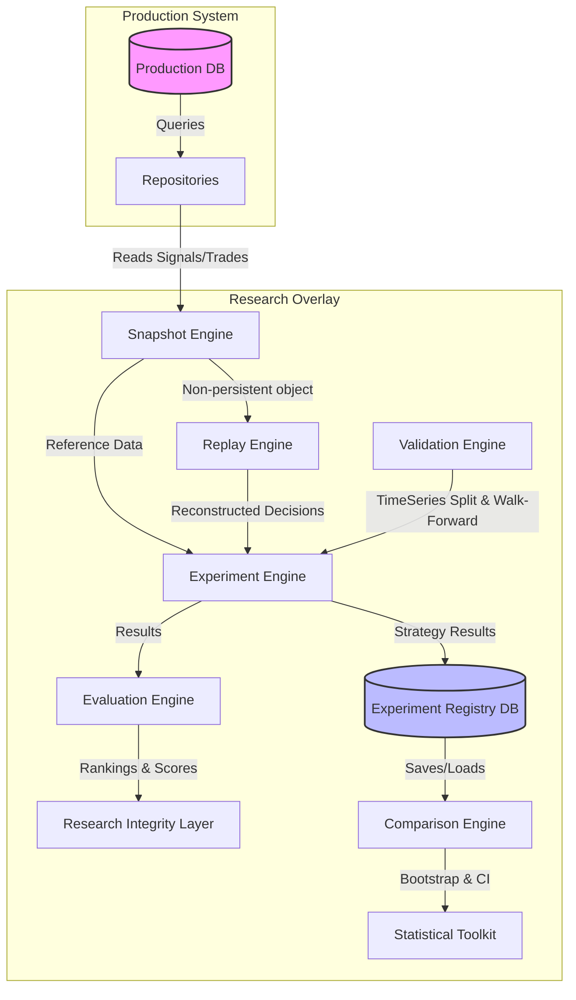

# Sprint 3.5 Full Research Overlay Audit

**Prepared by:** Principal Quant Architect & System Design Reviewer  
**Verdict:** **FAIL** (Severe quantitative invalidity, code/API mismatches, and mathematical/statistical shortcuts)  
**Date:** 2026-07-07  

---

## 1. Executive Summary

A comprehensive architectural and quantitative audit was performed on the entire **Sprint 3.5 Research Overlay System** (comprising Snapshot, Replay, Experiment, Registry, Evaluation, Integrity, Statistical Toolkit, Comparison, and Validation engines).

While the system is modularized and establishes an overlay structure, the implementation contains critical flaws that render it **scientifically invalid and production-unaligned**. The most egregious issues include:
1. **Critical Bugs & Crashes:** The verification scripts (e.g., `verify_replay_engine.py`) fail upon execution due to mismatched APIs (`ReplayResult` attributes).
2. **Broken Trade-to-Signal Mapping:** The Replay Engine maps signal IDs directly to trade position IDs instead of the position's `signal_id` attribute, causing false mismatches and invalid divergence scores.
3. **Hardcoded Metrics & Mathematical Heuristics:** The Experiment Engine hardcodes Sharpe and Max Drawdown to `0.0`, while the Evaluation Engine estimates the Sortino ratio using a hardcoded scaling factor ($Sharpe \times \sqrt{2}$) and computes an algebraically broken Profit Factor that forces net profits to zero.
4. **Statistical Violations:** The Comparison Engine's bootstrap analysis samples paired strategy returns independently, destroying temporal correlation and invalidating hypothesis tests. Time-series splitting lacks purging and embargoing, exposing the research to look-ahead bias and data leakage.

---

## 2. Architecture Audit

### Layer Separation & Dependency Flow
The research layer is separated as an overlay system under `ml_service/research/`. However, its isolation from production is compromised:
* **No Database Isolation:** The Snapshot Engine directly queries production tables (`paper_positions` and `signals`). Without an isolated or immutable snapshot database, the system is exposed to mutation or pruning of historical production data, violating the requirement for reproducibility.
* **Flow Direction:** Production data flows from the repositories into the research engine. The dependencies generally flow in the correct direction (Research imports Production repositories, not vice versa), preventing circular dependencies.
* **No true state persistence:** Snapshot service persistence methods are stubbed (`get_snapshot` returns `None`), meaning snapshots live entirely in transient memory, rendering cross-environment research collaboration impossible.

### Architecture Diagram
The diagram below illustrates the flow of dependencies and data through the Research Overlay system:



---

## 3. Snapshot Engine Audit

### Determinism Gaps
* **Execution Timestamp Dependency:** In [capture.py](file:///home/zafka/trade-dashboard/ml_service/research/snapshot_engine/capture.py#L48-L71), the snapshot ID is generated by hashing the serialized `snapshot_content` which includes a runtime execution timestamp (`datetime.utcnow().isoformat()`). Two snapshots captured from the *exact same* database content at different times will result in different snapshot IDs.
* **Non-Persistent Storage:** The Snapshot Service exposes `get_snapshot` and `get_replay` as returning `None`, with comments indicating persistence is not implemented.

### State Incompleteness
The snapshot only captures `trades` and `signals` from active database tables. To achieve institutional-grade reproducibility, the snapshot must include:
* **Order Book & Market Context:** Hardcoded to `None` in the current implementation.
* **Broker & Execution State:** Balance, equity, margin, and pending orders are hardcoded to `None`.
* **Model Metadata:** Weights, hyperparameters, and active model version hashes are hardcoded to `None`.

---

## 4. Replay Engine Audit

### Structural Mapping Bug
In [replay.py](file:///home/zafka/trade-dashboard/ml_service/research/replay_engine/replay.py#L29-L51), the trade mapping is constructed as:
```python
trade_map = {trade.get('id'): trade for trade in snapshot.trades}
```
And matched via:
```python
corresponding_trade = trade_map.get(signal_id)
```
* **The Bug:** `trade.get('id')` returns the database primary key of the trade position, whereas `signal_id` is the primary key of the generating signal. Because these IDs belong to different tables, the lookup will fail for almost all records (unless by random coincidence). This results in `corresponding_trade` being `None`, classifying almost all actual trades as mismatched, which inflates the divergence score.
* **The Correction:** The mapping must index on the trade's `signal_id` field:
  ```python
  trade_map = {trade.get('signal_id'): trade for trade in snapshot.trades if trade.get('signal_id') is not None}
  ```

### Verification Script API Mismatches
* Running `verify_replay_engine.py` throws an immediate `AttributeError`. The script attempts to access `result.decision_log` and `decision['trade_id']`, but the `ReplayResult` schema only defines `result.decisions` containing keys like `signal_id`, `reconstructed`, and `actual`.

---

## 5. Experiment & Evaluation Engine Audit

### Hardcoded Metrics
In [engine.py (Experiment Engine)](file:///home/zafka/trade-dashboard/ml_service/research/experiment_engine/engine.py#L114-L123), the engine returns hardcoded metrics:
```python
sharpe = 0.0
max_drawdown = 0.0
```
This renders parameter tuning sweeps or strategy comparisons for Sharpe ratio and drawdown completely useless, as every experiment variant registers `0.0`.

### Broken Mathematical Heuristics (Evaluation Engine)
In [engine.py (Evaluation Engine)](file:///home/zafka/trade-dashboard/ml_service/research/evaluation_engine/engine.py#L103-L162):
1. **Algebraically Broken Profit Factor:**
   The engine estimates profit factor from win rate and total PnL assuming:
   ```python
   avg_win = avg_pnl_per_trade / winrate
   avg_loss = avg_pnl_per_trade / (winrate - 1.0)
   ```
   If we substitute these into the gross profit and gross loss equations:
   $$GrossProfit = Wins \times AvgWin = (N \times winrate) \times \frac{AvgPnL}{winrate} = N \times AvgPnL = PnL$$
   $$GrossLoss = Losses \times |AvgLoss| = (N \times (1-winrate)) \times \left|\frac{AvgPnL}{winrate-1}\right| = N \times AvgPnL = PnL$$
   This causes $GrossProfit = GrossLoss = PnL$, resulting in an estimated profit factor of exactly $1.0$ (or a bounded adjustment) regardless of how profitable or loss-making the strategy actually is.
2. **Heuristic Sortino Ratio:**
   The Sortino ratio is estimated using the hardcoded shortcut:
   ```python
   return sharpe_ratio * math.sqrt(2)
   ```
   This assumes return distributions are perfectly normal and downside deviation scales uniformly, which is mathematically invalid for financial asset returns characterized by fat tails, skewness, and volatility clustering.

---

## 6. Statistical Validity Audit

### Bootstrap Correlation Violation
In [bootstrap.py](file:///home/zafka/trade-dashboard/ml_service/research/comparison_engine/bootstrap.py#L40-L47), the bootstrap analysis resamples strategy A returns and strategy B returns independently:
```python
sample_a = np.random.choice(arr_a, size=n_a, replace=True)
sample_b = np.random.choice(arr_b, size=n_b, replace=True)
```
* **The Flaw:** By sampling independently, the temporal correlation of returns on identical trading days is lost. If day $t$ was a severe market crash, both strategies likely suffered losses. Independent sampling breaks this pairing, artificially increasing the variance of the difference distribution.
* **The Correction:** Resampling must be done on the paired difference series $D_t = R_{A,t} - R_{B,t}$:
  ```python
  diff = arr_a - arr_b
  sample_diff = np.random.choice(diff, size=len(diff), replace=True)
  ```

### Look-Ahead Bias & Lack of Purging/Embargoing
In [splitter.py](file:///home/zafka/trade-dashboard/ml_service/research/validation_engine/splitter.py#L9-L46), the split is a simple chronological index slice.
* **The Flaw:** Quant model features are often overlapping (e.g., rolling indicators or multi-day return horizons). Chronological splits without **purging** (removing training labels overlapping with the validation set) and **embargoing** (removing training samples immediately following validation to account for auto-correlated residuals) leak future information into the model, leading to inflated validation metrics.

### Inconsistent Directional Differencing
* The Comparison Engine calculates `MetricsDifference` as `total_return_a - total_return_b` ($A - B$, i.e. Baseline - Candidate).
* In contrast, the Registry calculates comparison differences as `compare_pnl - base_pnl` ($B - A$, i.e. Candidate - Baseline).
* This inconsistency leads to sign inversion bugs when interpreting whether a challenger model outperforms a baseline.

---

## 7. Quant Research Maturity Score

| Dimension | Score (0-10) | Key Factors / Rationale |
| :--- | :---: | :--- |
| **Architecture** | 4/10 | Clean component structures and separation, but lacks DB isolation, and contains stubbed, non-functional persistence layers. |
| **Reproducibility** | 2/10 | Non-deterministic snapshot IDs, missing broker/market state variables, and missing configuration/model file version hashing. |
| **Statistical Rigor** | 2/10 | Independent bootstrapping violates paired return logic; no purging or embargoing in splitting; sign inversion in metric comparisons. |
| **Research Methodology** | 2/10 | Hardcoded Sharpe and Drawdown values; mathematically broken heuristics for Profit Factor and Sortino ratio calculations. |
| **Production Alignment** | 3/10 | Replay engine fails to run actual production model inference, instead querying production DB tables directly and matching trade/signal IDs incorrectly. |
| **OVERALL SCORE** | **2.6 / 10** | **Unacceptable for production or quantitative research.** |

---

## 8. Classified Findings

### CRITICAL (Must fix before continuing)
1. **Replay Engine Trade Mapping Bug:** `replay.py` matches trade position IDs to signal IDs, resulting in near-total failure to reconstruct trade executions.
2. **Broken Verification Scripts:** `verify_replay_engine.py` crashes due to mismatched API attribute names on `ReplayResult`.
3. **Hardcoded Metrics in Experiment Engine:** Experiment output reports `0.0` for Sharpe and Drawdown, making risk-adjusted comparison impossible.
4. **Invalid Profit Factor Calculation:** Algebraically invalid win/loss estimation forces estimated profit factors to 1.0.

### IMPORTANT (Should fix soon)
1. **Bootstrap Temporal Correlation Violation:** Independent resampling of paired strategies invalidates comparison significance tests.
2. **Lack of Purging and Embargoing:** Chronological splitting without overlapping data isolation introduces look-ahead bias and leaks future information.
3. **Non-Deterministic Snapshot IDs:** Snapshot IDs are dependent on the execution time clock rather than the content payload.
4. **Inconsistent Differencing Signs:** Comparison Engine calculates $A-B$ while Registry calculates $B-A$.
5. **Stubbed Snapshot Persistence:** Snapshot engine is completely transient; no storage exists to load or audit past experiments.

### OPTIONAL (Future improvements)
1. **Heuristic Sortino Ratio:** Replace Sortino approximation ($Sharpe \times \sqrt{2}$) with actual downside deviation calculations from return series.
2. **Market & Model State Capture:** Implement capture routines for limit order books and model metadata to achieve institutional-grade replay.

---

## 9. Final Decision

# VERDICT: FAIL

### Remediation Plan:
1. **Fix API and ID Mappings:** Correct the trade mapping in `replay.py` to index by `signal_id`, and update `verify_replay_engine.py` to match the `ReplayResult` schema.
2. **Implement True Metric Calculations:** Replace hardcoded `0.0` metrics in the experiment engine with real calculations from the return series.
3. **Correct Bootstrapping & Splitters:** Re-write `bootstrap.py` to sample from the difference series directly, and implement purged and embargoed time-series splitters.
4. **Implement Persistent Storage:** Replace snapshot persistence stubs with structured SQLite tables.

---

## 10. Next Recommended Sprint

### Sprint 3.6: Research Rigor & Integration Remediation
The next step must focus exclusively on fixing these structural and mathematical failures. No new engines should be added until the core snapshot, replay, experiment, and statistical validation frameworks are mathematically sound and executionally correct.
