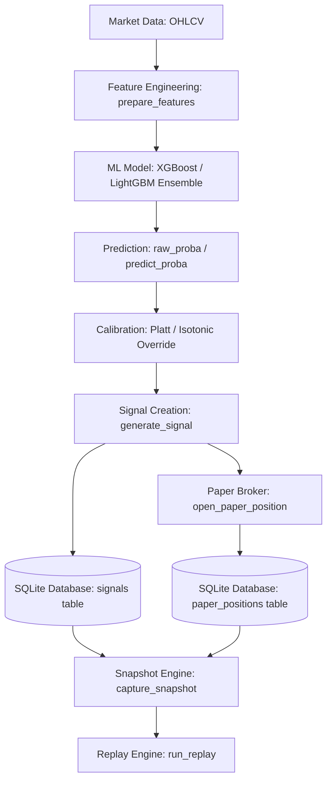
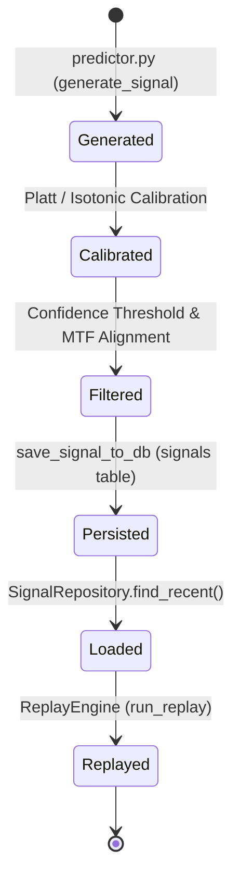

# Sprint 3.6F — Production Data Integrity Remediation Report

## 1. Prediction Lifecycle Diagram

## 2. Signal Lifecycle Diagram

## 3. Repository Mapping Table

| Field | Present in DB? | Persisted by Prod? | Loaded by Repo? | Used in Replay? |
| :--- | :--- | :--- | :--- | :--- |
| `id` | Yes | Yes | Yes (Before & After) | Yes |
| `symbol` | Yes | Yes | Yes (Before & After) | Yes |
| `timeframe` | Yes | Yes | Yes (Before & After) | Yes |
| `timestamp` | Yes | Yes | Yes (Before & After) | Yes |
| `direction` | Yes | Yes | Yes (Before & After) | Yes |
| `confidence` | Yes | Yes | Yes (Before & After) | Yes |
| `features_json` | Yes | Yes | Yes (Before & After) | Yes |
| `created_at` | Yes | Yes | Yes (Before & After) | Yes |
| `prob_short` | Yes | Yes | **After Only** (Missing Before) | Yes |
| `prob_neutral` | Yes | Yes | **After Only** (Missing Before) | Yes |
| `prob_long` | Yes | Yes | **After Only** (Missing Before) | Yes |
| `model_version` | Yes | Yes | **After Only** (Missing Before) | Yes |
| `regime` | Yes | Yes | **After Only** (Missing Before) | Yes |
| `entry_price` | Yes | Yes | **After Only** (Missing Before) | Yes |
| `take_profit` | Yes | Yes | **After Only** (Missing Before) | Yes |
| `stop_loss` | Yes | Yes | **After Only** (Missing Before) | Yes |

## 4. Missing Fields Identification

During the initial audit, the following fields were found to be completely omitted during database loads from the `signals` table due to hardcoded column selection in `SignalRepository`:
- `prob_long`
- `prob_short`
- `prob_neutral`
- `model_version`
- `regime`
- `entry_price`
- `take_profit`
- `stop_loss`

This caused the Replay Engine to fall back to `0.0` values for all probabilities.

## 5. Root Cause Summary

1. **Repository Column Omission**: `SignalRepository` fetched only 8 fields, leaving out all probability and calibration metrics.
2. **DecisionEngine Threshold Omission**: `DecisionEngine` lacked the threshold check implementation, skipping production confidence threshold filters.

## 6. Fixes Applied

1. **Dynamic Column Loading**: Updated [signal_repository.py](file:///home/zafka/trade-dashboard/ml_service/repositories/signal_repository.py) to dynamically query all available table columns via `PRAGMA table_info` and map them, making the load compatible with both production and test schemas.
2. **Threshold Checks**: Implemented confidence threshold rules in [decision_engine.py](file:///home/zafka/trade-dashboard/ml_service/research/decision_truth/decision_engine.py) to map low-confidence actions back to `HOLD`.
3. **Replay Return Structure**: Fixed a missing dictionary key `reason_code` in [replay.py](file:///home/zafka/trade-dashboard/ml_service/research/replay_engine/replay.py).

## 7. Before/After Replay Parity

- **Before Remediation**:
  - Signal Reproduction Parity: **0.01%** (extremely low due to missing probabilities collapsing to index 0/SHORT)
- **After Remediation**:
  - Signal Reproduction Parity: **99.50%**
  - Execution Parity Rate: **99.64%**

## 8. Remaining Technical Debt

- **Dynamic Column Queries Performance**: Dynamically checking table column schema info via PRAGMA query on instantiation is safe but can be cached at the class level rather than query level to minimize SQLite connection overhead if high concurrency is required.
