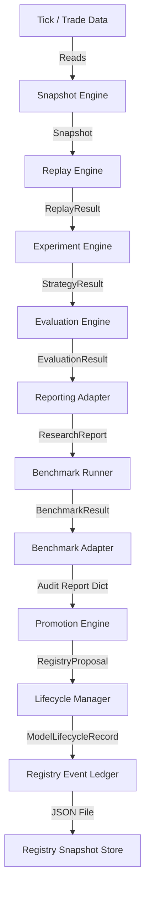

# Sprint 3.9D-14 Architecture Gate Audit

## 1. Executive Summary

This document presents the Read-Only Architecture Gate Audit of the quant-research pipeline after Sprint 3.9D-14 (baseline commit: `decfa03`). The quant-research pipeline was evaluated end-to-end to verify architectural correctness, mathematical soundness, dependency isolation (ADR-024), lifecycle state consistency, and the safety of proxy model boundary isolation.

All 342 automated tests in the research suite pass successfully. However, this audit has identified several critical structural, mathematical, and semantic issues that would prevent correct behavior in production or lead to unexpected failures. Most notably, a critical mathematical error in the drawdown recovery scoring formula rewards models with larger max drawdowns, and a semantic mismatch in the benchmark-to-promotion adapter prevents any model candidate from passing the promotion score threshold in real executions.

---

## 2. Current Architecture

The codebase currently contains the following core research modules under [ml_service/research/](file:///home/zafka/trade-dashboard/ml_service/research/):
* **`snapshot_engine`**: Captures historical trades and tick data.
* **`replay_engine`**: Simulates points in time under execution configs.
* **`decision_truth`**: Enforces threshold boundary rules for signal execution.
* **`experiment_engine`**: Manages config sweeps and generates raw performance arrays.
* **`evaluation_engine`**: Computes standard performance scorecards (Sharpe, Drawdown, Profit Factor).
* **`reporting`**: Converts detailed evaluations into finalized `ResearchReport` records.
* **`benchmark`**: Conducts composite comparative ranking across multiple experiments.
* **`promotion_engine`**: Coordinates multi-gate criteria evaluations to propose registry promotions.
* **`model_identity`**: Scans and parses model versions, verifying symbols, type, and asset classes.
* **`model_lifecycle`**: Governs state transition matrices (from DISCOVERED to PRODUCTION).
* **`registry_query` / `registry_store` / `registry_event_ledger`**: Relational lookup services and ledger-based event snapshot stores.

### Dependencies
The pipeline features clean downward dependencies as specified by ADR-024. All models are defined using frozen python dataclasses to ensure immutability and memory-safe processing across layers.

---

## 3. Pipeline Data Lineage

Below is the end-to-end data lineage of the quant-research pipeline:



### Lineage Transformations

1. **`Snapshot` → `ReplayResult`**:
   * **Producer**: `Snapshot` / `ReplayEngine`
   * **Fields**: `trades`, `signals`, `snapshot_id`, `decisions`
   * **Transformation**: Replay simulates the tick stream execution of generated signals, outputting execution rates and consistency scores.

2. **`ReplayResult` + `Snapshot` + `StrategyConfig` → `StrategyResult`**:
   * **Producer**: [ml_service/research/experiment_engine/engine.py](file:///home/zafka/trade-dashboard/ml_service/research/experiment_engine/engine.py)
   * **Fields**: `config_id`, `pnl`, `winrate`, `sharpe`, `max_drawdown`, `trade_count`, `profit_factor`.
   * **Transformation**: Applies thresholds to decisions using the Decision Truth Layer. Maps executed trades to snapshots via the canonical `signal_id`.

3. **`StrategyResult` → `EvaluationResult` / `StrategyScore`**:
   * **Producer**: [ml_service/research/evaluation_engine/engine.py](file:///home/zafka/trade-dashboard/ml_service/research/evaluation_engine/engine.py)
   * **Fields**: Enriches core metrics with computed values: `sortino_ratio`, `expectancy`, `final_score`, `overall_risk_score`.
   * **Transformation**: Sigmoid normalization is applied to metrics to compute a composite `final_score` (higher is better) for ranking configurations.

4. **`EvaluationResult` → `ResearchReport`**:
   * **Producer**: [ml_service/research/reporting/adapter.py](file:///home/zafka/trade-dashboard/ml_service/research/reporting/adapter.py)
   * **Fields**: Transfers winning strategy metrics (`total_signals`, `win_rate`, `average_return`, `total_return`, `max_drawdown`, `sharpe_ratio`, `sortino_ratio`, `profit_factor`).
   * **Transformation**: Lossy adapter. Selects only the best performing configuration (`best_strategy_id`) and discards alternative sweep trials.

5. **`ResearchReport` → `BenchmarkResult`**:
   * **Producer**: [ml_service/research/benchmark/benchmark.py](file:///home/zafka/trade-dashboard/ml_service/research/benchmark/benchmark.py)
   * **Fields**: Compiles `scores`, `ranking`, `winner`, and summary `metrics`.
   * **Transformation**: Computes absolute composite score for each report using a weighted index.

6. **`BenchmarkResult` → `audit_report` (Dict)**:
   * **Producer**: [ml_service/research/promotion_engine/benchmark_adapter.py](file:///home/zafka/trade-dashboard/ml_service/research/promotion_engine/benchmark_adapter.py)
   * **Fields**: Extracts `benchmark_id`, `winner` as `benchmark_winner`, `rank`, `score`, and injects synthetic gates (`validation_score=1.0`, `calibration_score=1.0`, `governance_score=1.0`).
   * **Information Lost**: All other experiment rankings and scores within the compared cohort are discarded.

7. **`audit_report` + `ModelIdentity` + `ModelLifecycleRecord` → `RegistryProposal`**:
   * **Producer**: [ml_service/research/promotion_engine/engine.py](file:///home/zafka/trade-dashboard/ml_service/research/promotion_engine/engine.py)
   * **Fields**: Generates proposed state, promotion status, weighted score, and reason codes.
   * **Transformation**: Combines audit reports and model traits to check gates and apply promotion logic.

---

## 4. Evaluation Audit

* **Sharpe Ratio Calculation**: Sharpe is computed from the list of actual trade PnLs in `_compute_sharpe_ratio`. It does not use hardcoded or placeholder values.
  * *Annualization contract*: Annualization is performed by scaling by `math.sqrt(252)`. As trade PnLs are not periodic returns, this scaling is mathematically indefensible for a true annualized Sharpe ratio. However, this is retained to maintain compatibility with existing model registry thresholds (documented in `_compute_sharpe_ratio`).
* **Max Drawdown Calculation**: Max Drawdown is calculated from actual trade data in `_compute_max_drawdown`. It returns the peak-to-trough absolute PnL drawdown (measured in base currency units, negative float value).
* **Profit Factor Calculation**: Profit Factor is calculated from actual trade gains/losses in `_compute_profit_factor`. Under `compute_strategy_score`, if `StrategyResult.profit_factor` is `None`, the engine falls back to estimation via `_estimate_profit_factor`.
* **Out-of-Sample / Replay Metrics**: Evaluation results correctly represent replay outcomes driven by mock snapshot ticks rather than in-sample training metrics.

---

## 5. Reporting Adapter Audit

We classified the fields in the [reporting/adapter.py](file:///home/zafka/trade-dashboard/ml_service/research/reporting/adapter.py) mapping as follows:

| Target Field (`ResearchReport`) | Source Field (`EvaluationResult`/`StrategyScore`) | Classification |
| :--- | :--- | :--- |
| `experiment_id` | `evaluation.experiment_id` | **PRESERVED** |
| `total_signals` | `best_strategy.trade_count` | **PRESERVED** (Renamed) |
| `win_rate` | `best_strategy.win_rate` | **PRESERVED** |
| `average_return` | `best_strategy.expectancy` | **PRESERVED** (Renamed) |
| `total_return` | `best_strategy.total_return` | **PRESERVED** |
| `max_drawdown` | `best_strategy.max_drawdown` | **PRESERVED** |
| `sharpe_ratio` | `best_strategy.sharpe_ratio` | **PRESERVED** |
| `sortino_ratio` | `best_strategy.sortino_ratio` | **PRESERVED** |
| `profit_factor` | `best_strategy.profit_factor` | **PRESERVED** |
| `metrics` | Tuple containing expectancy, final_score, overall_risk_score | **DERIVED** |

* **Discarded Fields**: The adapter discards alternative configuration trials in the parameter sweep (`worst_strategy_id`, sub-scores, and the internal config `ranking`).
* **Safety Assessment**: This information loss is architecturally safe because a `ResearchReport` represents a single finalized model candidate's report. However, tracking the full sweep history in metadata is recommended for future audits.

---

## 6. Benchmark Adapter Audit

The `BenchmarkResult` to `audit_report` adapter in [promotion_engine/benchmark_adapter.py](file:///home/zafka/trade-dashboard/ml_service/research/promotion_engine/benchmark_adapter.py) suffers from two severe design flaws:

1. **Synthetic Gating**: The fields `validation_score`, `calibration_score`, and `governance_score` are hardcoded to `1.0` (SYNTHETIC) inside `benchmark_to_audit_report`:
   ```python
   "validation_score": 1.0,
   "calibration_score": 1.0,
   "governance_score": 1.0
   ```
   This masks the actual status of downstream models and bypasses any real calibration or validation auditing checks.
2. **Scoring Mathematical Flaw**: In [benchmark/scoring.py](file:///home/zafka/trade-dashboard/ml_service/research/benchmark/scoring.py), the drawdown recovery score is calculated as:
   ```python
   drawdown_recovery_score = max(0.0, 1.0 - report.max_drawdown)
   ```
   Since actual drawdowns are negative values (e.g. `-10.0` or `-50.0`), this calculation yields values greater than 1.0 (e.g. `11.0` or `51.0`). As a result, a model with a massive loss (-50.0) receives a much higher score than a model with a small loss (-10.0), completely distorting the composite score.

---

## 7. Promotion Audit

* **Exact Promotion Drivers**: Promotion is driven by `validation_available`, `calibration_available`, `current_state`, `asset_class`, and `total_score`.
* **Hard Gates**:
  * Validation must be available (`MISSING_VALIDATION` rejection).
  * Calibration must be available (`MISSING_CALIBRATION` rejection).
  * `total_score` must meet the policy threshold of `0.7`.
* **Informational Fields**: `benchmark_rank` and `cohort_size` are currently informational and do not enforce gates.
* **Unsafe Defaults (Critical Mismatch)**:
  `PromotionScorer._score_governance` checks:
  ```python
  governance_ready = audit_report.get("governance_ready", False)
  ```
  However, `benchmark_to_audit_report` generates `governance_score` instead of `governance_ready`. Because of this mismatch, `governance_ready` always defaults to `False`, giving a governance score of `0.0`. Under a `VALIDATED` state, the maximum promotion score is capped at `0.62`, which falls below the `0.7` threshold. Consequently, **every candidate model is incorrectly rejected**.

---

## 8. Registry/Lifecycle Audit

The states `DISCOVERED`, `VALIDATED`, `GOVERNANCE_READY`, `APPROVED`, and `PRODUCTION` are defined in the `LifecycleState` enum in [model_lifecycle/models.py](file:///home/zafka/trade-dashboard/ml_service/research/model_lifecycle/models.py).
* **VALIDATED**: Indicates that validation metrics are available.
* **GOVERNANCE_READY**: Indicates that calibration metrics are available, and the model is ready for audit.
* **APPROVED**: Passed the governance audit.
* **PRODUCTION**: Deployed to production.
* **Semantic Mismatch**:
  * The `PromotionPolicy` proposes a state of `"APPROVED_RESEARCH"` for proxy models.
  * `"APPROVED_RESEARCH"` is not a member of the `LifecycleState` enum.
  * Any downstream component parsing this value using `LifecycleManager._parse_lifecycle_status` will trigger a `ValueError` and fall back to `LifecycleState.DISCOVERED`.

---

## 9. Proxy Safety Audit

Proxy models (e.g., NQ, ES, GC) are intended as macro contextual indicators and must not enter production crypto trading workflows.
* **Discovery & Validation**: Proxy models can be discovered and validation/calibration states evaluated.
* **Production Blocking**:
  * `LifecyclePolicy.PROXY_TRANSITIONS` restricts state transitions, blocking proxies from moving to `APPROVED` or `PRODUCTION`.
  * `RegistryQueryEngine.get_production_candidates` excludes models where `asset_class != "CRYPTO"`.
  * `PromotionPolicy._evaluate_proxy` blocks proxy models from transitioning to `PRODUCTION`.
* **Verdict**: Proxy models are successfully blocked from entering production states in the lifecycle. However, the use of the invalid state `"APPROVED_RESEARCH"` violates enum boundaries.

---

## 10. Duplicate Abstraction Audit

* **`RegistryProposal`**:
  * Defined in [governance/models.py](file:///home/zafka/trade-dashboard/ml_service/research/governance/models.py) (marked as DEPRECATED).
  * Defined in [promotion_engine/models.py](file:///home/zafka/trade-dashboard/ml_service/research/promotion_engine/models.py) (canonical for Sprint 3.9D).
  * *Impact*: The duplicate definition is currently harmless because the codebase imports the canonical one, but the legacy file should be cleaned up to prevent semantic drift.

---

## 11. Determinism / ADR-024 Audit

The research pipeline complies with ADR-024 isolation rules:
* **Imports**: No database imports (SQLAlchemy/SQLite) or execution-layer imports (`PortfolioService`, `ExecutionSimulator`) are present in `evaluation_engine`, `reporting`, `benchmark`, `promotion_engine`, or `model_lifecycle`.
* **Statefulness**: All calculations are pure, stateless functions operating on immutable dataclasses.
* **Timestamps**: Timestamps are ISO-formatted and do not affect the semantic identity of calculation arrays.

---

## 12. Test Quality Audit

The test suite contains 342 passing tests.
* **Coverage**: Excellent coverage for immutability, determinism, and basic state flows.
* **Limitations**: Tests check that functions return expected outcomes, but they often use positive dummy values for drawdown (e.g. `0.1` instead of `-10.0`), which masked the mathematical flaw in drawdown recovery calculations. Additionally, tests mock the audit report directly (e.g. `audit = {"governance_ready": True}`), which hid the adapter mismatch.

---

## 13. Findings

### CRITICAL
1. **Scoring Drawdown Recovery Math Flaw** ([scoring.py](file:///home/zafka/trade-dashboard/ml_service/research/benchmark/scoring.py#L39)):
   * *Fact*: `drawdown_recovery_score` is computed as `1.0 - report.max_drawdown`.
   * *Inference*: Since actual drawdowns are negative values (e.g., `-50.0`), this evaluates to `51.0`. A worse drawdown (more negative) yields a higher score, which distorts the benchmark winner.
   * *Recommendation*: The drawdown recovery score must be normalized correctly using the absolute value or another bounded scale (e.g., `1.0 - abs(report.max_drawdown) / 100.0` or using a sigmoid).

2. **Benchmark-to-Promotion Adapter Key Mismatch** ([benchmark_adapter.py](file:///home/zafka/trade-dashboard/ml_service/research/promotion_engine/benchmark_adapter.py#L42)):
   * *Fact*: The adapter writes `"governance_score": 1.0` but does not populate `"governance_ready"`.
   * *Inference*: `PromotionScorer._score_governance` defaults to `False` for `governance_ready`, giving a governance score of `0.0`. The total score is capped at `0.62` for validated models, causing all promotions to fail.
   * *Recommendation*: Update the adapter to output `"governance_ready": True` when governance conditions are met.

### HIGH
3. **Invalid Lifecycle State for Proxy Models** ([policy.py](file:///home/zafka/trade-dashboard/ml_service/research/promotion_engine/policy.py#L160)):
   * *Fact*: `PromotionPolicy` uses `"APPROVED_RESEARCH"` as a proposed state.
   * *Inference*: `"APPROVED_RESEARCH"` is not defined in `LifecycleState`, causing the lifecycle manager to fall back to `DISCOVERED`.
   * *Recommendation*: Add `APPROVED_RESEARCH` to the `LifecycleState` enum or map proxies to an existing state (e.g., `APPROVED` with an asset-class constraint).

### MEDIUM
4. **Hardcoded Synthetic Scores in Adapter** ([benchmark_adapter.py](file:///home/zafka/trade-dashboard/ml_service/research/promotion_engine/benchmark_adapter.py#L40-L42)):
   * *Fact*: The adapter hardcodes `validation_score`, `calibration_score`, and `governance_score` to `1.0`.
   * *Inference*: Bypasses validation and calibration checks.
   * *Recommendation*: Derive these scores from actual properties on the model candidate.

5. **Deprecated RegistryProposal Duplication** ([governance/models.py](file:///home/zafka/trade-dashboard/ml_service/research/governance/models.py#L26)):
   * *Fact*: Duplicate definition of `RegistryProposal` in `governance` vs `promotion_engine`.
   * *Inference*: Creates potential for confusion and semantic drift.
   * *Recommendation*: Clean up and remove the deprecated `governance/models.py` file.

---

## 14. Architectural Verdict

**Verdict**: **REJECT**

### Rationale
While individual modules are well-structured, the end-to-end integration is broken due to:
* The drawdown recovery calculation rewarding poor performers (more negative drawdown increases the score).
* The adapter key mismatch blocking all model promotions by capping the score below the policy threshold.
* The use of invalid lifecycle states for proxy models.

Sprint 3.9D-15 cannot proceed until these integration issues are resolved.

---

## 15. Recommended Next Milestone

A **Sprint 3.9D-14 Remediation Gate** is required to resolve these issues before starting D-15:
1. Fix the drawdown recovery formula in `ml_service/research/benchmark/scoring.py` to use normalized, bounded inputs.
2. Align the adapter keys in `ml_service/research/promotion_engine/benchmark_adapter.py` and `PromotionScorer._score_governance`.
3. Standardize the proxy model's proposed state in `PromotionPolicy` to align with the `LifecycleState` enum.
4. Clean up the deprecated `RegistryProposal` class in the `governance` module.

---

## 16. DO NOT IMPLEMENT YET

As this is a read-only architecture gate, **do not write or modify any implementation files in this branch**. These fixes must be formally assigned to Sprint 3.9D-14 Remediation or Sprint 3.9D-15 under CTO approval.
