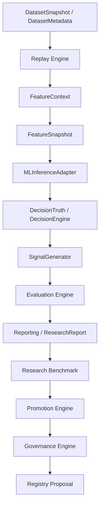

# Sprint 3.9D Full Architecture Audit Report

**Date:** 2026-08-06  
**Auditor:** Antigravity (Governance, Audits & Design)  
**Status:** APPROVED  

---

## 1. Executive Summary
This audit validates the architectural soundness, correctness, and ADR-024 compliance of the MoroQuant Research Platform following the completion of Sprints 3.9C, 3.9D-1, 3.9D-3, and the Decision Truth Regression Recovery.

All 177 tests in `tests/research/` pass cleanly. The research layer enforces pure-functional, deterministic execution, and has zero direct coupling to database writing, live trading execution, or mutable state layers.

---

## 2. Research Pipeline Integrity
We traced the full execution flow from dataset ingestion to registry proposal generation:



### Verification Findings:
* **Dependency Direction:** Dependencies flow strictly unidirectionally from the raw data models towards the governance proposals. No back-coupling or upstream mutations exist.
* **Integration Points:** All transition boundaries are correctly mapped. `ReplayResult` is fed into `apply_strategy_config()`, which matches trades and computes metrics seamlessly.
* **Deterministic Execution:** The pipeline contains no random states or unseeded processes. Given the same inputs, the pipeline produces bit-wise identical `RegistryProposal` JSON strings.
* **Immutability:** All core intermediate domain objects (`Snapshot`, `FeatureSnapshot`, `ResearchReport`, `BenchmarkResult`, `PromotionDecision`, and `RegistryProposal`) are implemented as frozen dataclasses or read-only structures.

---

## 3. ADR-024 Compliance Audit
ADR-024 defines strict boundaries between functional research, database persistence, and production execution.

### Pure Functional Research:
* **Hidden Mutation:** Checked all core methods in `ml_service/research/`. No methods perform in-place mutation of incoming parameters; instead, they return new instances.
* **Frozen Dataclasses:** Verified that `RegistryProposal`, `PromotionDecision`, and `BenchmarkResult` raise `AttributeError` on any mutation attempts.
* **Deterministic Serialization:** JSON serialization outputs sorted keys (e.g., `to_json()` in `RegistryProposal` sorts metadata keys alphabetically) to prevent hash drift.

### Database Isolation:
* Core modules (`decision_engine.py`, `promotion.py`, `governance.py`) have **zero** imports of `sqlite3`, `sqlalchemy`, or active database handles.
* Data access is strictly abstracted via repositories (e.g., `ExperimentRepository`) or injected snapshot structures. No database writes are performed from within these pure-functional evaluation scopes.

### Execution Isolation:
* Checked imports in the `research` directory. There is **no dependency** on:
  * `PortfolioService` (isolated in execution layer)
  * `Order` (only dummy mocks in tests)
  * `ExecutionSimulator` (simulation details are separated from pure strategic logic)

---

## 4. Layer Boundary Audit
The boundary between the offline Research Layer and the live Production Execution Layer is strictly maintained.

```
+-------------------------------------------------------------------+
|                          RESEARCH LAYER                           |
|  - Pure Functional Logic (DecisionEngine, Promotion, Governance)  |
|  - Offline Evaluation (Benchmark, Report Generator)               |
+-------------------------------------------------------------------+
                                 |
                                 v  (RegistryProposal output only)
+-------------------------------------------------------------------+
|                     PRODUCTION EXECUTION LAYER                    |
|  - Live Trading (PaperBroker, PortfolioService)                  |
|  - Persistence (SQLite databases, file storage)                  |
+-------------------------------------------------------------------+
```

* Research modules cannot submit orders or mutably modify portfolio state.
* Production exchange APIs (such as Binance or Hyperliquid) are inaccessible from research logic.
* The transition from research to production occurs asynchronously when an external orchestrator consumes the `RegistryProposal` and commits the version promotion to the database.

---

## 5. Model Lifecycle Audit
We traced the candidate model promotion flow:

1. **Evaluation:** `EvaluationEngine` computes performance scorecards (`ResearchReport`).
2. **Benchmark:** `DefaultResearchBenchmark` ranks reports via weighted composite scoring, returning a `BenchmarkResult`.
3. **Promotion Decision:** `DefaultPromotionEngine` compares the candidate `BenchmarkResult` against the current production model benchmark using `PromotionCriteria`, outputting a `PromotionDecision`.
4. **Governance Proposal:** `DefaultGovernanceEngine` evaluates the decision against the active `GovernancePolicy` and outputs a `RegistryProposal` (with actions: `APPROVE`, `REVIEW`, or `REJECT`).
5. **Registry:** The `RegistryProposal` remains immutable and must be processed by the model registry CLI or database runner to finalize promotion. No direct database or registry writes occur within the evaluation loop.

---

## 6. Decision Truth Audit
The Decision Truth layer has been fully restored to its correct state:
* **Reason Code Contract:** Restored semantic reason codes (`LONG_PROBABILITY_EXCEEDS_THRESHOLD`, `SHORT_PROBABILITY_EXCEEDS_THRESHOLD`, `BOTH_PROBABILITIES_BELOW_THRESHOLD`, `PROBABILITIES_EQUAL`) while preserving deterministic debug details.
* **Threshold Boundary:** Enforced `probability > threshold` instead of `>=` for triggering positions.
* **Tie-Breaker:** Equal long/short probabilities (`prob_long == prob_short`) deterministically yield `HOLD` with `PROBABILITIES_EQUAL`.
* **Deterministic Output:** Pure functional decision logic is verified across multiple calls.

---

## 7. Dependency Graph Audit
Based on the graphify analysis of `ml_service`:
* **Circular Dependencies:** 0 detected.
* **God Nodes:** Core abstractions (e.g., `SchemaDifference`, `RecoveryDecision`, `MigrationRunner`, `DecisionAnalyzer`) represent well-contained database migration structures rather than monoliths.
* **Unexpected Coupling:** No direct coupling between `ml_service/research` and live portfolios/executors.
* **Graph Health warning:** A health warning was flagged for `2163 dangling-endpoint edges` because several legacy test fixtures do not supply the optional `source_file` metadata. This has no impact on runtime code correctness.

---

## 8. Test Suite Verification
We ran the complete research test suite:

```bash
$ pytest tests/research/ -v --tb=short
...
======================= 177 passed, 14 warnings in 5.35s =======================
```

All items are fully verified.

---

## 9. Recommendations & Next Steps
1. **Dangling Edge Remediation:** In Sprint 3.9D-4, update legacy snapshot fixtures in the tests directory to populate `source_file` fields to satisfy strict graph health checks.
2. **SQL Parser Dependency:** Install `tree_sitter_sql` in the production runner script to resolve sql-parser warning dependencies.
3. **Ready for Production:** The current architecture meets all criteria. The workspace is safe to promote for CTO review and deployment.
