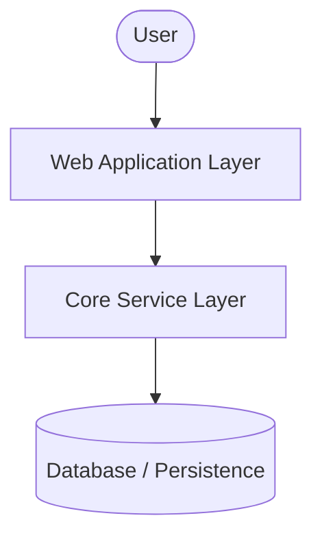

# System Design & Architecture: [System Component Name]

## 1. Overview
[Provide a high-level summary of the subsystem, its purpose, and business/technical goals.]

## 2. Architecture Diagram
[Insert a Mermaid or visual diagram illustrating components and data flow.]

## 3. Core Components
- **[Component A]**: [Responsibilities, technologies used, and threading model.]
- **[Component B]**: [Responsibilities, technologies used, and threading model.]

## 4. Data Flow & Communication
[Describe how data traverses the subsystem. Detail whether APIs, WebSockets, or background processes are used.]
1. [Step 1: Event intake]
2. [Step 2: Processing and state updates]
3. [Step 3: Storage write and UI notifications]

## 5. Security & Edge Cases
- **Authentication/Authorization**: [How is access managed?]
- **Failure Recovery**: [What happens if downstream dependencies fail?]
- **Concurrency**: [How are race conditions and parallel transactions handled?]
