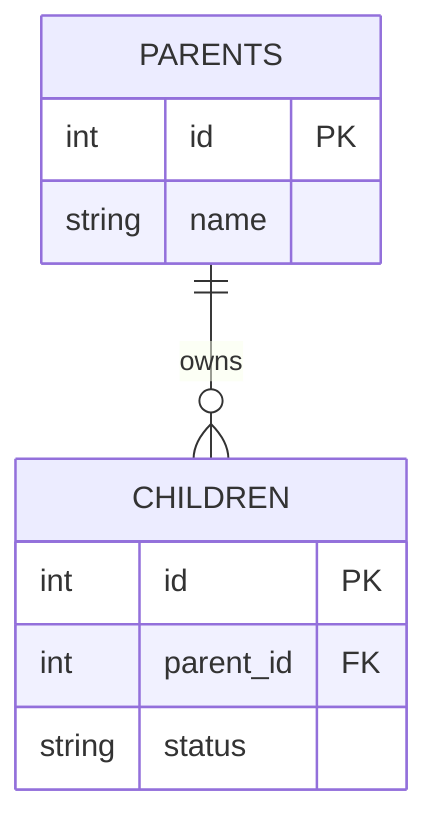

# Schema Definition: [Database/Module Name]

## 1. Overview
[Explain the database engine context (SQLite / PostgreSQL), storage frequency, and backup strategy.]

## 2. Entity Relationship Diagram


## 3. Schema Reference

### Table: `[table_name]`
[Brief description of what entity class this table stores.]

| Column Name | Type | Constraints | Description |
|---|---|---|---|
| `id` | `INTEGER` / `UUID` | `PRIMARY KEY`, `AUTOINCREMENT` | Unique identifier |
| `[column_name]` | `VARCHAR(255)` | `NOT NULL` | Description of use case |

### Indexes & Performance
- **Index `[idx_name]`**: On columns `([col_a], [col_b])`. Purpose: Accelerate query speeds on analytical filters.

## 4. Sample Migration DDL
[Syntax guidelines for migrations.]
```sql
-- Up migration script
-- Down migration script
```
