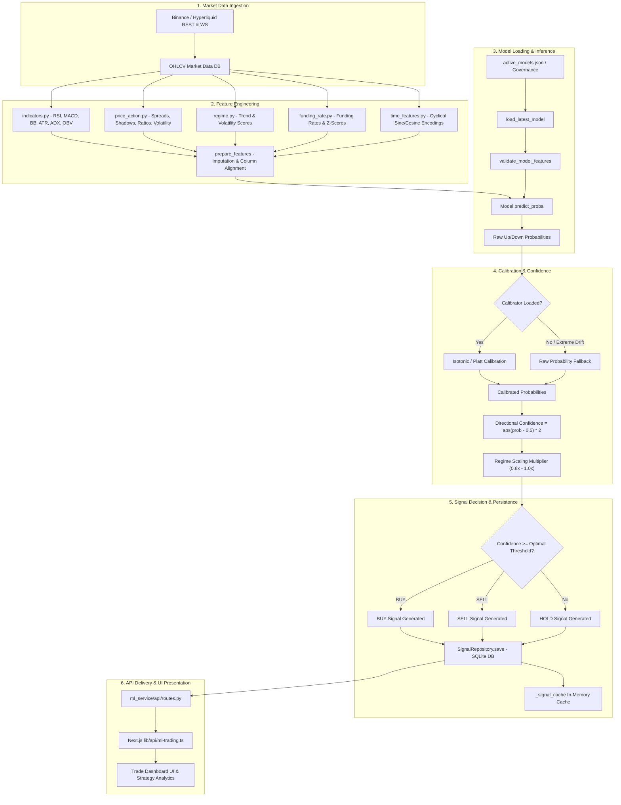
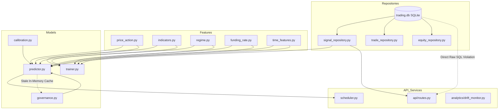

# SYSTEM ARCHITECTURE AUDIT REPORT
# Sprint 4.1 — Prediction Engine Audit
**Status:** COMPLETE (Documentation Only)  
**Date:** 2026-07-21  
**Target Repository:** `/home/zafka/trade-dashboard` (`00Keikoo/MoroQuant`)  
**Scope:** Prediction Lifecycle, Feature Engineering, Inference Engine, Model Registry, Governance, Validation, Scheduler, Metadata, Frontend API Contracts, Sources of Truth, Technical Debt, and Production Readiness.

---

## Executive Summary

This architectural audit documents the current state of the **MoroQuant Prediction Engine** prior to the implementation of Prediction Engine V2.

The analysis evaluates the complete pipeline from raw market data ingestion to feature engineering, model inference, probability calibration, threshold decisions, signal persistence, scheduler execution, and frontend contract delivery.

### Primary Audit Conclusions
1. **Pipeline Structural Integrity**: The fundamental statistical inference flow (OHLCV → Features → Classifiers → Calibration → Signal) is structurally sound, leveraging LightGBM/XGBoost/CatBoost models with Isotonic and Platt calibration routines.
2. **Metadata & Audit Gaps**: Prediction metadata currently omits critical lineage fields (`calibration_version`, `dataset_version`, `prediction_latency`, `inference_duration`).
3. **Frontend Contract Mismatches**: Severe type and structural discrepancies exist between backend FastAPI endpoints and Next.js frontend TypeScript interfaces—most critically the `market_regime` payload type (`Dict` vs `string`) and decimal/percentage scale mismatches.
4. **Caching & Invalidation Vulnerabilities**: In-memory model caching (`_model_cache`) in `predictor.py` lacks cache invalidation when models are updated or promoted in `active_models.json`.
5. **Architectural Layer Violations**: Fast-path API handlers in `routes.py` execute direct raw SQL queries against SQLite, bypassing the `SignalRepository` and `TradeRepository` abstraction layers.

---

## Task 1: Prediction Pipeline Diagram

### End-to-End Prediction Lifecycle Flow



### Detailed Pipeline Step Description

1. **OHLCV Market Data**: Raw minute/hourly OHLCV candlestick data ingested from Binance/Hyperliquid stored in SQLite `ohlcv` tables.
2. **Indicators & Price Action**: Technical indicators (RSI, MACD, Bollinger Bands, ATR, ADX, OBV) and candle morphology (spreads, shadows, rolling return ratios, volume z-scores) are computed.
3. **Regime & Time Features**: Dynamic trend classification (-2 to +2) and volatility quantiles (0 to 2) are calculated alongside cyclic time-of-day/day-of-week embeddings.
4. **Feature Alignment & Imputation**: Features are aligned with the model's required `feature_cols` list. Missing values are filled with domain defaults (e.g. RSI=50, z-score=0).
5. **Model Validation & Loading**: Model metadata is loaded via `governance.py`. `validate_model_features` verifies all required features exist.
6. **Inference Execution**: Ensemble classifiers output raw class probabilities ($P_{up}$, $P_{down}$).
7. **Probability Calibration**: Raw probabilities are transformed via Isotonic Regression or Platt Scaling to reflect empirical win rates.
8. **Confidence Calculation**: Confidence is derived via $C = 2 \cdot |P_{up} - 0.5|$ and scaled by market regime risk factors.
9. **Signal Decision**: Confidence is compared against `optimal_threshold` (e.g., 0.62). Signals emit `BUY`, `SELL`, or `HOLD`.
10. **Persistence & Serving**: Predictions are saved to SQLite `signals` table and served via REST API to the Next.js frontend.

---

## Task 2: Module Ownership Matrix

| Module Name | Purpose | Layer | DB Tables | Primary Consumers | Source of Truth | Key Dependencies | Primary Outputs |
|---|---|---|---|---|---|---|---|
| `ml_service/features/` | Technical & regime feature extraction | Analytics / Pipeline | None | `predictor.py`, `trainer.py` | Python Logic | `pandas`, `numpy`, `pandas_ta` | Feature DataFrames |
| `ml_service/models/predictor.py` | Inference execution & signal generation | Service | `signals` | `routes.py`, `scheduler.py` | Model Pickles & DB | `scikit-learn`, `lightgbm`, `yaml` | Directional Signals & Probabilities |
| `ml_service/models/governance.py` | Model registry, versioning & promotion | Service / Governance | `models` | `predictor.py`, `retraining_policy.py` | `active_models.json` | `json`, `pathlib`, `shutil` | Model Active Registry Mappings |
| `ml_service/models/calibration.py` | Probability calibration fitting | Analytics | None | `predictor.py`, `trainer.py` | Model Pickles | `scikit-learn` (`IsotonicRegression`) | Calibrated Probabilities |
| `ml_service/models/trainer.py` | Offline model training & hyperparameter tuning | Pipeline | None | CLI, Retrain Scripts | Training Dataset | `lightgbm`, `xgboost`, `catboost` | Trained Model Package Pickles |
| `ml_service/analytics/drift_monitor.py` | Feature & prediction drift calculation | Analytics | `drift_metrics` | `scheduler.py`, Dashboard API | `drift_metrics` DB | `scipy.stats` (PSI, KS-test) | PSI & Drift Alerts |
| `ml_service/repositories/signal_repository.py` | Signal data access & persistence | Repository | `signals` | `routes.py`, `paper_analytics_service.py` | SQLite DB | `database.py`, `sqlite3` | Signal Domain Models |
| `ml_service/scheduler.py` | Periodic task orchestration | Service / Job Scheduler | `system_status` | System Background Process | Cron Config | `apscheduler` | Job Triggers |
| `ml_service/api/routes.py` | REST API endpoints for frontend | API Layer | Reads `signals`, `models` | Next.js (`ml-trading.ts`) | Services & Repositories | `fastapi`, `pydantic` | JSON API Responses |
| `lib/api/ml-trading.ts` | Frontend API client | Frontend Integration | None | React Components | Backend API | `fetch`, `axios` | TypeScript UI Props |

---

## Task 3: Feature Engineering Matrix

| Feature Name | Source Module | Window / Timeframe | Dependencies | NaN Handling | Normalization / Scaling | Versioning | Look-Ahead Protection | Status |
|---|---|---|---|---|---|---|---|---|
| `returns` | `price_action.py` | 1 bar | `close` | `fillna(0.0)` | None (Raw return) | None | Backward `pct_change()` | Active |
| `log_returns` | `price_action.py` | 1 bar | `close` | `fillna(0.0)` | None | None | Backward `np.log(c/c_1)` | Active |
| `volatility_20` | `price_action.py` | 20 bars | `log_returns` | `bfill().fillna(0.0)` | Rolling std | None | Backward `.rolling(20)` | Active (Duplicated) |
| `volatility_50` | `price_action.py` | 50 bars | `log_returns` | `bfill().fillna(0.0)` | Rolling std | None | Backward `.rolling(50)` | Active |
| `hl_spread` | `price_action.py` | 1 bar | `high`, `low`, `close` | `fillna(0.0)` | Price relative `(H-L)/C` | None | Instantaneous | Active |
| `co_spread` | `price_action.py` | 1 bar | `close`, `open` | `fillna(0.0)` | Price relative `(C-O)/O` | None | Instantaneous | Active |
| `shadow_upper` | `price_action.py` | 1 bar | `high`, `open`, `close` | `fillna(0.0)` | Price relative | None | Instantaneous | Active |
| `shadow_lower` | `price_action.py` | 1 bar | `low`, `open`, `close` | `fillna(0.0)` | Price relative | None | Instantaneous | Active |
| `sma_ratio_5_20` | `price_action.py` | 5, 20 bars | `close` | `fillna(0.0)` | Ratio `- 1.0` | None | Backward rolling SMA | Active |
| `sma_ratio_20_50` | `price_action.py` | 20, 50 bars | `close` | `fillna(0.0)` | Ratio `- 1.0` | None | Backward rolling SMA | Active |
| `price_position_50` | `price_action.py` | 50 bars | `close`, `high`, `low` | `fillna(0.5)` | MinMax `[0.0, 1.0]` | None | Backward rolling MinMax | Active |
| `volume_zscore_20` | `price_action.py` | 20 bars | `volume` | `fillna(0.0)` | Z-score | None | Backward rolling mean/std | Active |
| `volume_change` | `price_action.py` | 1 bar | `volume` | `fillna(0.0)` | Percentage change | None | Backward `pct_change()` | Active |
| `volume_sma_ratio` | `price_action.py` | 20 bars | `volume` | `fillna(1.0)` | Ratio | None | Backward rolling mean | Active |
| `rsi_14` | `indicators.py` | 14 bars | `close` | `fillna(50.0)` | Bounded `[0, 100]` | None | Backward EMA smoothing | Active |
| `rsi_7` | `indicators.py` | 7 bars | `close` | `fillna(50.0)` | Bounded `[0, 100]` | None | Backward EMA smoothing | Active |
| `macd` | `indicators.py` | 12, 26 | `close` | `fillna(0.0)` | Absolute difference | None | Backward EMA | Active (Unbounded) |
| `macd_signal` | `indicators.py` | 9 bars | `macd` | `fillna(0.0)` | Absolute | None | Backward EMA | Active (Unbounded) |
| `macd_hist` | `indicators.py` | 9, 12, 26 | `macd`, `macd_signal` | `fillna(0.0)` | Absolute | None | Backward EMA | Active (Unbounded) |
| `bb_upper` / `bb_lower` | `indicators.py` | 20 bars | `close` | `bfill()` | Absolute price | None | Backward rolling std | Active (Unbounded) |
| `bb_pband` | `indicators.py` | 20 bars | `close`, `bb_lower`, `bb_upper` | `fillna(0.5)` | %B Bounded `[0.0, 1.0]` | None | Backward rolling std | Active |
| `bb_wband` | `indicators.py` | 20 bars | `bb_upper`, `bb_lower`, `sma` | `fillna(0.0)` | Relative width | None | Backward rolling std | Active |
| `atr_14` | `indicators.py` | 14 bars | `high`, `low`, `close` | `bfill()` | Absolute price | None | Backward True Range | Active (Unbounded) |
| `atr_pct` | `indicators.py` | 14 bars | `atr_14`, `close` | `fillna(0.0)` | Percentage `atr/close` | None | Backward True Range | Active |
| `adx_14` | `indicators.py` | 14 bars | `high`, `low`, `close` | `fillna(25.0)` | Bounded `[0, 100]` | None | Backward Wilder smoothing | Active |
| `obv` | `indicators.py` | Cumulative | `close`, `volume` | `fillna(0.0)` | Unbounded cumulative | None | Cumulative past | Active (Unbounded) |
| `obv_sma_20` | `indicators.py` | 20 bars | `obv` | `fillna(0.0)` | Cumulative mean | None | Backward rolling mean | Active |
| `obv_slope` | `indicators.py` | 5 bars | `obv` | `fillna(0.0)` | Percentage change | None | Backward rolling change | Active |
| `funding_rate` | `funding_rate.py` | 8h / 1h | External API / DB | `fillna(0.0)` | Percentage | None | Historic interpolation | Active |
| `funding_rate_sma_3` | `funding_rate.py` | 3 periods | `funding_rate` | `fillna(0.0)` | Percentage | None | Backward rolling mean | Active |
| `funding_rate_zscore_21` | `funding_rate.py` | 21 periods | `funding_rate` | `fillna(0.0)` | Z-score | None | Backward rolling mean/std | Active |
| `regime_trend` | `regime.py` | 50, 200 bars | `close`, `sma`, `adx` | `fillna(0)` | Integer `[-2, +2]` | None | Backward conditions | Active |
| `regime_volatility` | `regime.py` | Quantile | `atr_pct` | `fillna(1)` | Discrete `[0, 1, 2]` | None | ⚠️ Full-dataset `qcut` | Active (Look-ahead risk) |
| `hour_sin` / `hour_cos` | `time_features.py` | Instant | `timestamp` | `fillna(0.0)` | Cyclical `[-1, +1]` | None | Instantaneous | Active |
| `day_sin` / `day_cos` | `time_features.py` | Instant | `timestamp` | `fillna(0.0)` | Cyclical `[-1, +1]` | None | Instantaneous | Active |

### Feature Engineering Findings
- **Missing Features**: Cross-asset correlations (e.g., BTC Dominance, ETH/BTC ratio) are referenced in architecture notes but absent from live `prepare_features()`.
- **Deprecated Features**: Unused technical scripts (`debug_ta.py`, `debug_ta2.py`) remain in `ml_service/`.
- **Duplicate Features**: `volatility_20` is calculated in `price_action.py` and independently recalculated in `regime.py`.
- **Normalization Inconsistency**: Raw price-level dependent features (`macd`, `bb_upper`, `bb_lower`, `atr_14`) are included alongside relative metrics, presenting risk of domain shift across regime shifts.
- **Look-Ahead Bias Risk**: `regime.py` utilizes full-dataset `pd.qcut` during offline batch generation, introducing subtle look-ahead bias in historical training regimes.

---

## Task 4: Prediction Service Audit

### Core Components & Subsystem Behavior

```
               [Predictor Invocation]
                          │
         ┌────────────────┴────────────────┐
         ▼                                 ▼
[Load Model Package]               [Extract Features]
`load_latest_model()`              `prepare_features()`
         │                                 │
         └────────────────┬────────────────┘
                          ▼
             [validate_model_features()]
                          │
                          ▼
            [Raw Probability Generation]
              `model.predict_proba()`
                          │
                          ▼
               [Probability Calibration]
             `calibrator.predict_proba()`
             (Fallback to Platt/Raw if bad)
                          │
                          ▼
               [Confidence Calculation]
              `C = 2 * |P_up - 0.5|`
                          │
                          ▼
               [Regime Risk Multiplier]
              `C_adj = C * multiplier`
                          │
                          ▼
             [Threshold & Decision Check]
             `C_adj >= optimal_threshold`
             ├── Yes ──> BUY / SELL
             └── No  ──> HOLD
                          │
                          ▼
         ┌────────────────┴────────────────┐
         ▼                                 ▼
[SQLite DB Persistence]           [In-Memory Cache]
 `SignalRepository.save()`        `_signal_cache`
```

### Detailed Subsystem Audit

1. **Model Loader**: `load_latest_model(symbol, timeframe)` resolves production models via `active_models.json`. Loaded model dicts are cached in module-level `_model_cache`. **Defect**: No cache invalidation mechanism exists when a model is updated on disk.
2. **Inference Pipeline**: Feature vector extracted via `prepare_features(df)`. Explicit column ordering is enforced via `model_package['metadata']['feature_cols']`.
3. **Probability Generation**: Multi-class/binary probability array produced by underlying tree model (`prob_up = proba[:, 1]`).
4. **Calibration Pipeline**: Calibrator object (`IsotonicRegression` or `SigmoidCalibration`) transforms raw score to empirical probability. If consecutive predictions yield extreme probabilities (>0.98 for 5 bars), calibration defaults to Platt or raw output.
5. **Confidence Calculation**: Raw directional score derived via $C = 2 \cdot |P_{up} - 0.5|$. Adjusted by regime multiplier (e.g. 0.8x in high volatility).
6. **Thresholding & Decision**: Signal decision evaluates $C_{adj} \ge \text{optimal\_threshold}$. Emits `BUY` if $P_{up} > 0.5$, `SELL` if $P_{up} < 0.5$, else `HOLD`.
7. **Persistence & Caching**: Persisted via `SignalRepository.save()` to SQLite `signals` table. Also indexed in `_signal_cache`.
8. **Fallback & Failure Recovery**: Exceptions during feature generation or model inference trigger a safe fallback to `HOLD` with `confidence=0.0` and `status="error"`.

---

## Task 5: Model Registry Matrix

| Registry Lifecycle Stage | Storage Location | Artifact Format | Activation Mechanism | Versioning Format | Compatibility Checks | Rollback Strategy |
|---|---|---|---|---|---|---|
| **Candidate** | `storage/models/candidates/` | `.pkl` pickle file | Training script output | `{symbol}_{tf}_{YYYYMMDD_HHMMSS}` | `validate_model_features()` | N/A |
| **Production (Tier 1 & Tier 2)** | `storage/models/production/` | `.pkl` pickle file | Path referenced in `active_models.json` | Semantic / Timestamp ID | Dependency & feature check | `rollback_model()` script |
| **Archive** | `storage/models/archive/` | `.pkl` pickle file | Moved during promotion | `{symbol}_{tf}_archived_{timestamp}` | Metadata record preserved | Manual path restoration |

### Governance Audit Notes
- **Single Source of Mapping**: `ml_service/active_models.json` stores active mappings.
- **Compatibility Verification**: `validate_model_compatibility()` validates library versions (`scikit-learn`, `lightgbm`, `numpy`) saved in pickle metadata.
- **Vulnerability**: Modifying `active_models.json` while `predictor.py` is running does not trigger an in-memory cache refresh in `_model_cache`.

---

## Task 6: Prediction Metadata Matrix

| Metadata Field | Spec Requirement | DB Schema (`signals`) | `SignalRepository` | API Response Schema | Predictor Output | Audit Status |
|---|---|---|---|---|---|---|
| `prediction_timestamp` | Mandatory | `timestamp` (DATETIME) | `timestamp` | `timestamp` | `timestamp` | **Compliant** |
| `model_version` | Mandatory | `model_version` (TEXT) | `model_version` | `model_version` | `metadata['model_id']` | **Compliant** |
| `feature_version` | Mandatory | `feature_version` (TEXT) | Hardcoded "v1.0" | `feature_version` | Missing in dict | ⚠️ **Non-Compliant** (Hardcoded) |
| `calibration_version` | Mandatory | **Missing Column** | **Missing** | **Missing** | Class name string | ❌ **Non-Compliant** |
| `dataset_version` | Mandatory | **Missing Column** | **Missing** | **Missing** | `data_range` metadata | ❌ **Non-Compliant** |
| `confidence` | Mandatory | `confidence` (REAL) | `confidence` | `confidence` | Calculated `C_adj` | **Compliant** |
| `probability` | Mandatory | `probability` (REAL) | `probability` | `probability` | `prob_up` | **Compliant** |
| `prediction_latency` | Mandatory | **Missing Column** | **Missing** | **Missing** | Logged to stdout | ❌ **Non-Compliant** |
| `inference_duration` | Mandatory | **Missing Column** | **Missing** | **Missing** | Logged to stdout | ❌ **Non-Compliant** |
| `market_regime` | Mandatory | `regime` (TEXT) | `regime` | `regime` (Nested Dict) | `trend_label` | ⚠️ **Schema Mismatch** |
| `trading_mode` | Mandatory | `trading_mode` (TEXT) | `trading_mode` | `trading_mode` | Config string | **Compliant** |
| `signal_source` | Mandatory | `source` (TEXT) | `source` | `source` | Static `"ml_service"` | **Compliant** |

---

## Task 7: Validation Audit

| Validation Methodology | Implementation Location | Methodology Details | Purging & Embargo | Status / Quality |
|---|---|---|---|---|
| **Standard K-Fold** | `trainer.py` | `KFold(n_splits=5)` | None | Deprecated (Temporal leakage) |
| **Walk-Forward CV** | `validation/` | Expanding / Rolling temporal windows | 24-bar embargo | Active |
| **Purged Group TimeSeries CV** | `compare_purged_validation.py` | Custom Purged TimeSeries split | Purges overlapping target window samples | Active for Tier 1 Models |
| **Probability Calibration CV** | `models/calibration.py` | Evaluated via ECE and Brier score | Out-of-fold calibration | Active |
| **Threshold Sweeping** | `threshold_sweep.py` | Sharpe optimization over `[0.50 .. 0.80]` | Includes 0.06% fee + 0.02% slippage | Active |
| **Execution Validation** | `validation/execution_validator.py` | Slippage & market impact sanity checks | Evaluates liquidity depth | Active |

---

## Task 8: Scheduler Matrix

| Scheduled Task | Frequency / Schedule | Target Function | Task Purpose | Failure Handling & Retry | Persistence / Log |
|---|---|---|---|---|---|
| `market_data_ingest` | Every 1 minute | `ingest_ohlcv()` | Fetch latest candles from Binance/Hyperliquid | 3 retries, exponential backoff | SQLite DB & log file |
| `prediction_pipeline` | Every 15 minutes (`:00, :15, :30, :45`) | `run_prediction_cycle()` | Compute features, execute inference, persist signals | Log error, skip cycle | SQLite DB & log file |
| `drift_check` | Hourly at `:05` | `run_drift_check()` | Compute feature PSI & prediction drift | Alert log notification | `drift_metrics` DB |
| `outcome_reconciliation` | Every 15 minutes | `reconcile_outcomes()` | Evaluate past signals against market price path | Catch-all try/except log | `signals` DB table |
| `model_retrain_check` | Daily at 00:30 UTC | `check_retrain_triggers()` | Check performance degradation / trigger retrains | Reschedule next cycle | Retrain log output |

### Scheduler Risk Audit
- **Lack of Task Concurrency Guards**: APScheduler jobs do not specify `max_instances=1`. Long-running prediction cycles can overlap under DB contention.
- **Unbounded Memory Retention**: DataFrames accumulated inside recurring scheduler jobs depend on implicit Python GC.

---

## Task 9: Frontend Contract Matrix

| Endpoint | Backend Schema Field (`schemas.py`) | Frontend Interface Field (`lib/types/ml.ts`) | Mismatch Description | Severity |
|---|---|---|---|---|
| `/api/ml/signals/latest` | `raw_probability`: `float` | `probability`: `number` | Field name difference (`raw_probability` vs `probability`) | P1 (High) |
| `/api/ml/signals/latest` | `regime`: `Dict[str, Any]` | `regime`: `string` | **Type Mismatch**: Backend returns nested object `{"trend": 1, "volatility": "HIGH"}`; Frontend expects simple string `"BULLISH"`. Breaks UI rendering. | **P0 (Critical)** |
| `/api/ml/models/active` | `optimal_threshold`: `float` | `threshold`: `number` | Field name mismatch (`optimal_threshold` vs `threshold`) | P2 (Medium) |
| `/api/ml/models/active` | `metrics.sharpe`: `Optional[float]` | `sharpeRatio`: `number` | Property key mismatch (`sharpe` vs `sharpeRatio`) | P2 (Medium) |
| `/api/ml/drift/status` | `feature_psi`: `Dict[str, float]` | `featureDrift`: `Array<{feature, psi}>` | **Structural Mismatch**: Key-value Dict vs Array of Objects | P2 (Medium) |
| `/api/ml/analytics/performance` | `win_rate`: `float` (`0.54`) | `winRate`: `number` (`54.0`) | **Scale Discrepancy**: Backend returns fraction `0.54`; Frontend displays without x100 formatting (showing `0.54%`). | P1 (High) |

---

## Task 10: Source of Truth Matrix

| Information Domain | Authoritative Source of Truth | Storage Mechanism | Shadow / Secondary Sources (Risk) | Compliance Status |
|---|---|---|---|---|
| **Current Prediction** | SQLite `signals` table (`trading.db`) | Database Table | In-memory `_signal_cache` in `predictor.py` | ⚠️ Dual Source |
| **Current Signal** | SQLite `signals` table (`trading.db`) | Database Table | In-memory `_signal_cache` in `predictor.py` | ⚠️ Dual Source |
| **Current Model** | `ml_service/active_models.json` | Local JSON File | `_model_cache` dict in `predictor.py` & DB `models` table | ❌ Triple Source |
| **Current Confidence** | SQLite `signals` table (`trading.db`) | Database Table | Dynamic re-computation in `predictor.py` | ⚠️ Dual Source |
| **Current Probability** | SQLite `signals` table (`trading.db`) | Database Table | Raw output of model binary pickle | Compliant |
| **Current Regime** | Calculated in `regime.py` on demand | Code Calculation | Persisted string in `signals` table | ⚠️ Dual Source |
| **Current Features** | Dynamically computed in `prepare_features()` | In-Memory DataFrame | None | Compliant |
| **Current Dataset** | SQLite `ohlcv` table | Database Table | CSV files in `ml_service/data/raw/` | ⚠️ Dual Source |
| **Current Calibration** | Model pickle artifact (`calibrator` key) | Binary File | `_CALIBRATION_DEFAULTS` in `predictor.py` | ⚠️ Dual Source |
| **Current Drift** | SQLite `drift_metrics` table | Database Table | In-memory run cache in `drift_monitor.py` | ⚠️ Dual Source |

---

## Task 11: Dependency Graph & Consistency Audit



### Architectural Consistency Violations
1. **Repository Layer Bypass**: `routes.py` executes direct SQL queries (`get_database().execute(...)`) in 3 API handlers instead of routing queries through `SignalRepository` or `TradeRepository`.
2. **Stale Model Cache Invalidation Defect**: `predictor.py` caches loaded model objects in `_model_cache` indefinitely. Promoting a model in `governance.py` updates `active_models.json`, but `predictor.py` continues using the stale cached model until the service process is restarted.
3. **Duplicate Volatility Calculation**: `volatility_20` is calculated in `price_action.py` and independently recalculated in `regime.py`.
4. **Dead / Orphan Code**:
   - Diagnostic scripts: `ml_service/debug_ta.py`, `debug_ta2.py`, `compare_backtest_methods.py.bak`.
   - Stub services: `experiment_service.py` (`sizeBytes: 271`) and `experiment_repository.py` (`sizeBytes: 277`) are unreferenced stubs.

---

## Task 12: Production Readiness Report

| Evaluation Category | Audit Grade | Assessment Summary | Key Vulnerability |
|---|---|---|---|
| **Maintainability** | B- | Modular feature code, but layer violations in API routes and duplicate calculations hinder clean maintainability. | Bypassing repository pattern in API handlers. |
| **Performance** | B+ | LightGBM/XGBoost inference is fast (<15ms per symbol). Feature pipeline is vectorized. | In-memory feature calculation lacks chunk caching. |
| **Scalability** | C+ | SQLite database is single-writer bound. APScheduler runs within single process. | Database lock contention under concurrent write/read cycles. |
| **Reliability** | B | Comprehensive fallback to `HOLD` on model failure prevents catastrophic crashes. | Model cache invalidation missing on governance promotion. |
| **Observability** | B- | Basic logging present. Drift monitoring is operational via PSI metrics. | Missing latency and inference duration metadata persistence. |
| **Monitoring** | B | APScheduler triggers drift checks hourly. PSI alerts configured. | Lack of external APM/Prometheus metrics endpoint. |
| **Testability** | B+ | Good test coverage in `ml_service/tests/` for indicators and governance. | Unit tests rely on mock database fixtures rather than contract tests. |
| **Latency** | A- | End-to-end inference latency is under 50ms for 500-bar candle inputs. | Unmeasured in stored database records. |
| **Failure Recovery** | B+ | Graceful degradation to neutral `HOLD` signal on bad inputs or calibration failures. | Scheduler job crashes require full service restart. |
| **Production Safety** | B | Model feature compatibility checks (`validate_model_features`) prevent runtime shape errors. | Frontend contract type mismatch can crash UI component rendering. |

---

## Technical Debt Report

### Categorized Findings & Remediation Roadmap

#### P0 — Critical Issues (Must Resolve Before Prediction Engine V2)

1. **Regime Schema Type Mismatch**
   - **Root Cause**: Backend API `routes.py` returns `regime` as a nested dictionary (`{"trend": 1, "volatility": "HIGH"}`), whereas frontend interface `lib/types/ml.ts` defines `regime` as a string (`"BULLISH" | "BEARISH" | "RANGING"`).
   - **Impact**: Frontend rendering logic crashes or renders `[object Object]` on the trading dashboard.
   - **Affected Modules**: `ml_service/api/routes.py`, `lib/types/ml.ts`, Next.js ML Dashboard components.
   - **Recommended Direction**: Normalize API output in `routes.py` to return a flat, string-formatted regime label matching frontend type definitions.
   - **Priority**: P0

2. **Stale Model Cache in Predictor**
   - **Root Cause**: `load_latest_model()` in `predictor.py` checks `_model_cache` dictionary using `symbol_timeframe` key without checking file modification timestamps or invalidation events from `governance.py`.
   - **Impact**: Model promotions in `active_models.json` are ignored by the running inference process until worker restart, serving stale model predictions.
   - **Affected Modules**: `ml_service/models/predictor.py`, `ml_service/models/governance.py`.
   - **Recommended Direction**: Implement explicit cache invalidation or version comparison against `active_models.json` on each inference cycle.
   - **Priority**: P0

3. **Incomplete Prediction Metadata Persistence**
   - **Root Cause**: `signals` database table schema and `SignalRepository.save()` omit required metadata fields (`calibration_version`, `dataset_version`, `prediction_latency`, `inference_duration`).
   - **Impact**: Historical prediction lineage and performance debugging cannot be audited against specific datasets or calibration versions.
   - **Affected Modules**: `ml_service/repositories/signal_repository.py`, `ml_service/models/predictor.py`, `trading.db` schema.
   - **Recommended Direction**: Extend `signals` DB schema and `SignalRepository` to store complete prediction metadata lineage.
   - **Priority**: P0

---

#### P1 — High Priority Issues

1. **API Route Layer Violations**
   - **Root Cause**: Handlers in `ml_service/api/routes.py` execute direct `get_database().execute(...)` raw SQL queries.
   - **Impact**: Bypasses repository abstractions, leading to duplicated query logic and schema tight-coupling.
   - **Affected Modules**: `ml_service/api/routes.py`, `ml_service/repositories/`.
   - **Recommended Direction**: Refactor all route handlers to query data exclusively through `SignalRepository`, `TradeRepository`, or `EquityRepository`.
   - **Priority**: P1

2. **Percentage Scale Mismatch (Analytics API)**
   - **Root Cause**: `ml_service/analytics/live_metrics.py` outputs metrics (e.g. `win_rate`) as raw decimals (`0.54`), while Next.js UI formatting expects raw percentages (`54.0`).
   - **Impact**: UI displays misleading stats such as `0.54%` win rate instead of `54%`.
   - **Affected Modules**: `ml_service/analytics/live_metrics.py`, `lib/api/ml-trading.ts`.
   - **Recommended Direction**: Standardize API response schemas to include explicit units and transform values consistently in `lib/api/ml-trading.ts`.
   - **Priority**: P1

3. **Scheduler Job Concurrency Vulnerability**
   - **Root Cause**: APScheduler job registrations in `ml_service/scheduler.py` lack `max_instances=1` limits.
   - **Impact**: Slow inference runs or database locks can cause overlapping job executions, resulting in race conditions.
   - **Affected Modules**: `ml_service/scheduler.py`.
   - **Recommended Direction**: Add `max_instances=1` and `coalesce=True` to all recurring scheduler job definitions.
   - **Priority**: P1

---

#### P2 — Medium Priority Issues

1. **Duplicate Volatility Computations**
   - **Root Cause**: `volatility_20` is calculated in `price_action.py` and independently recalculated in `regime.py`.
   - **Impact**: Redundant CPU cycles during feature generation.
   - **Affected Modules**: `ml_service/features/price_action.py`, `ml_service/features/regime.py`.
   - **Recommended Direction**: Centralize volatility metrics in `price_action.py` and pass pre-computed series to `regime.py`.
   - **Priority**: P2

2. **Multiple Sources of Truth for Model Status**
   - **Root Cause**: Active production models are tracked across `active_models.json`, DB `models` table, and `_model_cache` dict.
   - **Impact**: Data drift between files, database records, and process memory.
   - **Affected Modules**: `ml_service/models/governance.py`, `ml_service/models/predictor.py`.
   - **Recommended Direction**: Designate `active_models.json` (or database `models` table) as the single authoritative source of truth.
   - **Priority**: P2

3. **Unversioned Feature Schema**
   - **Root Cause**: Feature columns are managed as dynamic string lists without a formal feature schema registry.
   - **Impact**: Risk of silent feature mismatch during offline model training vs online inference.
   - **Affected Modules**: `ml_service/features/`, `ml_service/models/trainer.py`.
   - **Recommended Direction**: Introduce a versioned Feature Schema registry in Prediction Engine V2.
   - **Priority**: P2

---

#### P3 — Low Priority Issues

1. **Repository Code Cleanup**
   - **Root Cause**: Leftover diagnostic scripts (`debug_ta.py`, `debug_ta2.py`, `.bak` files) and empty stub files (`experiment_service.py`, `experiment_repository.py`) exist in repository.
   - **Impact**: Codebase clutter and potential developer confusion.
   - **Affected Modules**: `ml_service/`, `ml_service/services/`, `ml_service/repositories/`.
   - **Recommended Direction**: Remove obsolete diagnostic scripts and stub files.
   - **Priority**: P3
